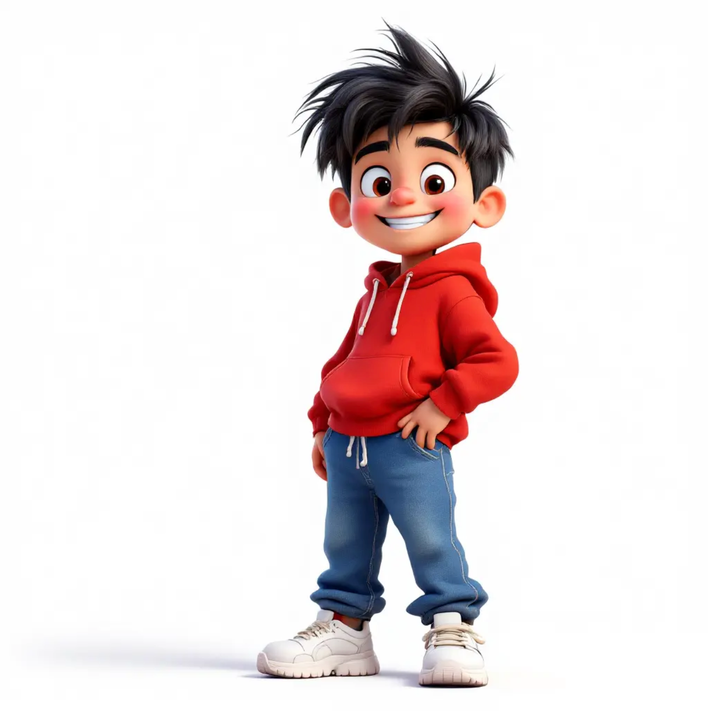

# Image-Edit Fine-tuning Framework

[](https://www.python.org/downloads/)  [](https://developer.nvidia.com/cuda-downloads)  [](LICENSE)  [](https://pytorch.org/)

## Overview

This repository provides a comprehensive framework for fine-tuning image editing tasks. The framework supports both **Qwen-Image-Edit** and **FLUX Kontext** model architectures. Our implementation focuses on efficient training through LoRA (Low-Rank Adaptation) and features an optimized embedding cache system that achieves 2-3x training acceleration.
## New
- **Multi Control**: 2025 Sep 16
<div align="center">
  <table>
    <tr>
      <td align="center">
        
        <br><em>control 0</em>
      </td>
      <td align="center">
        
        <br><em>control 1</em>
      </td>
      <td align="center">
        
        <br><em>generated results</em>
      </td>
    </tr>
  </table>
</div>

Support Multi Controls. The process logic is concat the latent of all control latents. And use different `latent_id` to identify them.

Pretrain Model is provided in  [Huggingface `TsienDragon/character-compositing`](https://huggingface.co/TsienDragon/character-compositing)

## Key Features

- **Dual Model Support**: Complete support for both Qwen-Image-Edit and FLUX Kontext model architectures
- **Multi-Precision Training**: FP16, FP8, and FP4 quantization levels for different hardware requirements
- **Efficient Fine-tuning**: LoRA-based parameter-efficient fine-tuning with minimal memory footprint
- [**Edit Mask Loss** feature documentation in `docs/image_edit_mask_loss.md`](docs/image_edit_mask_loss.md) Advanced mask-weighted loss function for focused training on edit regions
- [**Speed Optimization** including quantilizationand flash attention in `docs/speed_optimization.md`](docs/speed_optimization.md)
- **Embedding Cache System**: Proprietary caching mechanism for 2-3x training acceleration
- **Validation Sampling**: Real-time training progress monitoring with TensorBoard visualization
- **Resume Training**: Seamless training resumption from checkpoints with full state recovery
- **HuggingFace Integration**: Full compatibility with HuggingFace ecosystem for LoRA weights sharing and deployment
- **Auto-Upload to HuggingFace**: One-click upload of trained LoRA weights to HuggingFace Hub
- **Multi-GPU Support**: Distributed training capabilities with gradient accumulation
- **Quantization Support**: FP4/FP8/FP16 quantization for reduced memory usage and performance optimization
- **Flexible Architecture**: Modular design supporting various vision-language tasks
- **Production Ready**: Comprehensive testing suite and deployment configurations
- **Multi Control**: Support Multiple Controls for Image-Edit model that can support images compositing tasks.

## Table of Contents

- [Installation](#installation)
- [Quick Start](#quick-start)
- [Documentation](#documentation)
- [Model Architecture](#model-architecture)
- [Training](#training)
- [Inference](#inference)
- [Performance Benchmarks](#performance-benchmarks)
- [Citation](#citation)
- [License](#license)

## Dataset

Here we provided two toy datasets in the huggingface that user can efficiently use to train the model.

- Face segmentation dataset: [`TsienDragon/face_segmentation_20`](https://huggingface.co/datasets/TsienDragon/face_segmentation_20)

- Character composition dataset: [`TsienDragon/character-composition`](https://huggingface.co/datasets/TsienDragon/character-composition)


Quick usage:

```python
from src.utils.hugginface import load_editing_dataset

dd = load_editing_dataset("TsienDragon/face_segmentation_20")
sample = dd["train"][0]
```

Dataset structure reference and upload/download instructions are in [`docs/huggingface-related.md`](docs/huggingface-related.md). For datasets with CSV metadata files, use `upload_editing_dataset_from_csv()` which supports mixed image formats and flexible directory structures. We will remove the dataset copies under this repository and rely on Hugging Face going forward.

## Quick Start

### Prerequisites
- Python 3.12+
- CUDA 12.0+ (for GPU training)
- 16GB+ RAM, 8GB+ VRAM recommended

### Requirement Installation
```bash
# Clone repository
git clone https://github.com/yourusername/qwen-image-finetune.git
cd qwen-image-finetune

# Automated setup
./setup.sh

# Or with custom path and HF token
./setup.sh /your/path hf_your_token_here
```
Refer [`docs/speed_optimization.md`](docs/speed_optimization.md) to install `flash-atten` to speed-up the training.

### Train with Toy Dataset
1. prepare the datasets or use Hugging Face dataset (**recommended**). Refer `configs/face_seg_flux_kontext_fp16_huggingface_dataset.yaml`

2. prepare your config. Now suppose you have the config
Chose your model, optimizer, etc.
```bash
configs/my_config.yaml
```

3. (Optional) build cache first to speed up training (**recommended**)
It save the GPU memory since in the training, you dont need image encoder and prompt encoder anymore if you have the cache.
```bash
CUDA_VISIBLE_DEVICES=1 python -m src.main --config configs/my_config.yaml --cache
```
4. start training
Prepaare a `accelerate_config` to specify single gpu training or multi-gpu training
```bash
# three gpu training using accelerate
CUDA_VISIBLE_DEVICES=1,2,4 accelerate launch --config_file accelerate_config.yaml -m src.main --config configs/my_config.yaml
```

5. resume training (add resume_from_checkpoint: to config)
Add the checkpoint path in `train.resume_from_checkpoint` in the config and resume the training
```
CUDA_VISIBLE_DEVICES=1,2,4 accelerate launch --config_file accelerate_config.yaml -m src.main --config configs/my_config.yaml
```

### Configuration Guide

The framework provides various pre-configured training setups for different models and hardware requirements:

| Config File | Model | Precision | Key Features | GPU Memory | Recommended GPU | fps (second/batch) |
|------------|-------|-----------|--------------|------------|-----------------|---|
| `tests/test_configs/test_example_fluxkontext_fp16_character_composition.yaml` | Flux-Kontext| BF16 |Multi Control Image Lora Training |A100  | 26G |2.9|
| `tests/test_configs/test_example_fluxkontext_fp16.yaml` | Flux-Kontext | FP16 | Standard Lora Training | A100 | 27G|3.4|
| `tests/test_configs/test_example_qwen_image_edit_fp16_character_composition.yaml` | Qwen-Image-Edit | FP16 | Multi Control Image Lora Training |A100 | 42G| 2.8|
| `tests/test_configs/test_example_qwen_image_edit_fp16.yaml` | Qwen-Image-Edit | FP16 | Standard Lora Training | A100 | 43G |3.8|

GPU recommended with the following settings:
- batchsize: 2
- gradient-checkpoint: True
- Adam8bit
- image shape
  - character_composition: `[[384, 672], [512,512]]`
  - face-segmentation: `[[832, 576]]`


**Usage Example:**
```bash
# For FLUX Kontext FP4 training on RTX 4090
CUDA_VISIBLE_DEVICES=0 accelerate launch --config_file accelerate_config.yaml -m src.main --config $config_file
```

#### Training with RTX4090

```
Config Exampe
configs/face_seg_fp4_4090.yaml
NCCL_P2P_DISABLE=1 NCCL_IB_DISABLE=1 \
CUDA_VISIBLE_DEVICES=0,1 accelerate launch --config_file accelerate_config.yaml -m src.main --config $config_file
```
For multi-gpu training, need to set
```
distributed_type: MULTI_GPU  #for multi-gpu training
```
in the `accelerate_config.yaml`


### Validation Sampling During Training

The framework now supports validation sampling during training to monitor progress and visualize results in TensorBoard. This feature helps debug training issues and track model improvement over time.

Add the `sampling` section under `logging` in your YAML config:

```yaml
logging:
  output_dir: "/path/to/output"
  logging_dir: "logs"
  report_to: "tensorboard"

  # Sampling during training configuration
  sampling:
    enable: true              # Enable/disable sampling functionality
    validation_steps: 200     # Run validation sampling every N training steps
    num_samples: 4           # Number of samples to generate per validation
    seed: 42                 # Seed for reproducible sampling

    # Option 1: Use a validation dataset directory
    validation_data: "/path/to/validation/dataset"

    # Option 2: Use specific control-prompt pairs
    # validation_data:
    #   - control: "/path/to/control1.jpg"
    #     prompt: "A person with glasses"
    #   - control: "/path/to/control2.jpg"
    #     prompt: "A landscape with mountains"
```

Launch TensorBoard to view the validation results:
```bash
tensorboard --logdir=/path/to/output/logs
```
## Finetune Examples
### Single Control
#### Qwen-Image-Edit LoRA Fine-tuning Results

This project demonstrates fine-tuning the Qwen-VL model for face segmentation tasks. Below shows the comparison between pre and post fine-tuning results:

<div align="center">
  <table>
    <tr>
      <th>Input Image</th>
      <th>Base Model</th>
      <th>LoRA Fine-tuned Result</th>
    </tr>
    <tr>
      <td align="center">
        
        <br><em>Original input</em>
      </td>
      <td align="center">
        
        <br><em>Base Qwen-Image-Edit model (bfloat16)</em>
      </td>
      <td align="center">
        
        <br><em><strong>LoRA fine-tuned model in bf16</strong></em>
      </td>
    </tr>
    <tr>
      <td align="center">
        
        <br><em>Original input</em>
      </td>
      <td align="center">
        
        <br><em>Base Qwen-Image-Edit model（fp4)</em>
      </td>
      <td align="center">
        
        <br><em><strong>LoRA fine-tuned model (Base fp4,Lora bf16)</strong></em>
      </td>
    </tr>
  </table>
</div>

**Experiment Details:**
  - **Prompt:** "change the image from the face to the face segmentation mask"
  - **Row 1 - BF16 LoRA:** Base model (BF16) + LoRA adapters (BF16) - Checkpoint 900 steps on 20 samples
  - **Row 2 - FP4 LoRA:** Base model (BF16) + LoRA adapters (FP4 quantized) - Checkpoint 1000 steps on 20 samples
  - **Inference Steps:** 20, **CFG Scale:** 2.5

  **Key Observations:**
  - Both LoRA variants significantly outperform the base model
  - BF16 LoRA shows slightly better detail preservation
  - FP4 quantized LoRA maintains competitive quality while being more memory efficient
  - Base model uses BF16 precision in both experiments; only the LoRA adapters differ in quantization

#### 🔥 Flux Kontext Compare：FP16, FP8, FP4 LoRA Fine-tuning Results

<div align="center">
  <table>
    <tr>
      <th>Input Image</th>
      <th>精度类型</th>
      <th>Base Model (无LoRA)</th>
      <th>LoRA Fine-tuned Model</th>
    </tr>
    <tr>
      <td align="center" rowspan="3">
        
        <br><em>Original input image</em>
      </td>
      <td align="center"><strong>FP16</strong></td>
      <td align="center">
        
        <br><em>Base Flux Kontext model (FP16)</em>
      </td>
      <td align="center">
        
        <br><em><strong>FP16 LoRA fine-tuned model</strong></em>
      </td>
    </tr>
    <tr>
      <td align="center"><strong>FP8</strong></td>
      <td align="center">
        
        <br><em>FP8 base model (无LoRA)</em>
      </td>
      <td align="center">
        
        <br><em><strong>FP8 LoRA fine-tuned model</strong></em>
      </td>
    </tr>
    <tr>
      <td align="center"><strong>FP4</strong></td>
      <td align="center">
        
        <br><em>FP4 base model (无LoRA)</em>
      </td>
      <td align="center">
        
        <br><em><strong>FP4 LoRA fine-tuned model</strong></em>
      </td>
    </tr>
  </table>
</div>

### Multi Control
#### Qwen Image Edit with multi-controls
<div align="center">
  <table>
    <tr>
      <th align="center">Prompt Image 1</th>
      <th align="center">Prompt Image 2</th>
      <th align="center">Generated Image</th>
    </tr>
    <tr>
      <td align="center">
        
      </td>
      <td align="center">
        
      </td>
      <td align="center">
        
      </td>
    </tr>
    <tr>
      <td align="center">
        
      </td>
      <td align="center">
        
      </td>
      <td align="center">
        
      </td>
    </tr>
    <tr>
      <td align="center">
        
      </td>
      <td align="center">
        
      </td>
      <td align="center">
        
      </td>
    </tr>
  </table>
  <p><em><strong>Multi Control Examples from <a href="https://huggingface.co/TsienDragon/qwen-image-edit-character-composition">TsienDragon/qwen-image-edit-character-composition</a></strong></em></p>
</div>

#### Flux Kontext with multi controls

<div align="center">
  <table>
    <tr>
      <th align="center">Prompt Image 1</th>
      <th align="center">Prompt Image 2</th>
      <th align="center">Generated Image</th>
    </tr>
    <tr>
      <td align="center">
        
      </td>
      <td align="center">
        
      </td>
      <td align="center">
        
      </td>
    </tr>
    <tr>
      <td align="center">
        
      </td>
      <td align="center">
        
      </td>
      <td align="center">
        
      </td>
    </tr>
    <tr>
      <td align="center">
        
      </td>
      <td align="center">
        
      </td>
      <td align="center">
        
      </td>
    </tr>
  </table>
  <p><em><strong>Multi Control Examples from <a href="TsienDragon/flux-kontext-character-composition">TsienDragon/flux-kontext-character-composition</a></strong></em></p>
</div>

## Speed

|cache|Batch Size|Quantization|Gradient Checkpoint|Flash Attention|Device|GPU Used| Training Speed| Num of Process| config example|
|---|---|---|---|---|---|---|---| --- |---|
|cache|2| bf16| True| False|A100|48.6 G | 18.3 s/it| 1|[QwenEdit-bf16](configs/face_seg_config.yaml)|
|cache|2 | fp4| True| False|A100 |22.47 | 10.6 s/it| 1|[QwenEdit-fp4](configs/face_seg_fp4_config.yaml)|
|cache| 2 | bf16| True | True | A100 | 50.2 G | 10.34 s/it| 1|[QwenEdit-bf16](configs/face_seg_config.yaml)|
|cache| 2 | fp4 | True | True | A100 | 23.7 G | 10.8 s/it| 1|[QwenEdit-bf16](configs/face_seg_config.yaml)|
|non-cache|2| fp4| True| True|A100|54.8/53.9G| 20.1 s/it| 2|[QwenEdit-fp4-non-cache](configs/face_seg_fp4_non_cache_config.yaml)|
|cache| 2| fp4| True| True| rtx4090| 23.3/22.8G | 12.8 s/it| 2|[Qwenedit-fp4](configs/face_seg_fp4_4090.yaml)|
|cache| 1| fp4| True| True| rtx4090| 18.8/17.9G | 6.34 s/it| 2|[Qwenedit-fp4](configs/face_seg_fp4_4090.yaml)|
|cache| 2| bf16| True | True| A100 | 31.3 G | 6.65 s/ it |1|[FLuxKontext-bf16](configs/face_seg_flux_kontext_fp16.yaml)|
|cache| 2| bf16| True | True| A100 | 31.32/31.32G | 6.69 s/ it |2|[FLuxKontext-bf16](configs/face_seg_flux_kontext_fp16.yaml)|
|cache| 2| bf16| True | True| A100 | 31.9/31.9G | 6.78 s/ it |2|[FLuxKontext-bf16-prodigy-optimizer](configs/face_seg_flux_kontext_fp16_prodigy.yaml)|
|cache| 2| bf16| True | True| A100 | 31.8/31.8G | 6.77 s/ it |2|[FLuxKontext-fp8](configs/face_seg_flux_kontext_fp8.yaml)|
|cache| 2| bf16| True | True| A100 | 16.3G | 8.24 s/ it |1|[FLuxKontext-fp4](configs/face_seg_flux_kontext_fp4.yaml)|
|cache| 2| bf16| False | True| A100 |OOM | - |1|[FLuxKontext-fp4](configs/face_seg_flux_kontext_fp4.yaml)|

- prodigy-optimizer: [parameter free optimizer](https://github.com/konstmish/prodigy) No need to tune `lr` any more
- 4090: train on 4090 need to set `NCCL_P2P_DISABLE=1 NCCL_IB_DISABLE=1`. Other setting are same

## Inference
### Single Control
- Use trainer in this repo
```python
# Inference with trained LoRA model
from src.qwen_image_edit_trainer import QwenImageEditTrainer
from src.data.config import load_config_from_yaml
from PIL import Image

# Load configuration
config = load_config_from_yaml("configs/face_seg_config.yaml")

# Initialize trainer
trainer = QwenImageEditTrainer(config)

# Load trained LoRA weights
trainer.load_lora("/path/to/your/lora/weights")

# Setup for inference
trainer.setup_predict()

# Load input image
input_image = Image.open("data/face_seg/control_images/060002_4_028450_FEMALE_30.jpg")

# Generate face segmentation
result = trainer.predict(
    prompt_image=input_image,
    prompt="change the image from the face to the face segmentation mask",
    num_inference_steps=20,
    true_cfg_scale=4.0
)
# show the image
result[0]
# Save result
result[0].save("output_segmentation.png")
print("Generated face segmentation saved as output_segmentation.png")
```
- Use diffusers pipeline

```python
import torch
from PIL import Image
from diffusers import QwenImageEditPipeline
from diffusers.utils import load_image

pipe = QwenImageEditPipeline.from_pretrained("Qwen/Qwen-Image-Edit", torch_dtype=torch.bfloat16,height=512, width=512,
    output_type='np')
pipe.to("cuda:0")

pipe.load_lora_weights("TsienDragon/qwen-image-edit-lora-face-segmentation")
images_out = pipe(prompt_image, prompt,negative_prompt="", num_inference_steps=20, output_type='pil', true_cfg_scale=1.0).images

```
### Multi Control

## Notebooks Tutorials
- [Predict with Flux-Kontext](tests/trainer/test_flux_kontext_predict.ipynb)
- [Predict with Qwen-Image-Edit](tests/trainer/test_qwen-image-edit.ipynb)
## Debug
[Record of bugs encountered in `docs/debug.md`](docs/debug.md)

## 🤝 Contributing to Documentation

We welcome contributions to improve this documentation:

1. **Found an Error?** Open an issue or submit a PR
2. **Missing Information?** Suggest additions or improvements
3. **Want to Help?** Contact the maintainers for contribution guidelines

### Documentation Standards
- Use clear, concise language
- Include practical examples
- Provide complete code snippets
- Add troubleshooting sections
- Keep content up to date

## Getting Help

### Documentation Issues
- **Missing Information**: Check if it's covered in another section
- **Outdated Content**: Open an issue to report outdated information
- **Unclear Instructions**: Suggest improvements via issues or PRs

### Technical Support
- **Training Issues**: See [Training Guide](docs/training.md) troubleshooting
- **Data Preparation**: See [Data Preparation Guide](docs/data-preparation.md) for dataset setup
- **HuggingFace Model & Dataset**: See [HuggingFace Related Guide](docs/huggingface-related.md) for cloud datasets and LoRA model management
- **Optimizer Selection**: See [Training Guide](docs/training.md#optimizer-selection) for available optimizers
- **FLUX Kontext Training**: See [Training Guide](docs/training.md#flux-kontext-lora-training) for multi-precision training
- **Setup Problems**: Check [Setup Guide](docs/setup.md) common issues
- **Performance**: Review [Cache System](docs/cache-system.md) optimization
- **General Questions**: Open a GitHub issue with detailed description

## External Resources

### Related Projects
- [Qwen Official Repository](https://github.com/QwenLM/Qwen)
- [Hugging Face Transformers](https://huggingface.co/docs/transformers)
- [PyTorch Documentation](https://pytorch.org/docs/stable/)

### Community
- [GitHub Discussions](../../discussions) - General discussions and Q&A
- [Issues](../../issues) - Bug reports and feature requests
- [Pull Requests](../../pulls) - Code contributions


**📝 Note**: This documentation is continuously updated. Last updated: 2025/08/28

**⭐ Tip**: Use the navigation links above to jump to specific topics, or browse sequentially for a complete understanding of the framework.
