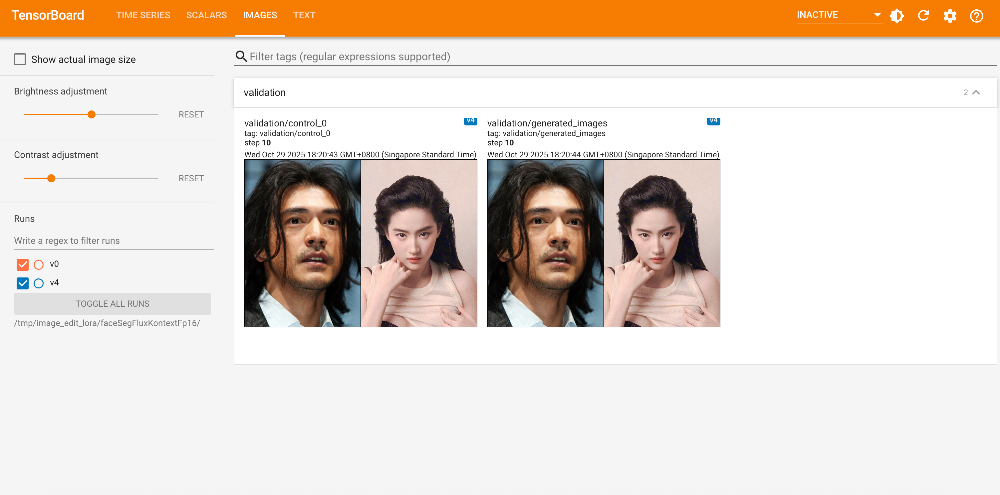
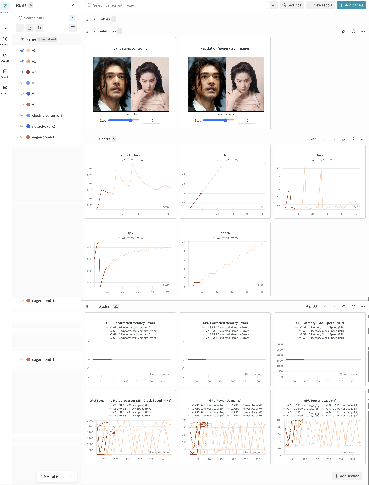
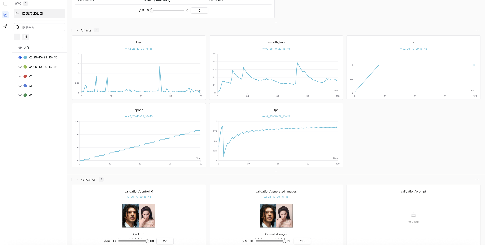
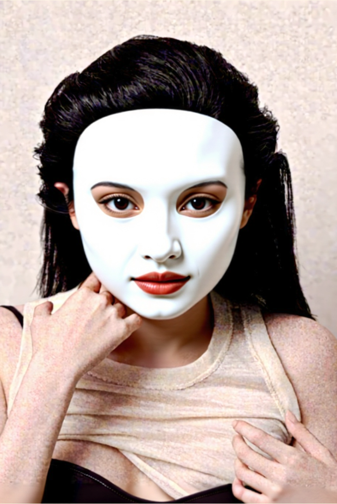

# Image-Edit Fine-tuning Framework

[](https://www.python.org/downloads/)  [](https://developer.nvidia.com/cuda-downloads)  [](LICENSE)  [](https://pytorch.org/)

## Overview

This repository provides a comprehensive framework for fine-tuning image editing tasks. The framework supports **FLUX Kontext**, **DreamOmni2**, **Qwen-Image-Edit**, and **Qwen-Image-Edit-2509** model architectures. Our implementation focuses on efficient training through LoRA (Low-Rank Adaptation) and features an optimized embedding cache system that achieves 2-3x training acceleration.

## New
- **🚀 DreamOmni2 Trainer Support (v3.3.0)**: Full support for DreamOmni2 LoRA fine-tuning with cumulative offset positioning for multi-image conditioning. Features include VLM-based prompt optimization and proper spatial relationship encoding through cumulative offsets. See [CHANGELOG:v3.3.0](docs/changelog/v3.3.0.md) for details.
  - Cumulative offset support for multi-image position encoding (RoPE)
  - Optional VLM prompt optimization using Qwen2.5-VL model
  - Compatible with existing Flux Kontext training pipeline
  - Example config: `tests/test_configs/test_dreamomni2_fp16.yaml`

- **🔧 Multi-Logger Support (v3.2.0)**: Added unified logging interface supporting TensorBoard, Weights & Biases, and SwanLab. Switch between logging backends with simple config changes. See [Logging Guide](docs/guide/logging.md) for details.
  - Unified `LoggerManager` API for all logging operations
  - Support for TensorBoard (local), wandb (cloud), and SwanLab (cloud)
  - Automatic authentication via `.env` files
  - Distributed training support with automatic process coordination

<div align="center">
  <table>
    <tr>
      <td align="center"><br><em>TensorBoard</em></td>
      <td align="center"><br><em>Wandb</em></td>
      <td align="center"><br><em>SwanLab</em></td>
    </tr>
  </table>
</div>


- **✨ Validation Visualization Improvements (v3.1.0)**: Enhanced validation sampling visualization with step-by-step progress display. Added support for viewing model improvement during training at regular intervals (every 100 steps).
<div align="center">
  <table>
    <tr>
      <td align="center"><br><em>Step 100</em></td>
      <td align="center"><br><em>Step 200</em></td>
      <td align="center"><br><em>Step 300</em></td>
      <td align="center"><br><em>Step 400</em></td>
      <td align="center"><br><em>Step 500</em></td>
      <td align="center"><br><em>Step 600</em></td>
    </tr>
  </table>
  <p><em>Validation sampling images showing results after every 100 training steps (steps 100-600) Tested with tests/test_configs/test_example_fluxkontext_fp16.yaml --cache</em></p>
</div>

- **🔧 FSDP LoRA Checkpoint Fix (v3.0.2)**: Fixed FSDP training issues with LoRA checkpoint saving and documented performance benchmarks across different training strategies. BF16 FSDP shows optimal memory-performance balance (10GB memory, 1.7 FPS) compared to FP4 DDP (25GB memory, 0.4 FPS). See [CHANGELOG:v3.0.2](docs/changelog/v3.0.2.md) for details.

- **🧪 Test Infrastructure Improvements (v3.0.1)**: Enhanced test resources management with HuggingFace Hub integration. Test resources are now automatically downloaded on-demand, reducing repository size and improving maintainability. Added comprehensive E2E tests for Qwen-Image-Edit and Qwen-Image-Edit-Plus sampling workflows. See [CHANGELOG:v3.0.1](docs/changelog/v3.0.1.md) for details.

- **🎯 Multi-Resolution Mixed Training (v3.0.0)**: Revolutionary multi-resolution training support that allows training with multiple resolution candidates in a single session. The system intelligently selects the optimal resolution based on each image's aspect ratio, supporting both simple shared-resolution mode and advanced per-image-type configuration. Compatible with all model architectures and training modes. See [CHANGELOG:v3.0.0](docs/changelog/v3.0.0.md) for complete details.
  - Simple mode: `multi_resolutions: [320*320, 512*512, 640*640]`
  - Advanced mode with per-type control: `multi_resolutions: {target: [...], controls: [[...], [...]]}`
  - Example config: `tests/test_configs/test_example_fluxkontext_multiresolution.yaml`

- **📚 Documentation Improvements (v2.4.1)**: Comprehensive documentation updates including MIT license badge, enhanced data preparation guide (Folder/HuggingFace/CSV sources), and English language standardization. See [CHANGELOG:v2.4.1](docs/changelog/v2.4.1.md) for details.

- **🔥 Dynamic Shape Support (v2.4.0)**: For Qwen-Image-Edit or Plus, we introduce the fixed number of pixels condition for batch process such that it support multiple shapes.
  - `data.init_args.processor.init_args.target_pixels: 512*512`
  - `data.init_args.processor.init_args.controls_pixels: [512*512]`
But this still got limitations for the randomness of shapes used in training. Next we may add H/W buckets to support real dynamic shapes training.

- **Qwen-Image-Edit-Plus (2509) Support (v2.3.0)**: Complete support for the enhanced Qwen-Image-Edit-Plus model architecture with native multi-image composition capabilities. Read here for [changes of the Qwen-Image-Edit-Plus version](docs/spec/models/qwen_image_edit_plus.md). Refer [predict notebook](tests/trainer/test_qwen_image_edit_plus.ipynb) for the predict example notebook. Pretrained model provided in [TsienDragon/qwen-image-edit-plus-lora-face-seg](https://huggingface.co/TsienDragon/qwen-image-edit-plus-lora-face-seg)

**⚠️ Important**: Qwen-Image-Edit-Plus (2509) requires the latest version of diffusers. Please install it using:

```bash
pip install --upgrade "git+https://github.com/huggingface/diffusers.git"
```

If you don't need Qwen-Image-Edit-Plus (2509) support, you can use the older version from `requirements.txt`.
  <div align="center">
    <table>
      <tr>
        <td align="center">
          
          <br>
          <em>Original Image</em>
        </td>
        <td align="center">
          
          <br>
          <em>LoRA for Face Segmentation</em>
        </td>
        <td align="center">
          
          <br>
          <em>Original with Character Composition (Plus version support multiple image composition natively)</em>
        </td>
        <td align="center">
          
          <br>
          <em>LoRA with Character Composition</em>
        </td>
      </tr>
    </table>
  </div>
- **CSV dataset support**: 2025 Sep 24 - support csv dataset path
- **Multi Control**: 2025 Sep 16
<div align="center">
  <table>
    <tr>
      <td align="center">
        
        <br><em>control 0</em>
      </td>
      <td align="center">
        
        <br><em>control 1</em>
      </td>
      <td align="center">
        
        <br><em>generated results</em>
      </td>
    </tr>
  </table>
</div>

Support Multi Controls. The process logic is concat the latent of all control latents. And use different `latent_id` to identify them.

Pretrain Model is provided in  [Huggingface `TsienDragon/character-compositing`](https://huggingface.co/TsienDragon/character-compositing)

## TODO
- [ ] Resolve validation DDP hang when validation samples use mixed resolutions (current workaround: keep validation shapes aligned). See `docs/TODO.md`.

## Key Features

- **Multi-Model Support**: Complete support for Qwen-Image-Edit, FLUX Kontext, DreamOmni2, and Qwen-Image-Edit-2509 model architectures
- **Multi-Resolution Mixed Training**: Train with multiple resolution candidates (e.g., 320x320, 512x512, 640x640) in a single session with intelligent aspect-ratio-aware selection
- **Multi-Precision Training**: FP16, FP8, and FP4 quantization levels for different hardware requirements
- **Efficient Fine-tuning**: LoRA-based parameter-efficient fine-tuning with minimal memory footprint
- [**Edit Mask Loss** feature documentation in `docs/spec/losses/image_edit_mask_loss.md`](docs/spec/losses/image_edit_mask_loss.md) Advanced mask-weighted loss function for focused training on edit regions
- [**Speed Optimization** including quantilizationand flash attention in `docs/guide/speed_optimization.md`](docs/guide/speed_optimization.md)
- **Embedding Cache System**: Proprietary caching mechanism for 2-3x training acceleration
- **Validation Sampling**: Real-time training progress monitoring with TensorBoard visualization
- **Resume Training**: Seamless training resumption from checkpoints with full state recovery
- **HuggingFace Integration**: Full compatibility with HuggingFace ecosystem for LoRA weights sharing and deployment
- **Auto-Upload to HuggingFace**: One-click upload of trained LoRA weights to HuggingFace Hub
- **Multi-GPU Support**: Distributed training capabilities with gradient accumulation
- **FSDP Training**: Fully Sharded Data Parallel training with optimized memory usage (10GB vs 25GB)
- **Quantization Support**: FP4/FP8/FP16 quantization for reduced memory usage and performance optimization
- **Flexible Architecture**: Modular design supporting various vision-language tasks
- **Production Ready**: Comprehensive testing suite and deployment configurations
- **Multi Control**: Support Multiple Controls for Image-Edit model that can support images compositing tasks.

## Table of Contents
- [Dataset](#dataset)
- [Installation](#installation)
- [Quick Start](#quick-start)
- [Documentation](#documentation)
- [Model Architecture](#model-architecture)
- [Training](#training)
- [Inference](#inference)
- [Performance Benchmarks](#performance-benchmarks)
- [Citation](#citation)
- [License](#license)

## Documentation

Comprehensive documentation is organized in the `docs/` directory:

- **[Getting Started Guide](docs/guide/)** — Setup, training, inference, and configuration guides
  - [Setup](docs/guide/setup.md) — Environment setup and installation
  - [Training](docs/guide/training.md) — Training workflows and best practices
  - [Inference](docs/guide/inference.md) — Model inference and deployment
  - [Data Preparation](docs/guide/data-preparation.md) — Dataset preparation and formats
  - [Configuration](docs/guide/configuration.md) — Configuration system reference
  - [LoRA Fine-tuning](docs/guide/lora.md) — LoRA training strategies
  - [Validation Sampling](docs/guide/validation_sampling.md) — Training progress visualization
  - [Speed Optimization](docs/guide/speed_optimization.md) — Performance tuning and quantization
  - [HuggingFace Integration](docs/guide/huggingface-related.md) — Dataset and model sharing
  - [Testing Reference](docs/guide/testing-quick-reference.md) — Testing guidelines
  - [Debug Guide](docs/guide/debug.md) — Troubleshooting and debugging

- **[Technical Specifications](docs/spec/)** — Detailed module specifications
  - [Models](docs/spec/models/) — Architecture specs for FLUX Kontext, DreamOmni2, Qwen-Image-Edit, and Qwen-Image-Edit-Plus
  - [Losses](docs/spec/losses/) — Loss function implementations and design rationale
  - [Data](docs/spec/data/) — Data loading and caching system specifications
  - [Trainer](docs/spec/trainer/) — Training loop and trainer architecture

- **[Changelog](docs/changelog/)** — Version history and release notes
  - [Changelog Overview](docs/changelog/index.md) — Summary of all releases
  - [Latest: v3.3.0](docs/changelog/v3.3.0.md) — DreamOmni2 trainer support

- **[Development Plans](docs/plan/)** — Roadmap and feature planning
  - [Plan Index](docs/plan/index.md) — Active and completed initiatives

- **[TODO List](docs/TODO.md)** — Current development tasks and progress

## Dataset

Here we provided two toy datasets in the huggingface that user can efficiently use to train the model.

- Face segmentation dataset: [`TsienDragon/face_segmentation_20`](https://huggingface.co/datasets/TsienDragon/face_segmentation_20)

- Character composition dataset: [`TsienDragon/character-composition`](https://huggingface.co/datasets/TsienDragon/character-composition)


Quick usage:

```python
from qflux.utils.huggingface import load_editing_dataset

dd = load_editing_dataset("TsienDragon/face_segmentation_20")
sample = dd["train"][0]
```

Dataset structure reference and upload/download instructions are in [`docs/guide/huggingface-related.md`](docs/guide/huggingface-related.md).

Added CSV data format support (v2.2.0): Dataset management based on CSV metadata files is now supported, providing a more flexible dataset structure. For datasets that use a CSV metadata file, use the upload_editing_dataset_from_csv() function, which supports mixed image formats and flexible directory structures. The CSV format allows custom column name mappings to accommodate different dataset structure requirements.

**⚠️ Important**: Before using this framework, you must prepare your dataset. See the [Data Preparation](docs/guide/data-preparation.md) guide for step-by-step instructions.

## Quick Start

### Prerequisites
- Python 3.12+
- CUDA 12.0+ (for GPU training)
- 18GB+ VRAM recommended
Other environment may works as well but did not test yet.

### Requirement Installation

```bash
# Clone repository
git clone https://github.com/yourusername/qwen-image-finetune.git
cd qwen-image-finetune

# Automated setup
./setup.sh

# Or with custom path and HF token
./setup.sh /your/path hf_your_token_here
```

**⚠️ Important for Qwen-Image-Edit-Plus (2509) Users**: If you plan to use Qwen-Image-Edit-Plus (2509) model, you need to install the latest version of diffusers from GitHub:

```bash
pip install --upgrade "git+https://github.com/huggingface/diffusers.git"
```

If you don't need Qwen-Image-Edit-Plus (2509) support, you can use the older version specified in `requirements.txt` (`diffusers>=0.36.0`).

Refer [`docs/guide/speed_optimization.md`](docs/guide/speed_optimization.md) to install `flash-attn` to accelerate training. It provides the greatest benefit with long prompts or large sequence lengths; for short prompts, the speedup may be limited.

### Train with Toy Dataset

**⚠️ Important**: All training commands must be executed from the `src/` directory. You need to `cd src/` before running any `python3 -m qflux.main` commands. Otherwise, you will encounter import errors.

1. prepare the datasets or use Hugging Face dataset (**recommended**). Refer `tests/test_configs/test_example_fluxkontext_fp16.yaml`

2. prepare your config. Now suppose you have the config
Chose your model, optimizer, etc.

3. (Optional) build cache first to speed up training (**recommended**)
It save the GPU memory since in the training, you dont need image encoder and prompt encoder anymore if you have the cache.

**⚠️ Important**: You must run the command from the `src/` directory. Otherwise, you will encounter import errors.

```bash
cd src/
python3 -m qflux.main --config ../configs/my_config.yaml --cache
```
The GPU devices used in cache are specified in the config as well.
For example
```yaml
cache:
  devices:
    vae: cuda:1
    text_encoder: cuda:0
    text_encoder_2: cuda:2
  cache_dir: ${logging.output_dir}/${logging.tracker_project_name}/cache
  use_cache: true
  prompt_empty_drop_keys:
    - prompt_embeds
    - pooled_prompt_embeds
```
Here vae encoder and text encoders could use different GPU ids if your GPU memory is not enough.

4. start training

**⚠️ Important**: You must run the command from the `src/` directory. Otherwise, you will encounter import errors.

Prepaare a `accelerate_config` to specify single gpu training or multi-gpu training
```bash
# three gpu training using accelerate
cd src/
CUDA_VISIBLE_DEVICES=1,2,4 accelerate launch --config_file ../accelerate_config.yaml -m qflux.main --config ../configs/my_config.yaml
```

Or do not use `accelerate_config.yaml` and specify the accelerate parameters in the bash script directly
Looks like
```bash
cd src/
CUDA_VISIBLE_DEVICES=0,1 \
accelerate launch \
  --num_processes 2 \
  --mixed_precision bf16 \
  -m qflux.main --config $config_file
```

5. resume training
In the config file add the resumed checkpoint folder
```
...
resume: <path_to_checkpoint_folder>
...
```

Then run the script same as above

### Configuration Guide

The framework provides various pre-configured training setups for different models and hardware requirements:

| Config File | Model | Precision | Key Features | GPU Memory | Recommended GPU | fps (second/batch) |
|------------|-------|-----------|--------------|------------|-----------------|---|
| [fluxkontext fp16 character composition](tests/test_configs/test_example_fluxkontext_fp16_character_composition.yaml) | Flux-Kontext| BF16 |Multi Control Image Lora Training |A100  | 26G |2.9|
| [fluxkontext fp16 face segmentation](tests/test_configs/test_example_fluxkontext_fp16.yaml) | Flux-Kontext | FP16 | Standard Lora Training | A100 | 27G|3.4|
| [qwen-image-edit fp16 character composition](tests/test_configs/test_example_qwen_image_edit_fp16_character_composition.yaml) | Qwen-Image-Edit | FP16 | Multi Control Image Lora Training |A100 | 42G| 2.8|
| [qwen-image-edit fp16 face segmentation](tests/test_configs/test_example_qwen_image_edit_fp16.yaml) | Qwen-Image-Edit | FP16 | Standard Lora Training | A100 | 43G |3.8|
|[qwen-iamge-edit-plus character composition](tests/test_configs/test_example_qwen_image_edit_plus_fp4_character_composition.yaml)|Qwen-Image-Edit-Plus | fp4 | fp4 lora training| A100 | 33| 3.8|
|[qwen-iamge-edit-plus fp4 face segmentation](tests/test_configs/test_example_qwen_image_edit_plus_fp4.yaml)|Qwen-Image-Edit-Plus | fp4 | fp4 lora training| A100 | 27.9| 3.6|

GPU recommended with the following settings:
- batchsize: 2
- gradient-checkpoint: True
- Adam8bit
- image shape
  - character_composition: `[[384, 672], [512,512]]` 或使用像素约束 `controls_pixels: [512*512]`
  - face-segmentation: `[[832, 576]]` 或使用像素约束 `controls_pixels: [512*512]`


**Usage Example:**

**⚠️ Important**: You must run the command from the `src/` directory. Otherwise, you will encounter import errors.

```bash
# For FLUX Kontext FP4 training on RTX 4090
cd src/
CUDA_VISIBLE_DEVICES=0 accelerate launch --config_file ../accelerate_config.yaml -m qflux.main --config $config_file
```
See doc [docs/configuration.md](docs/configuration.md) for more details about the configs

#### FSDP training
- Setup
In the [accelerate config](accelerate_config.yaml), choose proper distributed_type and choose proper num_processes (the number of gpus you want to use)
```
distributed_type: FSDP #NO # MULTI_GPU, FSDP
num_processes: 2
```


- Memory cost compare

|config| model | dtype | desc | machine| GPU memory | speed (second / batch)|
|---   | ---   | ---   | ---  | ---    |  ---       |  --- |
|  [qwen-config](tests/test_configs/test_example_qwen_image_edit_fp16.yaml) | Qwen-Image-Edit | FP16 | Standard Lora Training | A100x1 | 43G |3.8|
|  [qwen-config](tests/test_configs/test_example_qwen_image_edit_fp16.yaml)| Qwen-Image-Edit | FP16 | Standard Lora Training | A100x2(DDP) | 55G |3.1|
|  [qwen-config](tests/test_configs/test_example_qwen_image_edit_fp16.yaml) | Qwen-Image-Edit | FP16 | Standard Lora Training | A100x3(DDP) | 55G |3.41|
| [qwen-config](tests/test_configs/test_example_qwen_image_edit_fp16.yaml) | Qwen-Image-Edit | FP16 | Standard Lora Training | A100x2(FSDP) | 38G |4.66|
|  [qwen-config](tests/test_configs/test_example_qwen_image_edit_fp16.yaml) | Qwen-Image-Edit | FP16 | Standard Lora Training | A100x3(FSDP) | 22.2G |4.8|

**Parameter Summary Information over different local ranks**
<table>
<tr>
<td align="center"><b>Rank-0</b></td>
<td align="center"><b>Rank-1</b></td>
<td align="center"><b>Rank-2</b></td>
</tr>
<tr>
<td></td>
<td></td>
<td></td>
</tr>
</table>

#### Training with RTX4090

**⚠️ Important**: You must run the command from the `src/` directory. Otherwise, you will encounter import errors.

```bash
# Config Example
# configs/face_seg_fp4_4090.yaml
cd src/
NCCL_P2P_DISABLE=1 NCCL_IB_DISABLE=1 \
CUDA_VISIBLE_DEVICES=0,1 accelerate launch --config_file ../accelerate_config.yaml -m qflux.main --config $config_file
```
For multi-gpu training, need to set
```
distributed_type: MULTI_GPU  #for multi-gpu training
```
in the `accelerate_config.yaml`


### Validation Sampling During Training

The framework provides built-in validation sampling during training, allowing you to monitor your model's progress in real-time. This feature is configured in your YAML file:

```yaml
validation:
  enabled: true        # Enable validation sampling
  steps: 100           # Run validation every 100 steps
  max_samples: 2       # Use up to 2 samples from validation dataset
  seed: 42             # Fixed seed for reproducible results
  dataset:             # Validation dataset configuration
    # Dataset configuration similar to training dataset
```

See the [Validation Sampling Guide](docs/guide/validation_sampling.md) for detailed configuration options.

Launch TensorBoard to view the validation results:
```bash
tensorboard --logdir=/path/to/output/logs
```
## Finetune Examples
### Single Control
#### Qwen-Image-Edit LoRA Fine-tuning Results

This project demonstrates fine-tuning the Qwen-VL model for face segmentation tasks. Below shows the comparison between pre and post fine-tuning results:

<div align="center">
  <table>
    <tr>
      <th>Input Image</th>
      <th>Base Model</th>
      <th>LoRA Fine-tuned Result</th>
    </tr>
    <tr>
      <td align="center">
        
        <br><em>Original input</em>
      </td>
      <td align="center">
        
        <br><em>Base Qwen-Image-Edit model (bfloat16)</em>
      </td>
      <td align="center">
        
        <br><em><strong>LoRA fine-tuned model in bf16</strong></em>
      </td>
    </tr>
    <tr>
      <td align="center">
        
        <br><em>Original input</em>
      </td>
      <td align="center">
        
        <br><em>Base Qwen-Image-Edit model（fp4)</em>
      </td>
      <td align="center">
        
        <br><em><strong>LoRA fine-tuned model (Base fp4,Lora bf16)</strong></em>
      </td>
    </tr>
  </table>
</div>

**Experiment Details:**
  - **Prompt:** "change the image from the face to the face segmentation mask"
  - **Row 1 - BF16 LoRA:** Base model (BF16) + LoRA adapters (BF16) - Checkpoint 900 steps on 20 samples
  - **Row 2 - FP4 LoRA:** Base model (BF16) + LoRA adapters (FP4 quantized) - Checkpoint 1000 steps on 20 samples
  - **Inference Steps:** 20, **CFG Scale:** 2.5

  **Key Observations:**
  - Both LoRA variants significantly outperform the base model
  - BF16 LoRA shows slightly better detail preservation
  - FP4 quantized LoRA maintains competitive quality while being more memory efficient
  - Base model uses BF16 precision in both experiments; only the LoRA adapters differ in quantization

#### 🔥 Flux Kontext Compare：FP16, FP8, FP4 LoRA Fine-tuning Results

<div align="center">
  <table>
    <tr>
      <th>Input Image</th>
      <th>精度类型</th>
      <th>Base Model (无LoRA)</th>
      <th>LoRA Fine-tuned Model</th>
    </tr>
    <tr>
      <td align="center" rowspan="3">
        
        <br><em>Original input image</em>
      </td>
      <td align="center"><strong>FP16</strong></td>
      <td align="center">
        
        <br><em>Base Flux Kontext model (FP16)</em>
      </td>
      <td align="center">
        
        <br><em><strong>FP16 LoRA fine-tuned model</strong></em>
      </td>
    </tr>
    <tr>
      <td align="center"><strong>FP8</strong></td>
      <td align="center">
        
        <br><em>FP8 base model (无LoRA)</em>
      </td>
      <td align="center">
        
        <br><em><strong>FP8 LoRA fine-tuned model</strong></em>
      </td>
    </tr>
    <tr>
      <td align="center"><strong>FP4</strong></td>
      <td align="center">
        
        <br><em>FP4 base model (无LoRA)</em>
      </td>
      <td align="center">
        
        <br><em><strong>FP4 LoRA fine-tuned model</strong></em>
      </td>
    </tr>
  </table>
</div>

### Multi Control
#### Qwen Image Edit with multi-controls
<div align="center">
  <table>
    <tr>
      <th align="center">Prompt Image 1</th>
      <th align="center">Prompt Image 2</th>
      <th align="center">Generated Image</th>
    </tr>
    <tr>
      <td align="center">
        
      </td>
      <td align="center">
        
      </td>
      <td align="center">
        
      </td>
    </tr>
    <tr>
      <td align="center">
        
      </td>
      <td align="center">
        
      </td>
      <td align="center">
        
      </td>
    </tr>
    <tr>
      <td align="center">
        
      </td>
      <td align="center">
        
      </td>
      <td align="center">
        
      </td>
    </tr>
  </table>
  <p><em><strong>Multi Control Examples from <a href="https://huggingface.co/TsienDragon/qwen-image-edit-character-composition">TsienDragon/qwen-image-edit-character-composition</a></strong></em></p>
</div>

#### Flux Kontext with multi controls

<div align="center">
  <table>
    <tr>
      <th align="center">Prompt Image 1</th>
      <th align="center">Prompt Image 2</th>
      <th align="center">Generated Image</th>
    </tr>
    <tr>
      <td align="center">
        
      </td>
      <td align="center">
        
      </td>
      <td align="center">
        
      </td>
    </tr>
    <tr>
      <td align="center">
        
      </td>
      <td align="center">
        
      </td>
      <td align="center">
        
      </td>
    </tr>
    <tr>
      <td align="center">
        
      </td>
      <td align="center">
        
      </td>
      <td align="center">
        
      </td>
    </tr>
  </table>
  <p><em><strong>Multi Control Examples from <a href="TsienDragon/flux-kontext-character-composition">TsienDragon/flux-kontext-character-composition</a></strong></em></p>
</div>

## Speed

|cache|Batch Size|Quantization|Gradient Checkpoint|Flash Attention|Device|GPU Used| Training Speed| Num of Process| config example|
|---|---|---|---|---|---|---|---|---|---|
|cache|2| bf16| True| False|A100|48.6 G | 18.3 s/it| 1|[QwenEdit-bf16](configs/face_seg_config.yaml)|
|cache|2 | fp4| True| False|A100 |22.47 | 10.6 s/it| 1|[QwenEdit-fp4](configs/face_seg_fp4_config.yaml)|
|cache| 2 | bf16| True | True | A100 | 50.2 G | 10.34 s/it| 1|[QwenEdit-bf16](configs/face_seg_config.yaml)|
|cache| 2 | fp4 | True | True | A100 | 23.7 G | 10.8 s/it| 1|[QwenEdit-bf16](configs/face_seg_config.yaml)|
|non-cache|2| fp4| True| True|A100|54.8/53.9G| 20.1 s/it| 2|[QwenEdit-fp4-non-cache](configs/face_seg_fp4_non_cache_config.yaml)|
|cache| 2| fp4| True| True| rtx4090| 23.3/22.8G | 12.8 s/it| 2|[Qwenedit-fp4](configs/face_seg_fp4_4090.yaml)|
|cache| 1| fp4| True| True| rtx4090| 18.8/17.9G | 6.34 s/it| 2|[Qwenedit-fp4](configs/face_seg_fp4_4090.yaml)|
|cache| 2| bf16| True | True| A100 | 31.3 G | 6.65 s/ it |1|[FLuxKontext-bf16](configs/face_seg_flux_kontext_fp16.yaml)|
|cache| 2| bf16| True | True| A100 | 31.32/31.32G | 6.69 s/ it |2|[FLuxKontext-bf16](configs/face_seg_flux_kontext_fp16.yaml)|
|cache| 2| bf16| True | True| A100 | 31.9/31.9G | 6.78 s/ it |2|[FLuxKontext-bf16-prodigy-optimizer](configs/face_seg_flux_kontext_fp16_prodigy.yaml)|
|cache| 2| bf16| True | True| A100 | 31.8/31.8G | 6.77 s/ it |2|[FLuxKontext-fp8](configs/face_seg_flux_kontext_fp8.yaml)|
|cache| 2| bf16| True | True| A100 | 16.3G | 8.24 s/ it |1|[FLuxKontext-fp4](configs/face_seg_flux_kontext_fp4.yaml)|
|cache| 2| bf16| False | True| A100 |OOM | - |1|[FLuxKontext-fp4](configs/face_seg_flux_kontext_fp4.yaml)|

- prodigy-optimizer: [parameter free optimizer](https://github.com/konstmish/prodigy) No need to tune `lr` any more
- 4090: train on 4090 need to set `NCCL_P2P_DISABLE=1 NCCL_IB_DISABLE=1`. Other setting are same

Check this docs for more training guides docs/training.md
## Inference
### Single Control
- Use trainer in this repo
```python
# Inference with trained LoRA model
from qflux.trainer.qwen_image_edit_trainer import QwenImageEditTrainer
from qflux.data.config import load_config_from_yaml
from PIL import Image

# Load configuration
config = load_config_from_yaml("configs/face_seg_config.yaml")
config.model.lora.pretrained_weight = "/path/to/your/lora/weights.safetensors"

# Initialize trainer (LoRA will be loaded automatically in setup_predict)
trainer = QwenImageEditTrainer(config)

# Setup for inference
trainer.setup_predict()

# Load input image
input_image = Image.open("data/face_seg/control_images/060002_4_028450_FEMALE_30.jpg")

# Generate face segmentation
result = trainer.predict(
    prompt_image=input_image,
    prompt="change the image from the face to the face segmentation mask",
    num_inference_steps=20,
    true_cfg_scale=4.0
)
# show the image
result[0]
# Save result
result[0].save("output_segmentation.png")
print("Generated face segmentation saved as output_segmentation.png")
```
- Use diffusers pipeline

```python
import torch
from PIL import Image
from diffusers import QwenImageEditPipeline
from diffusers.utils import load_image

pipe = QwenImageEditPipeline.from_pretrained("Qwen/Qwen-Image-Edit", torch_dtype=torch.bfloat16,height=512, width=512,
    output_type='np')
pipe.to("cuda:0")

pipe.load_lora_weights("TsienDragon/qwen-image-edit-lora-face-segmentation")
images_out = pipe(prompt_image, prompt,negative_prompt="", num_inference_steps=20, output_type='pil', true_cfg_scale=1.0).images

```
### Multi Control

## Notebooks Tutorials
- [Predict with Flux-Kontext](tests/trainer/test_flux_kontext_predict.ipynb)
- [Predict with Qwen-Image-Edit](tests/trainer/test_qwen-image-edit.ipynb)
## Debug
[Record of bugs encountered in `docs/debug.md`](docs/debug.md)

## 🤝 Contributing to Documentation

We welcome contributions to improve this documentation:

1. **Found an Error?** Open an issue or submit a PR
2. **Missing Information?** Suggest additions or improvements
3. **Want to Help?** Contact the maintainers for contribution guidelines

### Documentation Standards
- Use clear, concise language
- Include practical examples
- Provide complete code snippets
- Add troubleshooting sections
- Keep content up to date

## Star History

[](https://www.star-history.com/#tsiendragon/qwen-image-finetune&Date)

## Getting Help

### Documentation Issues
- **Missing Information**: Check if it's covered in another section
- **Outdated Content**: Open an issue to report outdated information
- **Unclear Instructions**: Suggest improvements via issues or PRs

### Technical Support
- **Training Issues**: See [Training Guide](docs/training.md) troubleshooting
- **Data Preparation**: See [Data Preparation Guide](docs/data-preparation.md) for dataset setup
- **HuggingFace Model & Dataset**: See [HuggingFace Related Guide](docs/huggingface-related.md) for cloud datasets and LoRA model management
- **Optimizer Selection**: See [Training Guide](docs/training.md#optimizer-selection) for available optimizers
- **FLUX Kontext Training**: See [Training Guide](docs/training.md#flux-kontext-lora-training) for multi-precision training
- **Setup Problems**: Check [Setup Guide](docs/setup.md) common issues
- **Performance**: Review [Cache System](docs/cache-system.md) optimization
- **General Questions**: Open a GitHub issue with detailed description

## External Resources

### Related Projects
- [Qwen Official Repository](https://github.com/QwenLM/Qwen)
- [Hugging Face Transformers](https://huggingface.co/docs/transformers)
- [PyTorch Documentation](https://pytorch.org/docs/stable/)

### Community
- [GitHub Discussions](../../discussions) - General discussions and Q&A
- [Issues](../../issues) - Bug reports and feature requests
- [Pull Requests](../../pulls) - Code contributions


**📝 Note**: This documentation is continuously updated. Last updated: 2025/09/26

**⭐ Tip**: Use the navigation links above to jump to specific topics, or browse sequentially for a complete understanding of the framework.

## License

This project is licensed under the MIT License. See the [LICENSE](LICENSE) file for details.
