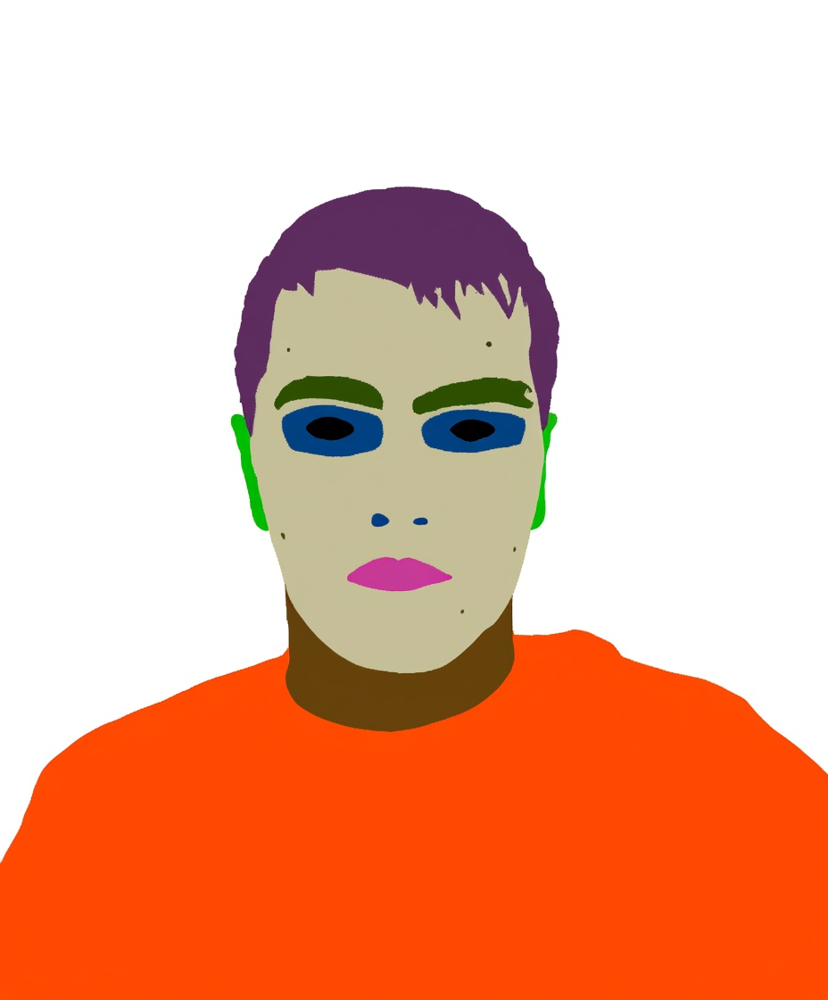

# Qwen-Image-Edit Fine-tuning Framework

[](https://www.python.org/downloads/)  [](https://developer.nvidia.com/cuda-downloads)  [](LICENSE)  [](https://pytorch.org/)

## Overview

This repository provides a comprehensive framework for fine-tuning Qwen Vision-Language models for specialized image editing and understanding tasks. Our implementation focuses on efficient training through LoRA (Low-Rank Adaptation) and features an optimized embedding cache system that achieves 2-3x training acceleration.

## Key Features

- **Efficient Fine-tuning**: LoRA-based parameter-efficient fine-tuning with minimal memory footprint
- **Embedding Cache System**: Proprietary caching mechanism for 2-3x training acceleration
- **Multi-GPU Support**: Distributed training capabilities with gradient accumulation
- **Quantization Support**: FP4/INT8 quantization for reduced memory usage
- **Flexible Architecture**: Modular design supporting various vision-language tasks
- **Production Ready**: Comprehensive testing suite and deployment configurations

## Table of Contents

- [Installation](#installation)
- [Quick Start](#quick-start)
- [Documentation](#documentation)
- [Model Architecture](#model-architecture)
- [Training](#training)
- [Inference](#inference)
- [Performance Benchmarks](#performance-benchmarks)
- [Citation](#citation)
- [License](#license)

## Installation

### Prerequisites
- Python 3.12+
- CUDA 12.0+ (for GPU training)
- 16GB+ RAM, 8GB+ VRAM recommended

### Installation
```bash
# Clone repository
git clone https://github.com/yourusername/qwen-image-finetune.git
cd qwen-image-finetune

# Automated setup
./setup.sh

# Or with custom path and HF token
./setup.sh /your/path hf_your_token_here
```
Refer [`docs/speed_optimization.md`](docs/speed_optimization.md) to install `flash-atten` to speed-up the training.

### Basic Usage with Toy Dataset
```bash
# 1. provied toy data for lora training  data/face_seg/
ls data/face_seg/control_images/    # control images  (20 samples)
ls data/face_seg/training_images/   # target images and prompts (20 samples)

# 2. trainig config
cp configs/face_seg_config.yaml configs/my_config.yaml

# 3. doing cache to same GPU memory. It needs 48.6G memory for lora training with batch size 2 and gradient checkpoint
CUDA_VISIBLE_DEVICES=1 python -m src.main --config configs/my_config.yaml --cache

# 4. start training
CUDA_VISIBLE_DEVICES=1 accelerate launch --config_file accelerate_config.yaml -m src.main --config configs/my_config.yaml
```

#### Training with RTX4090

```
Config Exampe
configs/face_seg_fp4_4090.yaml
NCCL_P2P_DISABLE=1 NCCL_IB_DISABLE=1 \
CUDA_VISIBLE_DEVICES=0,1 accelerate launch --config_file accelerate_config.yaml -m src.main --config $config_file
```
For multi-gpu training, need to set
```
distributed_type: MULTI_GPU  #for multi-gpu training
```
in the `accelerate_config.yaml`


#### 🎯 LoRA Fine-tuning Results Comparison

This project demonstrates fine-tuning the Qwen-VL model for face segmentation tasks. Below shows the comparison between pre and post fine-tuning results:

##### Results Comparison

<div align="center">
  <table>
    <tr>
      <th>Input Image</th>
      <th>Base Model Results</th>
      <th>LoRA Fine-tuned Results</th>
    </tr>
    <tr>
      <td align="center">
        
        <br><em>Original input image</em>
      </td>
      <td align="center">
        
        <br><em>Base Qwen-VL model</em>
      </td>
      <td align="center">
        
        <br><em>LoRA fine-tuned model</em>
      </td>
    </tr>
  </table>
  <p><strong>Comparison:</strong> The LoRA fine-tuned model shows significantly improved accuracy and details in face segmentation compared to the base model.</p>
</div>

##### Precision Comparison: BF16 vs FP4 LoRA Fine-tuning

<div align="center">
  <table>
    <tr>
      <th>Input Image</th>
      <th>Base Model</th>
      <th>LoRA Fine-tuned Result</th>
    </tr>
    <tr>
      <td align="center">
        
        <br><em>Original input</em>
      </td>
      <td align="center">
        
        <br><em>Diffusion Base Model FP16</em>
      </td>
      <td align="center">
        
        <br><em><strong>Diffusion Base Model FP16, LoRA BF16</strong></em>
      </td>
    </tr>
    <tr>
      <td align="center">
        
        <br><em>Original input</em>
      </td>
      <td align="center">
        
        <br><em>Diffusion Base Model FP4 Quantized</em>
      </td>
      <td align="center">
        
        <br><em><strong>Base FP4 Quantized, LoRA FP16</strong></em>
      </td>
    </tr>
  </table>
</div>

**Experiment Details:**
  - **Prompt:** "change the image from the face to the face segmentation mask"
  - **Row 1 - BF16 LoRA:** Base model (BF16) + LoRA adapters (BF16) - Checkpoint 900 steps on 20 samples
  - **Row 2 - FP4 LoRA:** Base model (BF16) + LoRA adapters (FP4 quantized) - Checkpoint 1000 steps on 20 samples
  - **Inference Steps:** 20, **CFG Scale:** 2.5

  **Key Observations:**
  - Both LoRA variants significantly outperform the base model
  - BF16 LoRA shows slightly better detail preservation
  - FP4 quantized LoRA maintains competitive quality while being more memory efficient
  - Base model uses BF16 precision in both experiments; only the LoRA adapters differ in quantization


##### Performance Analysis
- **Before Fine-tuning**: Base model can identify face regions but with limited segmentation precision
- **After Fine-tuning**: LoRA fine-tuning significantly improves segmentation accuracy and boundary details
- **Key Improvements**: More precise boundary detection, better detail preservation, more stable segmentation quality

> 💡 **Note**: Through LoRA fine-tuning, we achieve significant performance improvements for specific tasks while maintaining model efficiency and lightweight characteristics.
### Lora Training Performance

|Batch Size|Quantization|Gradient Checkpoint|Flash Attention|Device|GPU Used| Training Speed|
|---|---|---|---|---|---|---|
|2| bf16| True| False|A100|48.6 G | 18.3 s/it|
|2 | fp4| True| False|A100 |22.47 | 10.6 s/it|
| 2 | fbf16| True | True | A100 | 50.2 G | 10.34 s/it|
| 2 | fp4 | True | True | A100 | 23.7 G | 10.8 s/it|
| 2| fp4| True| True| rtx4090| 23.3/22.8G | 12.8 s/it|
| 1| fp4| True| True| rtx4090| 18.8/17.9G | 6.34 s/it|

### Inference
```python
# Inference with trained LoRA model
from src.qwen_image_edit_trainer import QwenImageEditTrainer
from src.data.config import load_config_from_yaml
from PIL import Image

# Load configuration
config = load_config_from_yaml("configs/face_seg_config.yaml")

# Initialize trainer
trainer = QwenImageEditTrainer(config)

# Load trained LoRA weights
trainer.load_lora("/path/to/your/lora/weights")

# Setup for inference
trainer.setup_predict()

# Load input image
input_image = Image.open("data/face_seg/control_images/060002_4_028450_FEMALE_30.jpg")

# Generate face segmentation
result = trainer.predict(
    prompt_image=input_image,
    prompt="change the image from the face to the face segmentation mask",
    num_inference_steps=20,
    true_cfg_scale=4.0
)
# show the image
result[0]
# Save result
result[0].save("output_segmentation.png")
print("Generated face segmentation saved as output_segmentation.png")
```
## Speed Optimization

[Speed Optimization including quantilizationand flash attention in `docs/speed_optimization.md`](docs/speed_optimization.md)

## Debug
[Record of bugs encountered in `docs/debug.md`](docs/debug.md)

## 🎯 Key Features Covered

### Training Optimization
- **Embedding Cache System**: 2-3x training acceleration
- **LoRA Fine-tuning**: Memory-efficient parameter updates
- **Multi-GPU Support**: Distributed training capabilities
- **Gradient Checkpointing**: Memory optimization techniques

### Model Capabilities
- **Multimodal Processing**: Combined text and image understanding
- **Flexible Architecture**: Support for various image editing tasks
- **Quality Control**: Advanced inference parameters and optimization
- **Production Ready**: Deployment guides and API examples

### Developer Tools
- **Comprehensive Testing**: Full test suite and validation tools
- **Monitoring**: Real-time storage and performance monitoring
- **Configuration**: Flexible YAML-based configuration system
- **Documentation**: Complete API reference and examples

## 🤝 Contributing to Documentation

We welcome contributions to improve this documentation:

1. **Found an Error?** Open an issue or submit a PR
2. **Missing Information?** Suggest additions or improvements
3. **Want to Help?** Contact the maintainers for contribution guidelines

### Documentation Standards
- Use clear, concise language
- Include practical examples
- Provide complete code snippets
- Add troubleshooting sections
- Keep content up to date

## 📞 Getting Help

### Documentation Issues
- **Missing Information**: Check if it's covered in another section
- **Outdated Content**: Open an issue to report outdated information
- **Unclear Instructions**: Suggest improvements via issues or PRs

### Technical Support
- **Training Issues**: See [Training Guide](docs/training.md) troubleshooting
- **Setup Problems**: Check [Setup Guide](docs/setup.md) common issues
- **Performance**: Review [Cache System](docs/cache-system.md) optimization
- **General Questions**: Open a GitHub issue with detailed description

## 📚 External Resources

### Related Projects
- [Qwen Official Repository](https://github.com/QwenLM/Qwen)
- [Hugging Face Transformers](https://huggingface.co/docs/transformers)
- [PyTorch Documentation](https://pytorch.org/docs/stable/)

### Community
- [GitHub Discussions](../../discussions) - General discussions and Q&A
- [Issues](../../issues) - Bug reports and feature requests
- [Pull Requests](../../pulls) - Code contributions

---

**📝 Note**: This documentation is continuously updated. Last updated: 2025/08/28

**⭐ Tip**: Use the navigation links above to jump to specific topics, or browse sequentially for a complete understanding of the framework.
