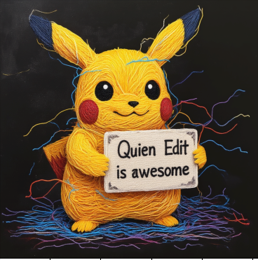

# Changelog

All notable changes to this project will be documented in this file.

The format is based on [Keep a Changelog](https://keepachangelog.com/en/1.0.0/),
and this project adheres to [Semantic Versioning](https://semver.org/spec/v2.0.0.html).

## [Unreleased]

### Added
- To be added...

### Changed
- To be added...

### Fixed
- To be added...

---

## [1.6.0] - 2025-09-18

### Added
- **Save Final Checkpoint on Completion**: Automatically save the final checkpoint when training completes or is interrupted, ensuring training progress is preserved
- **HuggingFace Compatible LoRA Format**: LoRA weights now use HuggingFace-compatible state dict filenames and format, enabling direct loading with diffusers pipeline: `pipe.load_lora_weights(lora_weight, prefix="", adapter_name="lora_edit")`
- **Automatic LoRA Weight Upload**: Support automatic upload of trained LoRA weights to HuggingFace model repository

### Changed
- **Training Workflow Optimization**: Improved weight saving and management workflow after training completion
- **Enhanced Compatibility**: Improved integration with HuggingFace ecosystem for easier model sharing and deployment

### Technical Details
- LoRA state dict format fully compatible with HuggingFace standards
- Automatic checkpoint saving mechanism ensures training robustness
- Support one-click upload of training results to HuggingFace Hub

---

## [1.5.3] - 2025-09-15

### Fixed
- **Documentation Corrections**: Updated additional control image naming rule descriptions to ensure consistency with actual code implementation
  - Fixed control image naming rules in `docs/huggingface-dataset.md` from `<base>_1.*` to `<base>_control_1.*`
  - Updated example directory structure to match actual naming conventions
  - Fixed comments in `src/data/dataset.py` to align with code implementation
  - Corrected additional control image naming description in `docs/prd/multi_control.md`
  - Fixed control image collection logic description in `src/utils/hugginface.py`

### Technical Details
- Unified additional control image naming convention to `<base>_control_1.*`, `<base>_control_2.*` format
- Ensured all documentation matches code implementation to avoid user confusion

---

## [1.5.2] - 2025-09-11

### Added
- **HuggingFace Dataset Support**: Implemented seamless integration with HuggingFace datasets
  - 在 `ImageDataset` 类中添加智能路径检测，自动区分本地路径和 HF 仓库 ID
  - 实现懒加载机制，避免大型数据集的枚举开销
  - 支持混合使用本地数据集和 HF 数据集
  - 提供 `face_seg_flux_kontext_fp16_huggingface_dataset.yaml` 配置示例
  - 完整的数据格式转换，确保与现有预处理流程兼容

### Changed
- **Data Loading Performance**: Significantly improved large dataset loading performance through lazy loading mechanism
- **Configuration System**: Maintained full backward compatibility, existing config files require no modifications
- **Documentation**: Added `docs/huggingface-dataset.md` detailed guide including upload, download, and usage instructions

### Technical Details
- Path detection logic: Automatically distinguishes between local paths and HF repository ID formats
- Data format conversion: HF dataset PIL Image → RGB numpy array
- Unified interface: `__getitem__` method provides consistent handling for both local and HF data
- Complete design documentation: `docs/prd/v1.5.2_add_huggingface_dataset.md`

---

## [1.5.1] - 2025-01-11

### Changed
- **Optimizer Selection Documentation**: Added new optimizer selection section in `docs/training.md`
  - 支持四种优化器：AdamW（默认）、8-bit Adam（内存高效）、Prodigy（自动学习率）、SGD（经典）
  - 提供详细的 YAML 配置示例和使用场景说明
  - 添加快速参考表格，对比各优化器的内存占用、自动学习率功能和最佳使用场景
  - 在 README.md 技术支持部分添加优化器选择的快速链接

### Fixed
- Fixed bitsandbytes optimizer class path (from `bnb.optim.Adam8bit` to `bitsandbytes.optim.Adam8bit`)

---

## [1.5.0] - 2025-01-10

### Added
- **FLUX Kontext LoRA Training Support**: Complete implementation of LoRA fine-tuning functionality for FLUX Kontext models
  - 支持三种精度级别：FP16（最高质量）、FP8（平衡性能）、FP4（最大效率）
  - 提供预配置的训练配置文件：`face_seg_flux_kontext_fp16.yaml`、`face_seg_flux_kontext_fp8.yaml`、`face_seg_flux_kontext_fp4.yaml`
  - 实现了 `FluxKontextLoraTrainer` 类，继承自 `BaseTrainer` 确保接口一致性
  - 支持双文本编码器架构（CLIP + T5），优化多设备分配策略
  - 完整的缓存系统支持，包括 VAE、CLIP 和 T5 编码器的独立设备配置

### Changed
- **Documentation Enhancement**: Added detailed FLUX Kontext training guidance section in `docs/training.md`
  - 详细的精度对比表格，包含质量、训练速度、显存需求和使用场景
  - 完整的训练工作流程和多GPU训练配置
  - 设备分配策略和内存优化建议
  - FLUX Kontext 推理代码示例和最佳实践
- **框架描述更新**: 更新 README.md 以反映双模型架构支持
  - 强调对 Qwen-Image-Edit 和 FLUX Kontext 的完整支持
  - 突出多精度训练能力（FP16/FP8/FP4）
  - 更新技术支持部分，添加 FLUX Kontext 训练指南链接

### Technical Details
- FLUX Kontext model architecture: Transformer-based diffusion model supporting joint understanding of images and text
- Precision performance comparison: FP16 (reference quality), FP8 (95% quality, 1.5x speed), FP4 (85% quality, 2.5x speed)
- Memory requirement optimization: FP16 (24GB training/12GB inference) → FP8 (18GB/8GB) → FP4 (12GB/5GB)
- 支持的预训练模型：
  - `black-forest-labs/FLUX.1-Kontext-dev` (FP16)
  - `camenduru/flux1-kontext-dev_fp8_e4m3fn_diffusers` (FP8)
  - `eramth/flux-kontext-4bit-fp4` (FP4)

---

## [1.4.0] - 2025-01-03

### Added
- **Edit Mask Loss Support**: Implemented mask-based loss function to improve image editing training effectiveness
  - 新增 `MaskEditLoss` 类，支持对编辑区域和背景区域的差异化权重
  - 实现 `map_mask_to_latent` 函数，将图像空间掩码映射到潜在空间序列权重
  - 支持可配置的前景权重 (`foreground_weight`) 和背景权重 (`background_weight`)
  - 完全向后兼容，现有训练管道在 `mask_loss: false` 时保持不变

### Changed
- **Dataset Support**: Extended dataset structure to support optional edit mask files (`*_mask.png`)
- **Configuration System**: Added `loss.mask_loss`, `loss.foreground_weight`, `loss.background_weight` configuration options
- **Training Effectiveness**: Improved model convergence speed and quality in key editing regions through focused loss computation

### Technical Details
- Mask processing pipeline: Image space → VAE downsampling → 2×2 patch merging → Latent space sequence alignment
- Dual loss computation: Combination of original loss + mask-weighted loss
- Support for joint application of timestep weights and mask weights
- Detailed implementation documentation: `docs/prd/image_edit_mask_loss.md`

---

## [0.2.0] - 2025-08-27

### Added
- **QwenImageEditTrainer.predict() Method**: Implemented complete image generation inference functionality
  - 支持单张或批量图像处理
  - 完整的 CFG (Classifier-Free Guidance) 支持，包括负面提示
  - 多设备 GPU 分布式推理支持
  - 遵循原始 QwenImageEditPipeline 的完整推理逻辑
  - 支持可配置的推理步数和引导强度
  - 包含完整的去噪循环和时间步调度
  - 输出高质量的 RGB 格式图像

### Changed
- **Inference Performance**: New predict method now correctly generates high-quality image samples
- **Device Management**: Optimized device allocation strategy for multi-GPU inference
- **Memory Efficiency**: Implemented transformer cache context to improve inference efficiency

### Technical Details
- Complete rewrite of predict method ensuring consistent behavior with QwenImageEditPipeline
- Implemented correct latent vector processing and image decoding pipeline
- Added complete batch processing support
- Integrated progress bar display to track inference progress

---

## Historical Versions

### [0.1.0] - 2025-08-27
- Initial version release
- Basic training functionality implementation
- Cache system support

