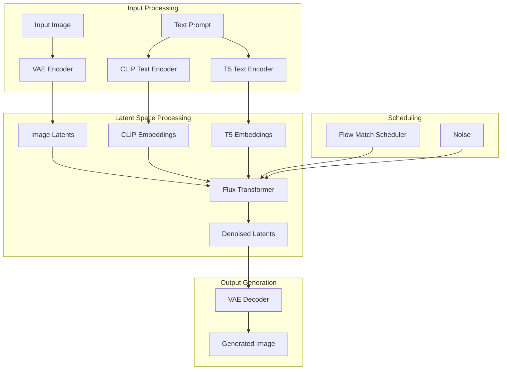
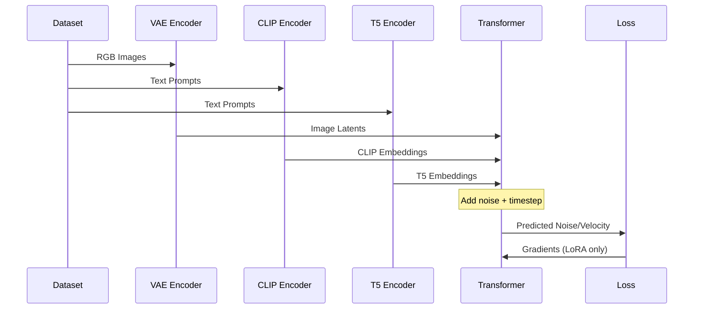
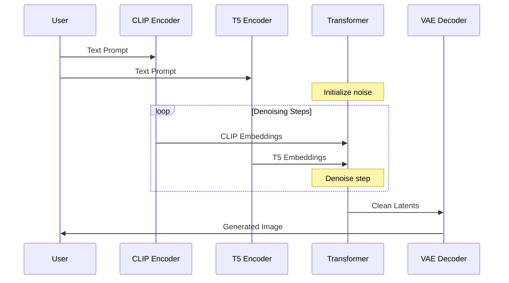

# Flux Kontext Model Architecture Analysis

## Overview

This document provides a comprehensive analysis of the Flux Kontext model architecture, including its components, data flow, and implementation details for integration with our training framework.

## Model Architecture Overview

### High-Level Architecture



### Component Breakdown


#### image process
```python
PREFERRED_KONTEXT_RESOLUTIONS = [
    (672, 1568),
    (688, 1504),
    (720, 1456),
    (752, 1392),
    (800, 1328),
    (832, 1248),
    (880, 1184),
    (944, 1104),
    (1024, 1024),
    (1104, 944),
    (1184, 880),
    (1248, 832),
    (1328, 800),
    (1392, 752),
    (1456, 720),
    (1504, 688),
    (1568, 672),
]
```
FLux got its own resolution preferred.
We could use one of the resolution in it, also can use any other resolution that can be devisible by `16`. Prompt image size could be different than the generated image resolution. It depends on the requirement of your task.

In the training, the size of the image to the VAE can also be different for source and target.

In the FLuxKontext Pipeline, you could adjust  `height`, `width`, `max_area` and `_auto_resize` to control the size.


#### Prompt Encoding (Dual Encoder)
```
(
    prompt_embeds,
    pooled_prompt_embeds,
    text_ids,
) = self.encode_prompt(
    prompt=prompt,
    prompt_2=prompt_2,
    prompt_embeds=prompt_embeds,
    pooled_prompt_embeds=pooled_prompt_embeds,
    device=device,
    num_images_per_prompt=num_images_per_prompt,
    max_sequence_length=max_sequence_length,
    lora_scale=lora_scale,
)
```
Before going to the diffuser, the prompt are encoded by the clip and T5 to get the prompt embedding and a pooled prompt embedding. For a given example, the shape of the output be
```
# shape of prompt_embeds torch.Size([1, 512, 4096])
# shape of pooled_prompt_embeds torch.Size([1, 768])
# shape of text_ids torch.Size([512, 3])
```
Generally, clip only get the high level semantic meanining, and T5 can have the very detailed semantic meaning. Once should notice that the clip cannot handle too much long prompt, it will clip the prompt to a maximum length of the token, say `77` tokens. This leads us to design different prompt for clip and T5. If you have pass the prompt_2, then prompt_2 is feeded into T5 and prompt is feeded into clip, otherwise, it should use same prompt for T5 and clip. But if your prompt is too long, then clip may have strange behavior.

```python
# We only use the pooled prompt output from the CLIPTextModel
pooled_prompt_embeds = self.get_clip_prompt_embeds(
    prompt=prompt,
)
prompt_embeds = self.get_t5_prompt_embeds(
    prompt=prompt_2,
    max_sequence_length=max_sequence_length, # usually 512
)
# shape of prompt_embeds: [batchsize, 512, 4096]
text_ids = torch.zeros(prompt_embeds.shape[1], 3)
# shape of text_ids [512,3]
```

直说：**`text_ids` 不是 token id，也不是 attention mask**。在 Flux 里它是给**3D RoPE 位置编码**用的“**坐标索引**”（shape 通常为 `(seq_len, 3)`）。做法是把文本侧的 `txt_ids` 与图像侧的 `img_ids` 在序列维上拼起来，送进 `FluxPosEmbed` 生成旋转位置编码，再用于注意力计算。([Hugging Face][1])

关键点：

* **文本侧的 `text_ids` 被设为全 0**（见你粘的代码）：等价于“不对文本再施加 RoPE”，因为文本已经由 T5/CLIP 编码器自带位置信息；而 **图像侧 `img_ids`** 则携带 2D 网格坐标（如 `(row, col)`），两者拼接后一起生成位置编码。([GitHub][2], [Hugging Face][1])
* Flux 的 RoPE 是 **三轴** 的（一般可视作 *t/h/w*），配置里常见 `axes_dims_rope = (16, 56, 56)`，三者之和等于每个注意力头的维度（例如 128）。这解释了为什么 `text_ids`/`img_ids` 的最后一维是 3。([Hugging Face][1], [Ollama][3])
* 官方 diffusers 文档/实现展示了这一路径：`txt_ids` 与 `img_ids` → 拼接成 `ids` → `pos_embed(ids)` → 作为 `image_rotary_emb` 进入 transformer。([Hugging Face][4])

因此：**`text_ids` 的作用是为“文本 token 序列部分”占位提供 RoPE 坐标**（默认全 0），以便和图像 token 的坐标一起生成统一的旋转位置编码；正常使用时**无需改动它**，除非你在做自定义的文本侧 RoPE 策略或研究实现细节。([zhouyifan.net][5])

[1]: https://huggingface.co/spaces/InstantX/flux-IP-adapter/blob/main/transformer_flux.py "transformer_flux.py · InstantX/flux-IP-adapter at main"
[2]: https://raw.githubusercontent.com/huggingface/diffusers/main/examples/community/pipeline_flux_with_cfg.py "raw.githubusercontent.com"
[3]: https://ollama.hf-mirror.com/Shakker-Labs/FLUX.1-dev-ControlNet-Union-Pro-2.0/blob/ee7b07538d5c07499f4b92ae4c210a44a18ebf18/controlnet_flux.py?utm_source=chatgpt.com "Shakker-Labs/FLUX.1-dev-ControlNet-Union-Pro-2.0 at ..."
[4]: https://huggingface.co/docs/diffusers/en/api/pipelines/flux "Flux"
[5]: https://zhouyifan.net/2024/09/03/20240809-flux1/ "Stable Diffusion 3「精神续作」FLUX.1 源码深度前瞻解读 | 周弈帆的博客"


##### clip prompt embedding
- **Model**: OpenAI CLIP-based text encoder
- **Purpose**: Primary text understanding and image-text alignment
- **Input**: Tokenized text prompts
- **Output**: Dense text embeddings
- **Characteristics**:
  - Fast inference
  - Good for general image-text understanding
  - Optimized for visual concepts
  - shape [batchsize, 768]
```
def get_clip_prompt_embeds(
    self,
    prompt: Union[str, List[str]],
):
```
The clip prompt embedding go through
1. tokenizer
```
        text_inputs = self.tokenizer(
            prompt,
            padding="max_length",
            max_length=self.tokenizer_max_length,
            truncation=True,
            return_overflowing_tokens=False,
            return_length=False,
            return_tensors="pt",
        )
```
It is from `CLIPTokenizer`
2. text encoder
```
prompt_embeds = self.text_encoder(text_input_ids.to(device), output_hidden_states=False)
```
from `CLIPTextModel` which is the preatained open-ai clip model
3. get pooled embedding
```
prompt_embeds = prompt_embeds.pooler_output
```
Obtain the fixed shape pooled embedding `[batchsize, 768]`


##### T5 prompt embedding
- **Model**: Google T5-based text encoder (likely T5-XXL)
- **Purpose**: Enhanced text understanding and complex prompt interpretation
- **Input**: Tokenized text prompts. The T5-XXL will also truncate the input tokens, but usually the 512 tokens, which is quite large then clip 77.
- **Output**: Rich contextual embeddings
- **Characteristics**:
  - Superior text understanding
  - Better handling of complex prompts
  - Higher memory requirements
  - output shape [batchsize, 512, 4096]  # 512 is the seqeunce
```python
def get_t5_prompt_embeds(
    self,
    prompt: Union[str, List[str]] = None,
    max_sequence_length: int = 512,
):
    text_inputs = self.tokenizer_2(
        prompt,
        padding="max_length",
        max_length=max_sequence_length,
        truncation=True,
        return_length=False,
        return_overflowing_tokens=False,
        return_tensors="pt",
    )
    prompt_embeds = self.text_encoder_2(text_input_ids, output_hidden_states=False)[0]
```
The tokenizer if `T5TokenizerFast`. The model is from `T5EncoderModel` from google.

### Visual Encoding System (VAE)

Now comes to the a kernel step, prepare the latent used for diffusion models
```python
latents, image_latents, latent_ids, image_ids = self.prepare_latents(
            image,
            batch_size * num_images_per_prompt,
            num_channels_latents,
            height,
            width,
            prompt_embeds.dtype,
            device,
            generator,
            latents,
        )
```

```python
    def prepare_latents(
        self,
        image: Optional[torch.Tensor],
        batch_size: int,
        num_channels_latents: int, # 16, fixed
        height: int,
        width: int,
        latents: Optional[torch.Tensor] = None,
    ):
        # VAE applies 8x compression on images but we must also account for packing which requires
        # VAE encoder convert image from shape [3,H,W] -> [16,H/8,W/8]
        # latent height and width to be divisible by 2.
        # self.vae_scale_factor = 8
        height = 2 * (int(height) // (self.vae_scale_factor * 2))
        width = 2 * (int(width) // (self.vae_scale_factor * 2))
        shape = (batch_size, num_channels_latents, height, width)
        # [3,H,W] -> [16,H/8,W/8]

        image_latents = image_ids = None
        image_latents = self.encode_vae_image(image=image)
        # iamge shape [1, 3, 704, 1024] -> latent shape [1, 16, 88, 128] 8x downsampling


        image_latents = torch.cat([image_latents], dim=0)

        image_latent_height, image_latent_width = image_latents.shape[2:]
        image_latents = self._pack_latents(
            image_latents, batch_size, num_channels_latents, image_latent_height, image_latent_width
        )
        #  [1, 16, 88, 128] -> [1, 2816, 64]
        image_ids = self._prepare_latent_image_ids(
            batch_size, image_latent_height // 2, image_latent_width // 2, device, dtype
        )
        # [1, 2816, 64]
        #  tensor(
        # [[ 0.,  0.,  0.],
        # [ 0.,  0.,  1.],
        # [ 0.,  0.,  2.],
        # ...,
        # [ 0., 43., 61.],
        # [ 0., 43., 62.],
        # [ 0., 43., 63.]],
        #
        # image ids are the same as latent ids with the first dimension set to 1 instead of 0
        image_ids[..., 0] = 1

        latent_ids = self._prepare_latent_image_ids(batch_size, height // 2, width // 2, device, dtype)

        if latents is None:
            latents = randn_tensor(shape, generator=generator, device=device, dtype=dtype)
            latents = self._pack_latents(latents, batch_size, num_channels_latents, height, width)
        else:
            latents = latents.to(device=device, dtype=dtype)

        return latents, image_latents, latent_ids, image_ids
```
#### preprocess
the image to the VAE encode is already processs to proper size which is divisable by 16
the width and shape determined the random latent (initial noise for diffusion model). It could be different than the image to VAE encode (prompt image embedding), but should also be divisible by 16.


#### encode_vae_image
Can be simplied as

```python
self.vae.encode(image[i : i + 1]).latent_dist.mode()
```
短答：**为了一致、可复现、少噪声的条件编码**。Flux 在把图像送入 VAE encoder 时默认取 **posterior 的众数（`mode()`，对高斯就是均值）**，而不是随机采样——这样同一张参考图总是得到**相同的 latents**，不额外引入随机噪声；扩散过程本身已经会加噪并建模随机性。Diffusers 的多条 img2img / inpaint / ControlNet 管线也都是这么做的（`latent_dist.mode()`），保持图像条件稳定、结果更可控。([GitHub][1])

要点（直说）

* **确定性/复现性**：使用 `mode()`（均值）→ 同一输入图像映射到同一 latent，编辑/参照生成更稳定；这在官方示例与训练脚本中也作为默认做法（如 InstructPix2Pix 直接用 `vae.encode(...).latent_dist.mode()` 取“原图嵌入”）。([Medium][2])
* **避免“双重噪声”**：扩散采样已经注入随机性，VAE 再随机采样只会引入额外方差、带来抖动；而 SD/Flux 系列的 VAE **posterior 方差通常很小**，均值和一次随机样本几乎无差别，取均值更稳。([fast.ai Course Forums][3], [Reddit][4])
* **生态一致性**：Diffusers 通用的 `retrieve_latents` 就提供两种模式：`"sample"`（随机）和`"argmax"`（取 `mode()`）；多条官方管线默认走后者以保证稳定条件。([Diffchecker][5])

如果你**确实需要随机性**（例如做微小风格扰动/数据增强），可以显式改为采样：

```python
latents = vae.encode(image).latent_dist.sample(generator)  # 而不是 .mode()
# 或者
latents = retrieve_latents(encoder_output, generator, sample_mode="sample")
```

但在大多数 **img2img / 参考图编辑 / inpaint** 场景，**取 `mode()` 更稳、更可控**。([GitHub][1])

[1]: https://github.com/huggingface/diffusers/blob/main/src/diffusers/pipelines/controlnet/pipeline_controlnet_sd_xl_img2img.py?utm_source=chatgpt.com "pipeline_controlnet_sd_xl_img2i..."
[2]: https://medium.com/p/def0b2583c89?utm_source=chatgpt.com "INSTRUCT-PIX2PIX STABLE DIFFUSION DIFFUSION MODEL"
[3]: https://forums.fast.ai/t/lesson-9-official-topic/100562?page=14&utm_source=chatgpt.com "Lesson 9 official topic - Page 14 - Part 2 2022/23"
[4]: https://www.reddit.com/r/StableDiffusion/comments/1ag5h5s/the_vae_used_for_stable_diffusion_1x2x_and_other/?utm_source=chatgpt.com "The VAE used for Stable Diffusion 1.x/2.x and other models ..."
[5]: https://www.diffchecker.com/m2pNMQaT/?utm_source=chatgpt.com "diffusers sdxl t2i vs i2i"

#### pack latent
一句话：这是把 VAE latent 的 `[B,C,H,W]` 做 **space-to-depth(2×2)** 的“打包/分块”，得到以 **2×2 像素块为一个 token** 的序列，供 Flux 的 Transformer 处理与做 3D-RoPE 定位。

| 步骤  | 代码                               | 形状变化                     | 含义                         |
| --- | -------------------------------- | ------------------------ | -------------------------- |
| 输入  | —                                | `[B, C, H, W]`           | VAE 编码后的图像 latent          |
| 分块  | `view(B, C, H//2, 2, W//2, 2)`   | `[B, C, H/2, 2, W/2, 2]` | 把每个 2×2 邻域显式拆出             |
| 轴重排 | `permute(0, 2, 4, 1, 3, 5)`      | `[B, H/2, W/2, C, 2, 2]` | 把“块网格 (H/2×W/2)”放到前面       |
| 拉平  | `reshape(B, (H//2)*(W//2), C*4)` | `[B, (H/2·W/2), 4C]`     | 每个 2×2 块 → 1 个 token，特征维×4 |

直观理解：

* 等价于 **`PixelUnshuffle(2)` + 把空间维展平成序列**。
* 这么做把**序列长度 L 降为原来的 1/4**（注意力开销 \~O(L²) 降幅巨大），同时把**每个 token 的通道维增为 4C**，保留局部 2×2 信息密度。
* 生成的网格 `(H/2, W/2)` 正好用于构建 `image_ids`（行、列坐标 + 域标记）做 **3D RoPE** 定位；文本 token 的 `text_ids` 与之在序列维拼接，实现统一的位置编码。

例子（你注释里的数）：`[1,16,88,128] -> [1, 2816, 64]`

* `seq_len = 88/2 * 128/2 = 44 * 64 = 2816`
* `feat_dim = 16 * 4 = 64`

注意事项：

* 需要 `H`、`W` **是偶数**；否则会 shape 不整除。这也是为什么原来的 w,h 需要被 16 整除
* `view` 依赖内存连续；若上游非连续，优先用 `.reshape(...)`（更稳）。

#### image id

一句话：**`image_ids` 是给 Flux 的 3D RoPE 位置编码用的“网格坐标 + 域标记”**，告诉 Transformer 每个**图像 latent 补丁**在二维网格里的行列位置，并标明这是“图像域”的 token，而不是纯噪声 latent 或文本。([Hugging Face][1])

要点：

* **怎么生成**：对 VAE latent 先按 2×2 打包成补丁（例：`[1,16,88,128] → [1,2816,64]`），再用补丁网格尺寸 `(H/2, W/2)` 构建 `(row, col)` 坐标，形成张量 **`[H/2, W/2, 3]`**，最后展平成 **`[(H/2·W/2), 3]`**。后三维里的 **第2维=行索引，第3维=列索引**。([Hugging Face][1])
* **域标记**：把 **第1维设为 1**（image domain）；对应的 `latent_ids` 用同样网格但域标记默认为 0。这样模型能区分“初始图像补丁”和“要生成/去噪的 latent 补丁”。([Hugging Face][1])
* **如何使用**：生成好 `latent_ids` 后，若是 img2img/编辑流程，会把 `image_ids` **在序列维拼到** `latent_ids` 后面，一起喂给位置嵌入与注意力层，保证空间对齐与跨域注意力。([Hugging Face][1])

别混淆：`image_ids` **不是 token ids / attention mask**；它只携带**位置与域信息**，供 **FluxPosEmbed/3D RoPE** 计算旋转位置编码使用。([Hugging Face][1])

[1]: https://huggingface.co/spaces/kontext-community/FLUX.1-Kontext-multi-image/blob/main/pipeline_flux_kontext.py "pipeline_flux_kontext.py · kontext-community/FLUX.1-Kontext-multi-image at main"

直说：它在**为每个 latent 补丁生成 2D 网格坐标**，供 Flux 的 **3D RoPE 位置编码**用。

* 先建张量 `[H, W, 3]`，全 0。三个通道语义是：`[domain, row, col]`。
* 用 `torch.arange(height)[:, None]` 写入第 2 通道 ⇒ 每行的 **行索引**（0…H-1）。
* 用 `torch.arange(width)[None, :]` 写入第 3 通道 ⇒ 每列的 **列索引**（0…W-1）。
* `domain` 通道保持 0（表示“latent 域”）；若是参考图像的 `image_ids` 一般把它设为 1，用于区分域。
* 最后把网格展平成 `[(H·W), 3]` 并转到指定 `device/dtype`；后续再按 batch 维度进行 `repeat`/拼接，与 `text_ids`、`image_ids`一起送入 RoPE。

直观例子：对位置 `(i, j)`，得到的 ID 就是 `[0, i, j]`。这让 transformer 在注意力里“知道”每个 token 对应的**行、列**（以及属于**哪个域**）。

### Diffusion Step

#### Timesteps

```python
       sigmas = np.linspace(1.0, 1 / num_inference_steps, num_inference_steps) if sigmas is None else sigmas
        # sigmas [1.   0.95 0.9  0.85 0.8  0.75 0.7  0.65 0.6  0.55 0.5  0.45 0.4  0.35
        #  0.3  0.25 0.2  0.15 0.1  0.05]
        # image_seq_len 4081
        image_seq_len = latents.shape[1]
        mu = calculate_shift(
            image_seq_len,
            self.scheduler.config.get("base_image_seq_len", 256),
            self.scheduler.config.get("max_image_seq_len", 4096),
            self.scheduler.config.get("base_shift", 0.5),
            self.scheduler.config.get("max_shift", 1.15),
        )
        # mu: 1.1474609375
        timesteps, num_inference_steps = retrieve_timesteps(
            self.scheduler,
            num_inference_steps,
            device,
            sigmas=sigmas,
            mu=mu,
        )
        # timesteps tensor([1000.0000,  983.5671,  965.9304,  946.9526,  926.4745,  904.3112,
        #         880.2457,  854.0219,  825.3360,  793.8240,  759.0469,  720.4692,
        #         677.4321,  629.1149,  574.4824,  512.2097,  440.5739,  357.2913,
        #         259.2705,  142.2193], device='cuda:0')
```
**Flux 的 `timesteps` 由两件事共同决定**——你给定的**噪声日程 `sigmas`**，以及按分辨率/序列长度自适应的**时间偏移系数 `mu`**。二者传进 `FlowMatchEulerDiscreteScheduler.set_timesteps(...)` 后，被映射成你看到的那串从 \~1000 递减到 \~140 的离散时间步。

要点拆解

* **`sigmas`（噪声强度表）**
  你的代码用线性表：`np.linspace(1.0, 1/steps, steps)`；调度器也支持内置的 Karras/指数等方案。这些值规定了每一步的噪声级。([Hugging Face][1])
* **`mu`（分辨率相关的“时间位移”）**
  先按**序列长度**算一个位移量，随后在 `set_timesteps` 里对 `sigmas` 进行**分辨率相关的时序平移/拉伸**：

  $$
  \mu \;=\; m \cdot \text{image\_seq\_len} + b,\quad
  m=\frac{\text{max\_shift}-\text{base\_shift}}{\text{max\_seq\_len}-\text{base\_seq\_len}},\;
  b=\text{base\_shift}-m\cdot \text{base\_seq\_len}.
  $$

  这样当序列从 `base_image_seq_len` 增到 `max_image_seq_len` 时，`mu` 会从 `base_shift` 线性过渡到 `max_shift`。你例子里 `image_seq_len≈4081` 得到 `mu≈1.14746` 接近上限。([GitHub][2])
* **调度器如何用它们**
  `retrieve_timesteps(...)` 内部调用 `scheduler.set_timesteps(num_inference_steps, sigmas=sigmas, mu=mu, ...)`；调度器据此产生**离散的训练时间刻度**（默认总长 1000）用于每一步反推噪声。**`mu` 控制“分辨率依赖的 timestep shifting”力度**：分辨率/序列越大，位移越强，从而调整去噪过程的侧重；官方文档也给了各参数在一致性/变化程度上的直观作用。([Hugging Face][1])

换句话说：
**`sigmas` 定形，`mu` 校准**（随分辨率而变），最终由 `FlowMatchEulerDiscreteScheduler` 把二者映射成你看到的 `timesteps` 序列，用于每一步的去噪更新。想自定义行为，可以改 `sigmas`（如用 Karras）或直接传入自定义 `timesteps`/`shift`。([Hugging Face][3])

[1]: https://huggingface.co/docs/diffusers/en/api/schedulers/flow_match_euler_discrete "FlowMatchEulerDiscreteScheduler"
[2]: https://raw.githubusercontent.com/linoytsaban/diffusers/rf-inversion/examples/community/pipeline_flux_rf_inversion.py?utm_source=chatgpt.com "https://raw.githubusercontent.com/linoytsaban/diff..."
[3]: https://huggingface.co/docs/diffusers/en/api/pipelines/flux?utm_source=chatgpt.com "Flux"

#### guidance
####

## 3. Core Transformer Architecture

### Flux Transformer Design
- **Architecture**: Transformer-based diffusion model
- **Input**: Concatenated image and text latents
- **Attention Mechanism**: Multi-head self-attention with cross-attention
- **Layers**: Typically 19-38 transformer blocks
- **Hidden Size**: 3072-4096 dimensions
- **Attention Heads**: 24-32 heads

### Transformer Block Structure
```python
class FluxTransformerBlock:
    def __init__(self, hidden_size, num_heads):
        self.norm1 = LayerNorm(hidden_size)
        self.self_attn = MultiHeadAttention(hidden_size, num_heads)
        self.norm2 = LayerNorm(hidden_size)
        self.cross_attn = MultiHeadAttention(hidden_size, num_heads)
        self.norm3 = LayerNorm(hidden_size)
        self.mlp = FeedForward(hidden_size)

    def forward(self, x, encoder_hidden_states):
        # Self-attention on image latents
        residual = x
        x = self.norm1(x)
        x = self.self_attn(x) + residual

        # Cross-attention with text embeddings
        residual = x
        x = self.norm2(x)
        x = self.cross_attn(x, encoder_hidden_states) + residual

        # Feed-forward network
        residual = x
        x = self.norm3(x)
        x = self.mlp(x) + residual

        return x
```

### LoRA Target Modules
The following modules are typically targeted for LoRA fine-tuning:
- `to_q`: Query projection in attention
- `to_k`: Key projection in attention
- `to_v`: Value projection in attention
- `to_out.0`: Output projection in attention

## 4. Flow Matching Scheduler

### Scheduler Architecture
- **Type**: Flow Matching (Rectified Flow)
- **Noise Schedule**: Linear or cosine schedule
- **Timesteps**: Typically 50-1000 steps
- **Sampling**: Euler or DPM-Solver methods

### Flow Matching Process
```python
def flow_matching_step(x_t, t, model, text_embeds):
    """
    Single step of flow matching denoising.
    """
    # Predict velocity field
    v_pred = model(x_t, t, text_embeds)

    # Update latents using flow equation
    dt = scheduler.get_timestep_spacing()
    x_next = x_t + dt * v_pred

    return x_next
```

## Data Flow Analysis

### Training Data Flow



### Inference Data Flow


