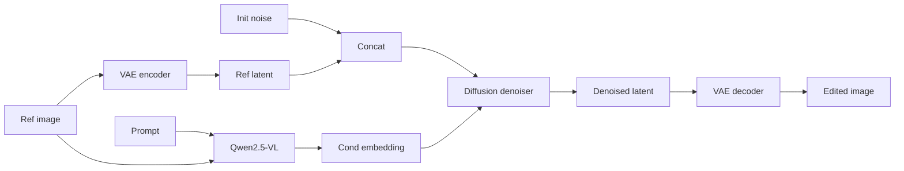
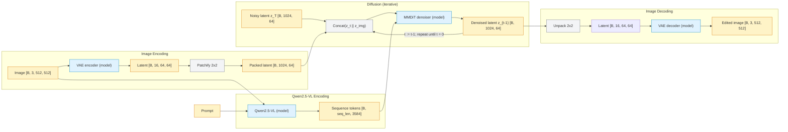
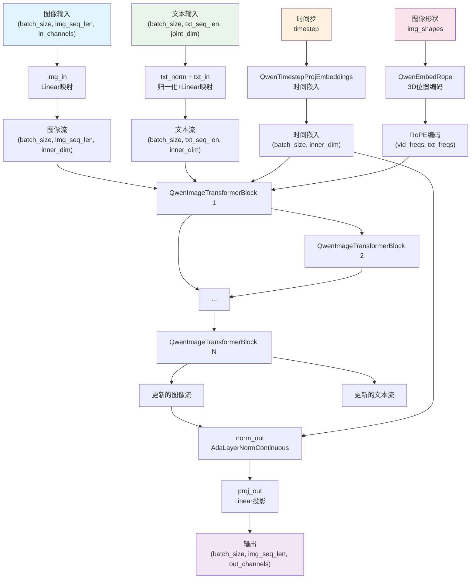
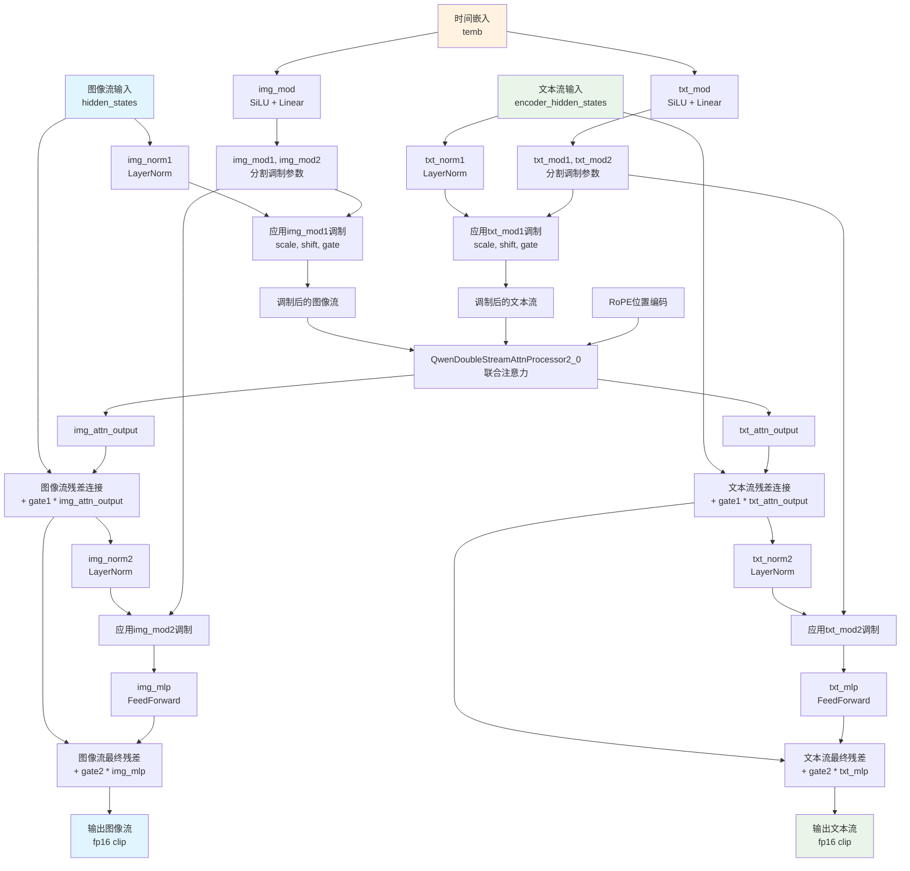
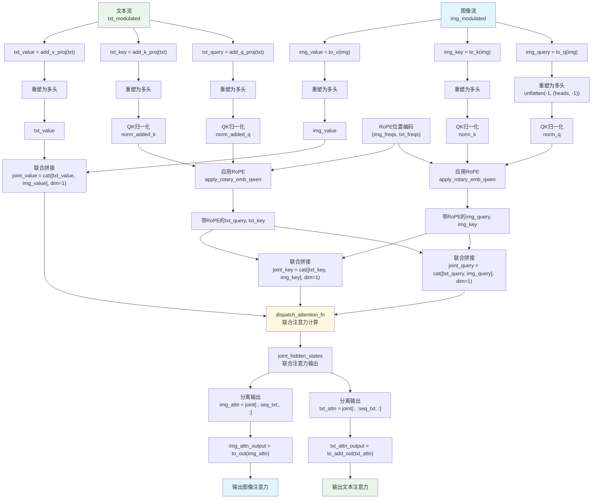
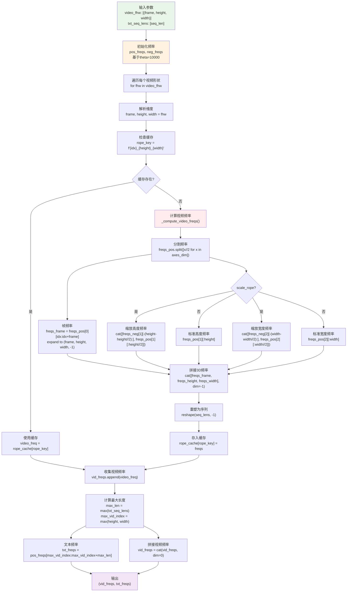
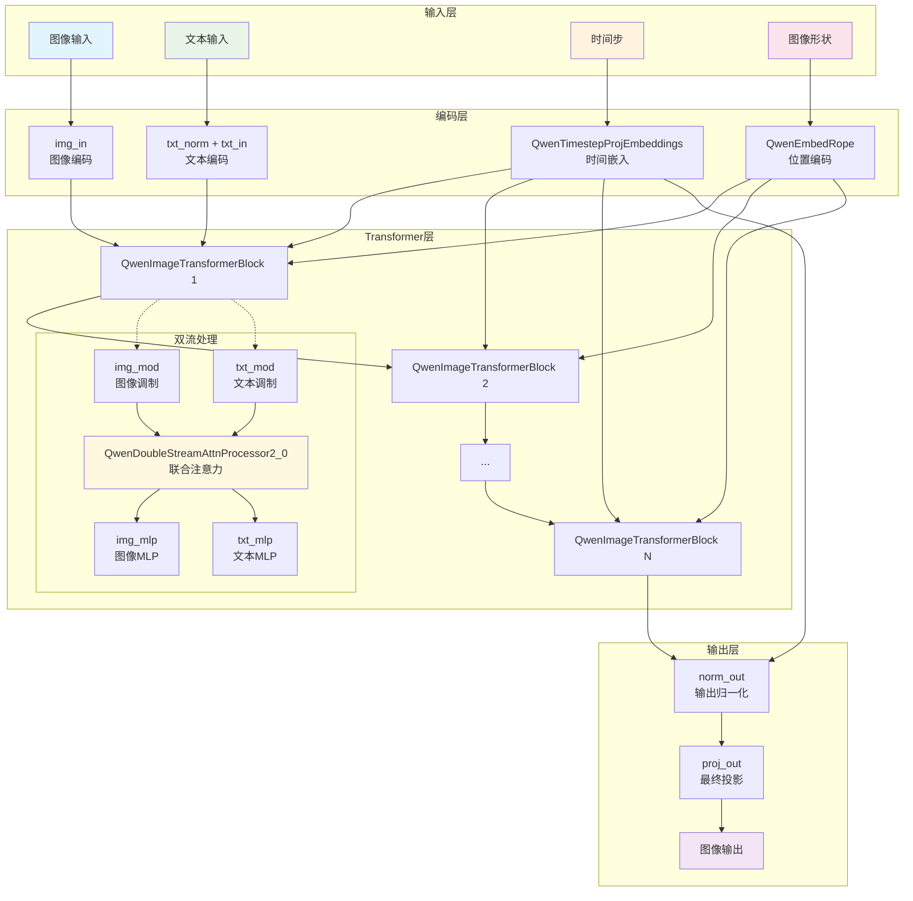

# Qwen Image Edit Architecture

## Model Overview

要了解 Qwen-Image-Edit 模型，首先我们要了解图片生成模型都是怎么工作的。生成模型从最初的 GAN 到现在的 latent diffusion 经历了很多的演变。Latent Diffusion 又涉及到 VAE 和扩散模型的原理，这些基础先要理解清楚。
- VAE: https://mad-sg.github.io/generative-ai-start-to-surrender/book/chapter6_VAE/vae_introduction/
- Diffusion: https://mad-sg.github.io/generative-ai-start-to-surrender/book/chapter7_diffusion/ddpm/

这上面有链接 对 VAE 和 Diffusion 有介绍

假设我们有了上述的理解，那我们就有一个大概的 latent diffusion 模型的一个架构了。 首先得有一个 VAE，这个主要用来做压缩，节省计算量。VAE 将图片压缩的 latent 空间，具有更紧凑的语义特征以及低层特征。 同时 VAE 的 AE 是不一样，这里需要理解清楚， VAE encoder 得到的是一个 mean 和 std，需要进行采样，才是统计空间里的具体的样本。 但是也可能只用这个 mean，如果预测的分布是一个比较窄的高斯分布，那 mean 和 sample 差别就不大，而且更加稳定。用 sample 的话好处是能得到更多的多样性。 如果这个实在不太清楚 就理解成 AE，对于 latent diffusion 的理解影响不大，后续再详细理解什么是 VAE。


然后另外一个模块就是对 prompt 的处理，最开始 prompt 只包括文本，目的是将文本转化为一个 包含了语义信息的embedding，然后注入到扩散模型里，相当于扩散的条件 `C`, 条件生成模型。最早的 stable diffusion 和 Flux 模型都是使用预训练的文本 embedding 模型，例如 clip 或者 T5,将文本转化为 embedding。 注入到扩散模型里。embedding 可能是一个 1 维的向量，浓缩了高度的信息，知道图片生成。但是问题是这种语义太过浓缩了，就没法控制一些精确的细节，因此后续也会用 T5 生成一个更加底层的 embedding，不再是一个一维的向量，而是一个 sequence token，更能充分包含更多信息，就能包含更多细节的信息。说一从整体的结构来说，我们需要给扩散模型提供一个条件的信息。那对于图片编辑类型的生成模型，是不是图片本身也可以提供语义信息作为条件，这样比只用 prompt 的文本信息，会更加充分。真好，目前的多模态大模型能完美提供这个条件，而且正好可以利用到多模态大模型发展带来的益处。



总体而言，对于 Qwen-Image-Edit, prompt和参考图片本身经过 Qwen2.5-VL 生成了一个 embedding，用来作为 diffusion 模块的条件。
作为图片编辑的 diffusion 模块，是直接借鉴了 Flux Kontext的设计，输入除了 noise latent, 还有一个参考图片经过 VAE encoder 的 decoder.因为图片编辑需要保持identity 不变，那么最好的方式是在原图上修改。但是 diffusion 是不支持直接在原图上进行修改的，它需要从一个 noise 逐步过度到真实图片。那么一个可行的方案，就是把 noise 和 prompt image latent concat 起来，这样模型也能看到原图。就可以让 diffusion 在后续的 attention 过程中，直接获取原图的信息，从而减少图片生成的难度以及对 object identity 的维持。 总体而言，整体的结构就和上面的流程图一样。 接下来我们再了解 diffusion 模块的细节。关于 VAE 和 Qwen2.5-VL 的内容，我们在其他模块里再仔细分析。

下面我们 总体介绍一下 Qwen-Image-Edit 的图片编辑过程，以一个 512x512 的图片为例子

```
1. 输入预处理
   原图: [B, 3, 512, 512] → VAE编码 → [B, 16, 1, 64, 64]

2. Latent打包
   [B, 16, 64, 64] → 2×2打包 → [B, 1024, 64]

3. 文本编码
   ["添加小猫",参考图片]→ Qwen2.5-VL → prompt embedding -> [B, seq_len, 3584]

4. 扩散过程 (50步迭代)
   noise latent = random gaussian sampling -> [B, 1024, 64]
   for loop:
      concat_latent = concat(noise latent , image latent) -> [B,2048,64]
      -> concat_latent, prompt embedding -> 去噪步骤  -> 新的 latent -> [B,2048,64]
      -> 提取钱 1024 个 patch -> [B,1024,64]
      -> 替换 noise latent

5. 结果生成
   denoised latent-> unpack latent  [B, 16, 64, 64] -> 最终latent → VAE解码 → [B, 3, 512, 512]
```

## Qwen-Image-Edit MMDiT
现在我们来进一步分析 Qwen-Image-Edit 的模型结构，可以和 Flux Kontext 模型的 MMDiT 进行对比。通过比较他们的不同之处，就能比较容易理解 Qwen-Image-Edit 的改动之处。
我们按照从上到下的思路进行分析，先分析大的结构，再考虑小的结构。

提前先总结一下他们差异的部分

|维度| Qwen-Image-Edit MMDiT| Flux Kontext MMDiT|
|---|---|---|
|输入| prompt embedding 只有一个，由 Qwen2.5-VL提供 | prompt embedding 有两个，由 CLIP 和T5 分别提供|
| MMDiT block| 全程使用 双流 DiT 模块，60 层| 前面是双流，后面是单流|
|latent patch | 对 latent 做 2x2 的 patchify| 不做|
|位置编码| 使用
### 整体架构图

#### Qwen-Image-Edit



#### Flux Kontext


## 模块详细分析

### 1. QwenImageTransformer2DModel（顶层模型）

#### 作用
- 整个模型的主入口和协调器
- 管理图像和文本的编码、变换和解码过程
- 控制扩散过程的时间步处理

#### 输入
- `hidden_states`: 图像序列张量 `(batch_size, image_sequence_length, in_channels)`
- `encoder_hidden_states`: 文本条件嵌入 `(batch_size, text_sequence_length, joint_attention_dim)`
- `encoder_hidden_states_mask`: 文本掩码
- `timestep`: 扩散时间步
- `img_shapes`: 图像形状信息 `[(frame, height, width), ...]`
- `txt_seq_lens`: 文本序列长度列表

#### 输出
- `sample`: 处理后的图像特征 `(batch_size, image_sequence_length, out_channels)`

#### 处理流程
1. **输入编码**：
   - 图像: `img_in` Linear层将输入通道数映射到内部维度
   - 文本: `txt_norm` + `txt_in` 对文本进行归一化和维度映射

2. **时间嵌入**：
   - 通过`time_text_embed`生成时间条件嵌入

3. **位置编码**：
   - 通过`pos_embed`生成RoPE位置编码

4. **Transformer块处理**：
   - 通过多个`QwenImageTransformerBlock`进行双流处理

5. **输出投影**：
   - `norm_out` + `proj_out` 生成最终输出

### 2. QwenImageTransformerBlock（核心Transformer块）

#### 作用
- 实现双流架构的核心计算单元
- 同时处理图像流和文本流，并进行交互

#### 输入
- `hidden_states`: 图像流特征
- `encoder_hidden_states`: 文本流特征
- `temb`: 时间嵌入
- `image_rotary_emb`: RoPE位置编码

#### 输出
- 更新后的图像流和文本流特征

#### 处理流程

1. **调制计算**：
   ```python
   img_mod_params = self.img_mod(temb)  # 图像调制参数
   txt_mod_params = self.txt_mod(temb)  # 文本调制参数
   ```

2. **第一阶段处理**：
   - 层归一化: `img_norm1`, `txt_norm1`
   - 调制应用: `_modulate()` 函数应用scale、shift、gate

3. **联合注意力**：
   - 通过`QwenDoubleStreamAttnProcessor2_0`进行联合注意力计算
   - 输出分离为图像和文本两个流

4. **残差连接**：
   - 添加门控残差连接

5. **第二阶段处理**：
   - 再次进行归一化、调制和MLP处理
   - 最终残差连接

6. **数值稳定性**：
   - 对fp16进行clip防止溢出

#### 双流处理流程图



### 3. QwenDoubleStreamAttnProcessor2_0（联合注意力处理器）

#### 作用
- 实现图像流和文本流的联合注意力机制
- 核心的双流交互逻辑

#### 输入
- `hidden_states`: 图像流 (样本)
- `encoder_hidden_states`: 文本流 (上下文)
- `image_rotary_emb`: RoPE位置编码

#### 输出
- `(img_attn_output, txt_attn_output)`: 图像和文本的注意力输出

#### 处理流程

1. **QKV计算**：
   ```python
   # 图像流QKV
   img_query = attn.to_q(hidden_states)
   img_key = attn.to_k(hidden_states)
   img_value = attn.to_v(hidden_states)

   # 文本流QKV
   txt_query = attn.add_q_proj(encoder_hidden_states)
   txt_key = attn.add_k_proj(encoder_hidden_states)
   txt_value = attn.add_v_proj(encoder_hidden_states)
   ```

2. **多头重塑**：
   - 将QKV重塑为多头注意力格式

3. **QK归一化**：
   - 应用查询和键的归一化

4. **RoPE应用**：
   - 对QK应用旋转位置编码

5. **联合注意力**：
   ```python
   # 拼接：[文本, 图像]
   joint_query = torch.cat([txt_query, img_query], dim=1)
   joint_key = torch.cat([txt_key, img_key], dim=1)
   joint_value = torch.cat([txt_value, img_value], dim=1)
   ```

6. **注意力计算**：
   - 使用`dispatch_attention_fn`进行高效注意力计算

7. **结果分离**：
   - 将联合注意力结果分离回图像和文本流

#### 联合注意力机制流程图



### 4. QwenEmbedRope（RoPE位置编码）

#### 作用
- 生成3D旋转位置编码（帧、高度、宽度）
- 支持视频和图像的位置信息编码

#### 输入
- `video_fhw`: 视频/图像形状 `[(frame, height, width), ...]`
- `txt_seq_lens`: 文本序列长度列表
- `device`: 计算设备

#### 输出
- `(vid_freqs, txt_freqs)`: 图像和文本的频率张量

#### 处理流程

1. **频率计算**：
   ```python
   # 为每个维度计算频率
   freqs = torch.outer(index, 1.0 / torch.pow(theta, torch.arange(0, dim, 2).div(dim)))
   freqs = torch.polar(torch.ones_like(freqs), freqs)  # 转换为复数
   ```

2. **3D位置编码**：
   - 帧维度: `freqs_frame`
   - 高度维度: `freqs_height`
   - 宽度维度: `freqs_width`

3. **缩放处理**：
   - 支持`scale_rope`选项进行频率缩放

4. **缓存机制**：
   - 使用`rope_cache`缓存计算结果
   - 支持动态编译模式

#### RoPE位置编码流程图



### 5. QwenTimestepProjEmbeddings（时间步嵌入）

#### 作用
- 将扩散过程的时间步转换为嵌入向量
- 为模型提供时间条件信息

#### 输入
- `timestep`: 时间步张量
- `hidden_states`: 隐藏状态（用于dtype匹配）

#### 输出
- `conditioning`: 时间条件嵌入

#### 处理流程

1. **时间投影**：
   ```python
   timesteps_proj = self.time_proj(timestep)  # Sinusoidal embedding
   ```

2. **嵌入变换**：
   ```python
   timesteps_emb = self.timestep_embedder(timesteps_proj)  # MLP变换
   ```

## 辅助函数

### get_timestep_embedding
- **作用**：生成正弦余弦时间步嵌入
- **特点**：支持频率缩放、相位翻转等参数

### apply_rotary_emb_qwen
- **作用**：应用旋转位置编码到查询和键张量
- **特点**：支持复数和实数两种模式

## 模块协作关系

### 数据流向
1. **输入处理**：图像和文本分别通过embedding层
2. **时间编码**：时间步通过`QwenTimestepProjEmbeddings`编码
3. **位置编码**：通过`QwenEmbedRope`生成3D位置编码
4. **双流处理**：多个`QwenImageTransformerBlock`进行联合处理
5. **输出生成**：最终通过归一化和投影生成结果

### 关键交互点
- **联合注意力**：在`QwenDoubleStreamAttnProcessor2_0`中实现图像-文本交互
- **调制机制**：时间嵌入通过调制影响每一层的处理
- **位置信息**：RoPE为注意力提供空间和时间位置信息

### 模块协作关系图


