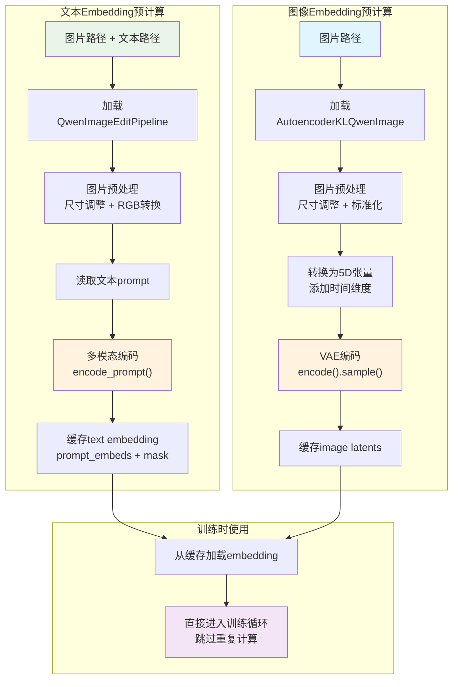
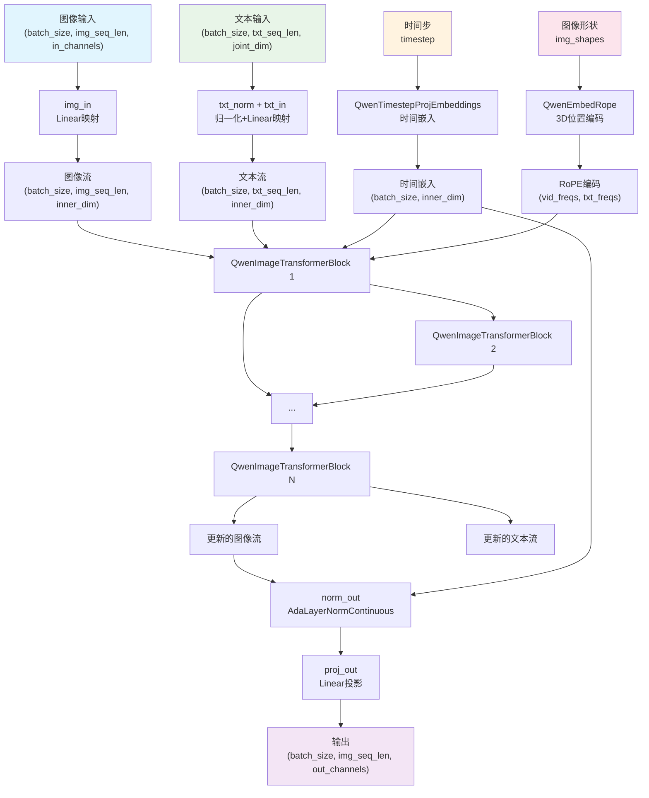
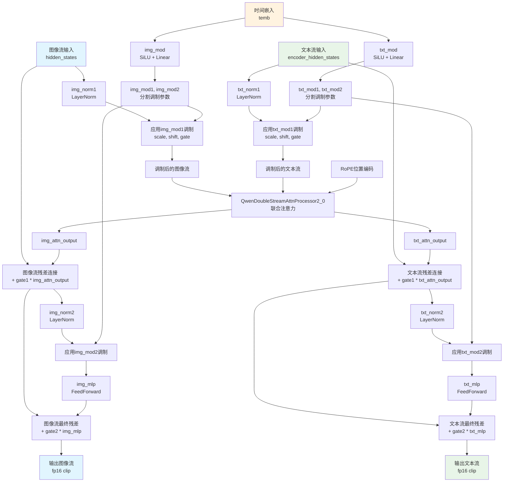
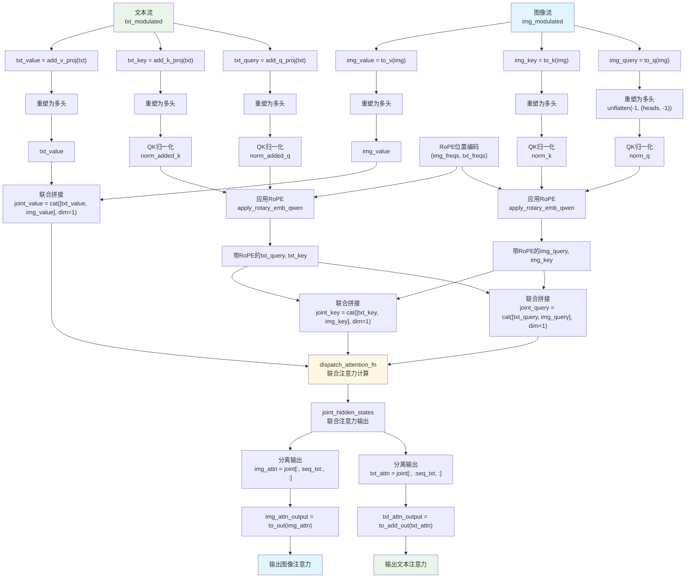
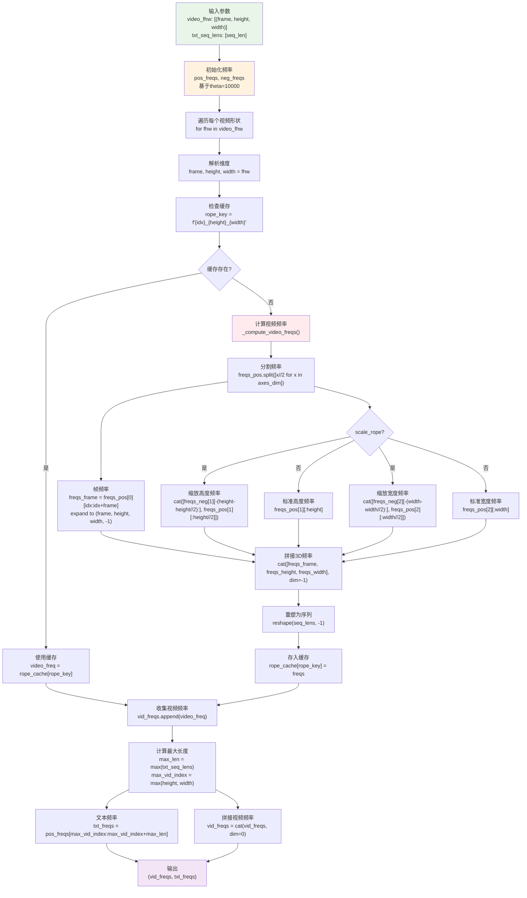
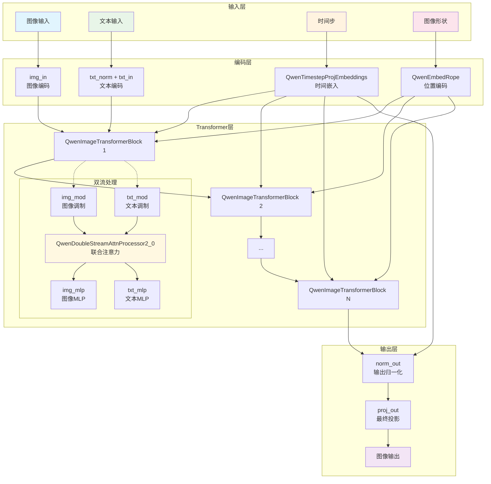

# Qwen Image模型架构详解

## 模型概述

Qwen Image是一个基于双流架构（Double-Stream Architecture）的扩散模型，用于图像编辑和生成任务。该模型采用联合注意力机制同时处理图像和文本信息，实现文本引导的图像生成/编辑。

## 数据预处理管道

### Embedding预计算流程概述

在模型训练之前，Qwen Image使用预计算的embedding来提高训练效率。整个预处理过程包括**文本embedding预计算**和**图像embedding预计算**两个并行的管道。

### 文本Embedding预计算过程

#### 处理流程
1. **初始化文本编码管道**
   ```python
   text_encoding_pipeline = QwenImageEditPipeline.from_pretrained(
       args.pretrained_model_name_or_path, transformer=None, vae=None, torch_dtype=weight_dtype
   )
   ```
   - **作用**：加载预训练的Qwen图像编辑管道，但只保留文本编码部分
   - **输入**：预训练模型路径
   - **输出**：文本编码管道对象

2. **图片和文本配对处理**
   ```python
   for img_name in tqdm([i for i in os.listdir(args.data_config.control_dir) if ".png" in i or '.jpg' in i]):
       img_path = os.path.join(args.data_config.control_dir, img_name)
       txt_path = os.path.join(args.data_config.img_dir, img_name.split('.')[0] + '.txt')
   ```
   - **作用**：遍历控制图片目录，为每张图片找到对应的文本文件
   - **输入**：图片目录和文本目录路径
   - **输出**：图片路径和对应文本路径的配对

3. **图片预处理和尺寸计算**
   ```python
   img = Image.open(img_path).convert('RGB')
   calculated_width, calculated_height, _ = calculate_dimensions(1024 * 1024, img.size[0] / img.size[1])
   prompt_image = text_encoding_pipeline.image_processor.resize(img, calculated_height, calculated_width)
   ```
   - **作用**：
     - 打开图片并转换为RGB格式
     - 根据原图比例计算新的宽高（保持总像素数为1024×1024）
     - 将图片调整到计算出的尺寸
   - **输入**：图片路径
   - **输出**：预处理后的图片张量

4. **多模态编码**
   ```python
   prompt = open(txt_path).read()
   prompt_embeds, prompt_embeds_mask = text_encoding_pipeline.encode_prompt(
       image=prompt_image,
       prompt=[prompt],
       device=text_encoding_pipeline.device,
       num_images_per_prompt=1,
       max_sequence_length=1024,
   )
   ```
   - **作用**：
     - 读取文本内容
     - 将图片和文本一起编码为embedding（多模态融合）
     - 生成注意力mask用于后续计算
   - **输入**：预处理后的图片 + 文本prompt
   - **输出**：prompt_embeds（文本embedding）和 prompt_embeds_mask（注意力mask）

5. **Embedding缓存**
   ```python
   cached_text_embeddings[img_name.split('.')[0] + '.txt'] = {
       'prompt_embeds': prompt_embeds[0].to('cpu'),
       'prompt_embeds_mask': prompt_embeds_mask[0].to('cpu')
   }
   ```
   - **作用**：将计算出的embedding保存到内存或磁盘，避免训练时重复计算
   - **输入**：计算出的embedding
   - **输出**：缓存的embedding字典

### 图像Embedding预计算过程

#### 处理流程
1. **VAE编码器初始化**
   ```python
   vae = AutoencoderKLQwenImage.from_pretrained(
       args.pretrained_model_name_or_path, subfolder="vae"
   )
   ```
   - **作用**：加载变分自编码器（VAE），用于将图片编码到潜在空间
   - **输入**：预训练模型路径
   - **输出**：VAE编码器对象

2. **目标图片预处理**
   ```python
   img = Image.open(os.path.join(args.data_config.img_dir, img_name)).convert('RGB')
   calculated_width, calculated_height, _ = calculate_dimensions(1024 * 1024, img.size[0] / img.size[1])
   img = text_encoding_pipeline.image_processor.resize(img, calculated_height, calculated_width)
   ```
   - **作用**：遍历目标图片目录，调整图片尺寸保持比例
   - **输入**：图片目录路径
   - **输出**：预处理后的图片

3. **图片标准化处理**
   ```python
   img = torch.from_numpy((np.array(img) / 127.5) - 1)
   img = img.permute(2, 0, 1).unsqueeze(0)
   pixel_values = img.unsqueeze(2)  # 添加时间维度
   ```
   - **作用**：
     - 将像素值从[0,255]标准化到[-1,1]
     - 调整张量维度：(H,W,C) → (C,H,W) → (1,C,H,W) → (1,C,1,H,W)
     - 添加时间维度变成5D张量以适配VAE
   - **输入**：PIL图片
   - **输出**：标准化的5D张量

4. **VAE潜在空间编码**
   ```python
   pixel_latents = vae.encode(pixel_values).latent_dist.sample().to('cpu')[0]
   ```
   - **作用**：使用VAE将图片编码到潜在空间，大幅降低计算复杂度
   - **输入**：标准化的图片张量
   - **输出**：图片的潜在表示（latent）

5. **控制图片处理**
   - 对控制图片目录执行相同的VAE编码过程
   - 生成控制图片的embedding用于条件生成

### 预计算流程图



### 预计算的优势

1. **训练加速**：避免每个epoch重复计算embedding，显著提升训练速度
2. **内存优化**：可选择磁盘缓存模式，减少GPU内存占用
3. **一致性保证**：所有训练步骤使用相同的embedding，确保训练稳定性
4. **多模态融合**：文本embedding已经包含图像信息，提供更丰富的语义表示

## 整体架构

### 核心特性
- **双流架构**：同时处理图像流和文本流
- **联合注意力**：图像和文本信息进行联合注意力计算
- **RoPE位置编码**：支持3D位置编码（时间、高度、宽度）
- **扩散过程**：基于时间步的去噪生成

### 整体架构流程图



## 模块详细分析

### 1. QwenImageTransformer2DModel（顶层模型）

#### 作用
- 整个模型的主入口和协调器
- 管理图像和文本的编码、变换和解码过程
- 控制扩散过程的时间步处理

#### 输入
- `hidden_states`: 图像序列张量 `(batch_size, image_sequence_length, in_channels)`
- `encoder_hidden_states`: 文本条件嵌入 `(batch_size, text_sequence_length, joint_attention_dim)`
- `encoder_hidden_states_mask`: 文本掩码
- `timestep`: 扩散时间步
- `img_shapes`: 图像形状信息 `[(frame, height, width), ...]`
- `txt_seq_lens`: 文本序列长度列表

#### 输出
- `sample`: 处理后的图像特征 `(batch_size, image_sequence_length, out_channels)`

#### 处理流程
1. **输入编码**：
   - 图像: `img_in` Linear层将输入通道数映射到内部维度
   - 文本: `txt_norm` + `txt_in` 对文本进行归一化和维度映射

2. **时间嵌入**：
   - 通过`time_text_embed`生成时间条件嵌入

3. **位置编码**：
   - 通过`pos_embed`生成RoPE位置编码

4. **Transformer块处理**：
   - 通过多个`QwenImageTransformerBlock`进行双流处理

5. **输出投影**：
   - `norm_out` + `proj_out` 生成最终输出

### 2. QwenImageTransformerBlock（核心Transformer块）

#### 作用
- 实现双流架构的核心计算单元
- 同时处理图像流和文本流，并进行交互

#### 输入
- `hidden_states`: 图像流特征
- `encoder_hidden_states`: 文本流特征
- `temb`: 时间嵌入
- `image_rotary_emb`: RoPE位置编码

#### 输出
- 更新后的图像流和文本流特征

#### 处理流程

1. **调制计算**：
   ```python
   img_mod_params = self.img_mod(temb)  # 图像调制参数
   txt_mod_params = self.txt_mod(temb)  # 文本调制参数
   ```

2. **第一阶段处理**：
   - 层归一化: `img_norm1`, `txt_norm1`
   - 调制应用: `_modulate()` 函数应用scale、shift、gate

3. **联合注意力**：
   - 通过`QwenDoubleStreamAttnProcessor2_0`进行联合注意力计算
   - 输出分离为图像和文本两个流

4. **残差连接**：
   - 添加门控残差连接

5. **第二阶段处理**：
   - 再次进行归一化、调制和MLP处理
   - 最终残差连接

6. **数值稳定性**：
   - 对fp16进行clip防止溢出

#### 双流处理流程图



### 3. QwenDoubleStreamAttnProcessor2_0（联合注意力处理器）

#### 作用
- 实现图像流和文本流的联合注意力机制
- 核心的双流交互逻辑

#### 输入
- `hidden_states`: 图像流 (样本)
- `encoder_hidden_states`: 文本流 (上下文)
- `image_rotary_emb`: RoPE位置编码

#### 输出
- `(img_attn_output, txt_attn_output)`: 图像和文本的注意力输出

#### 处理流程

1. **QKV计算**：
   ```python
   # 图像流QKV
   img_query = attn.to_q(hidden_states)
   img_key = attn.to_k(hidden_states)
   img_value = attn.to_v(hidden_states)

   # 文本流QKV
   txt_query = attn.add_q_proj(encoder_hidden_states)
   txt_key = attn.add_k_proj(encoder_hidden_states)
   txt_value = attn.add_v_proj(encoder_hidden_states)
   ```

2. **多头重塑**：
   - 将QKV重塑为多头注意力格式

3. **QK归一化**：
   - 应用查询和键的归一化

4. **RoPE应用**：
   - 对QK应用旋转位置编码

5. **联合注意力**：
   ```python
   # 拼接：[文本, 图像]
   joint_query = torch.cat([txt_query, img_query], dim=1)
   joint_key = torch.cat([txt_key, img_key], dim=1)
   joint_value = torch.cat([txt_value, img_value], dim=1)
   ```

6. **注意力计算**：
   - 使用`dispatch_attention_fn`进行高效注意力计算

7. **结果分离**：
   - 将联合注意力结果分离回图像和文本流

#### 联合注意力机制流程图



### 4. QwenEmbedRope（RoPE位置编码）

#### 作用
- 生成3D旋转位置编码（帧、高度、宽度）
- 支持视频和图像的位置信息编码

#### 输入
- `video_fhw`: 视频/图像形状 `[(frame, height, width), ...]`
- `txt_seq_lens`: 文本序列长度列表
- `device`: 计算设备

#### 输出
- `(vid_freqs, txt_freqs)`: 图像和文本的频率张量

#### 处理流程

1. **频率计算**：
   ```python
   # 为每个维度计算频率
   freqs = torch.outer(index, 1.0 / torch.pow(theta, torch.arange(0, dim, 2).div(dim)))
   freqs = torch.polar(torch.ones_like(freqs), freqs)  # 转换为复数
   ```

2. **3D位置编码**：
   - 帧维度: `freqs_frame`
   - 高度维度: `freqs_height`
   - 宽度维度: `freqs_width`

3. **缩放处理**：
   - 支持`scale_rope`选项进行频率缩放

4. **缓存机制**：
   - 使用`rope_cache`缓存计算结果
   - 支持动态编译模式

#### RoPE位置编码流程图



### 5. QwenTimestepProjEmbeddings（时间步嵌入）

#### 作用
- 将扩散过程的时间步转换为嵌入向量
- 为模型提供时间条件信息

#### 输入
- `timestep`: 时间步张量
- `hidden_states`: 隐藏状态（用于dtype匹配）

#### 输出
- `conditioning`: 时间条件嵌入

#### 处理流程

1. **时间投影**：
   ```python
   timesteps_proj = self.time_proj(timestep)  # Sinusoidal embedding
   ```

2. **嵌入变换**：
   ```python
   timesteps_emb = self.timestep_embedder(timesteps_proj)  # MLP变换
   ```

## 辅助函数

### get_timestep_embedding
- **作用**：生成正弦余弦时间步嵌入
- **特点**：支持频率缩放、相位翻转等参数

### apply_rotary_emb_qwen
- **作用**：应用旋转位置编码到查询和键张量
- **特点**：支持复数和实数两种模式

## 模块协作关系

### 数据流向
1. **输入处理**：图像和文本分别通过embedding层
2. **时间编码**：时间步通过`QwenTimestepProjEmbeddings`编码
3. **位置编码**：通过`QwenEmbedRope`生成3D位置编码
4. **双流处理**：多个`QwenImageTransformerBlock`进行联合处理
5. **输出生成**：最终通过归一化和投影生成结果

### 关键交互点
- **联合注意力**：在`QwenDoubleStreamAttnProcessor2_0`中实现图像-文本交互
- **调制机制**：时间嵌入通过调制影响每一层的处理
- **位置信息**：RoPE为注意力提供空间和时间位置信息

### 模块协作关系图

