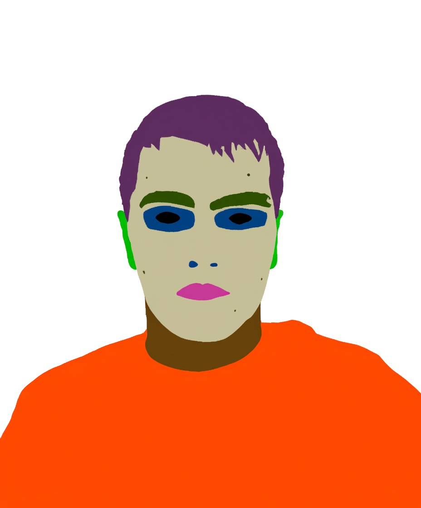
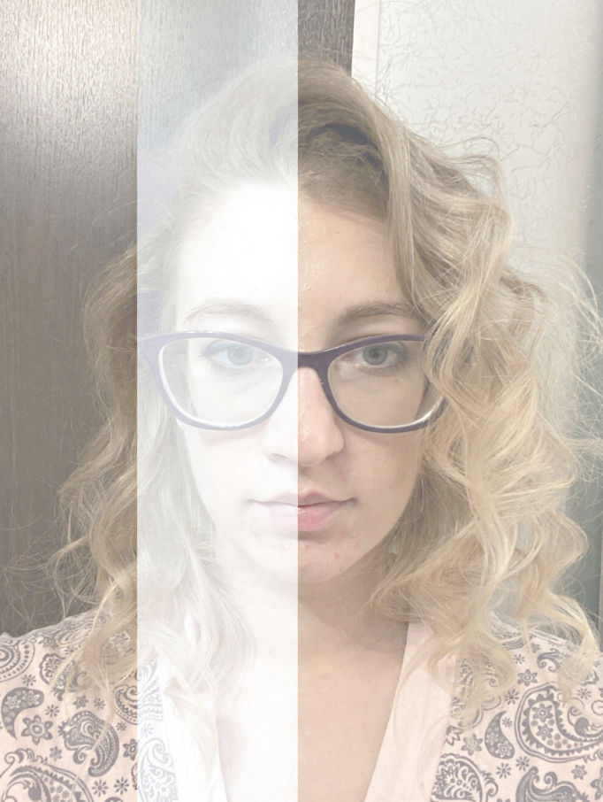

1. import peft error: `ImportError: /home/lilong/.conda/envs/py312/lib/python3.12/site-packages/torch/lib/../../nvidia/cusparse/lib/libcusparse.so.12: undefined symbol: __nvJitLinkComplete_12_4, version libnvJitLink.so.12`

```bash
python -m pip uninstall -y torch torchvision torchaudio
python -m pip install --force-reinstall --no-cache-dir \
  --index-url https://download.pytorch.org/whl/cu121 \
  torch torchvision torchaudio
python -c "import torch; print(torch.__version__, torch.version.cuda)"
```
reinstall flash atten
```bash
export CUDA_HOME=/usr/local/cuda-12.1   # 按实际改
export TORCH_CUDA_ARCH_LIST=8.0
pip install --no-binary=flash-attn --no-build-isolation --no-cache-dir -v --force-reinstall flash-attn==<match you torch version>
```

2. opencv import error: `ImportError: libGL.so.1: cannot open shared object file: No such file or directory`

```bash
sudo apt-get update
sudo apt-get install -y libgl1 libglib2.0-0    # 最小集
# 如果还报 GUI/Qt 相关，再装：
sudo apt-get install -y libxext6 libxrender1 libsm6
```

3. Diffuser import: `ImportError: cannot import name 'Qwen2_5_VLForConditionalGeneration' from 'transformers' (/home/lilong/.conda/envs/py312/lib/python3.12/site-packages/transformers/__init__.py)`

update to latest version
```bash
pip install diffusers==0.35.1
pip install transformers==4.55.4
```

4. CUDA DEVICE: `RuntimeError: Expected all tensors to be on the same device, but found at least two devices, cuda:1 and cuda:0! (when checking argument for argument index in method wrapper_CUDA__index_select)`

When multi GPU visible `CUDA_VISIBLE_DEVICES=0,1`, got this problem.

If truns out to be the accelrate hooks problem.
```python
print("hook?", getattr(self.text_encoder, "_hf_hook", None))
>>hook? AlignDevicesHook(execution_device=0, offload=False, io_same_device=True, offload_buffers=False, place_submodules=True, skip_keys='past_key_values')
```

One possible solution
```python
self.text_encoder = load_qwenvl(
    self.config.model.pretrained_model_name_or_path,
    weight_dtype=self.weight_dtype
)
```
Load the qwen-vl individually because the pipeline will set up the accelerator. Did not know how to fix it yet.

5. gcc: `subprocess.CalledProcessError: Command '['/usr/bin/gcc', '/tmp/tmpxa7uy_5f/cuda_utils.c', '-O3', '-shared', '-fPIC', '-Wno-psabi', '-o', '/tmp/tmpxa7uy_5f/cuda_utils.cpython-312-x86_64-linux-gnu.so', '-lcuda', '-L/data/lilong/envs/envs/myenv/lib/python3.12/site-packages/triton/backends/nvidia/lib', '-L/lib/x86_64-linux-gnu', '-I/data/lilong/envs/envs/myenv/lib/python3.12/site-packages/triton/backends/nvidia/include', '-I/tmp/tmpxa7uy_5f', '-I/data/lilong/envs/envs/myenv/include/python3.12']' returned non-zero exit status 1.`
Export cuda path. Refer the [`docs/speed_optimization.md`](docs/speed_optimization.md)

6. vae embedding is different from the diffuser repo

Use `.cache/control.png` this image to get the vae embedding in this repo and compare with diffuser repo. Make sure parameter are same.

Parameter in diffuser
```
image torch.Size([1, 3, 512, 512])
batch_size 1
num_channels_latents 16
height 512
width 512
prompt_embeds.dtype torch.bfloat16
device cuda:0
generator None
latents None
```

Verified the parameter are same. But the latent difference is
```
torch.norm(d_image_latent - image_latents)/torch.norm(image_latents)
>>
1.1641
```

```
torch.norm(d_image_after_process - image)/torch.norm(image)
>>>
1.38
```

Seems find the reason, the normalization is different. Current implementation, normalize to [0,1] form [0,255], while diffuser normalize to [-1,1]. Let's fix it.

Now fixed the vae encoding inconsistency problem.
```
torch.norm(d_image_latent - image_latents)/torch.norm(image_latents)
>>>
tensor(0.0525, dtype=torch.bfloat16)
```

To summarize, the image process is
1. convert to RGB mode
2. resize to make width and height divisible by 16
3. channel to [B,C,H,W]
4. normalzie from [0, 255] to [-1,1]

Now test the difference of prompt embedding error.
```
torch.norm(d_pooled_prompt_embeds - pooled_prompt_embeds.cpu())
>>>tensor(0., dtype=torch.bfloat16)

torch.norm(d_prompt_embeds - prompt_embeds.cpu())
>>>tensor(0., dtype=torch.bfloat16)

torch.norm(dimage_ids - text_ids.cpu())
>>>tensor(0., dtype=torch.bfloat16)
```
Now the embedding parts should be consistant to the diffuser repo. Let train it again.

7. Lora finetune on Flux has no effect
We are train on the face segmentation mask, expected output to be

But we got.


We found a error as indicate in 6. Lets train it again, to see if this resolves the problem.