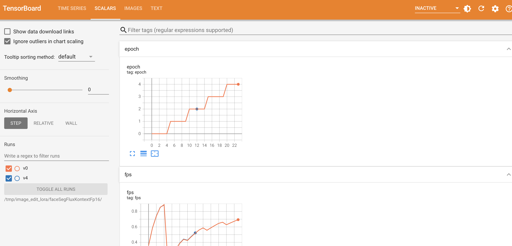

# Logging Guide

Last Updated: 2025-10-28

## Overview

The training framework supports multiple logging backends through a unified `LoggerManager` interface:
- **TensorBoard**: Local visualization with rich media support
- **Weights & Biases (wandb)**: Cloud-based experiment tracking
- **SwanLab**: Alternative cloud-based tracking platform

## Configuration

### Basic Setup

Configure logging in your YAML config file:

```yaml
logging:
  output_dir: /tmp/image_edit_lora/  # change the path to your own output path
  # report_to: tensorboard
  # report_to: wandb
  report_to: swanlab
  tracker_project_name: faceSegFluxKontextFp16
  tags:
    - test
    - FluxKontext
    - FaceSeg
    - user
  notes: "This is a test configuration for FluxKontext on FaceSeg dataset"
```

### Supported Logger Types

| Logger | Value | Description |
|--------|-------|-------------|
| TensorBoard | `tensorboard`  | Local logging, no authentication required |
| Weights & Biases | `wandb` | Cloud logging, requires API key |
| SwanLab | `swanlab` | Cloud logging, requires API key |
| None | `none` | Disable logging |

## Logger Setup & Examples

### TensorBoard

**Configuration:**
```yaml
logging:
  output_dir: "./output/my_experiment"
  report_to: "tensorboard"
  tracker_project_name: "flux-lora-training"
```

**View logs:**
```bash
tensorboard --logdir ./output/my_experiment
```

**Interface:**

Scalars:


Images:


### Weights & Biases

**Authentication:** Create `.env` file with:
```bash
WANDB_API_KEY=your_wandb_api_key_here
```

**Configuration:**
```yaml
logging:
  output_dir: "./output/my_experiment"
  report_to: "wandb"
  tracker_project_name: "flux-lora-training"
```

**Interface:**

Charts:


Model Summary:


Overview:


### SwanLab

**Authentication:** Create `.env` file with:
```bash
SWANLAB_API_KEY=your_swanlab_api_key_here
SWANLAB_WORKSPACE=your_workspace  # Optional
```

**Configuration:**
```yaml
logging:
  output_dir: "./output/my_experiment"
  report_to: "swanlab"
  tracker_project_name: "flux-lora-training"
```

**Interface:**

Overview:


Experiment Table:


Charts:


## Logged Metrics

### Training Metrics

Automatically logged every step:
- `loss`: Current batch loss
- `smooth_loss`: Exponentially smoothed loss
- `lr`: Current learning rate
- `epoch`: Current epoch number
- `fps`: Training speed (samples/second)

### Validation Metrics

Logged at validation intervals (if enabled):
- `validation/generated_images`: Generated images
- `validation/control_{i}`: Control/input images (i = image index)
- `validation/prompt`: Text prompts used

### Validation Configuration

Validation sampling can be configured in two ways:

#### Method 1: Inline Samples Configuration

Configure validation samples directly in the config file:

```yaml
validation:
  enabled: true
  steps: 10
  max_samples: 2
  seed: 42
  samples:
    - prompt: "change the image from the face to the face segmentation mask"
      images:
        - /raid/lilong/data/face_seg/test/control_images/test_person.png
      controls_size: [[832, 576]]
      height: 832
      width: 576
    - prompt: "change the image from the face to the face segmentation mask"
      images:
        - /raid/lilong/data/face_seg/test/control_images/test_male.png
      controls_size: [[832, 576]]
      height: 832
      width: 576
```

**Reference**: See `tests/test_configs/test_example_fluxkontext_fp16.yaml` (lines 37-53)

#### Method 2: Dataset-Based Validation

Use a dataset for validation samples:

```yaml
validation:
  enabled: true
  steps: 100
  max_samples: 2
  seed: 42
  dataset:
    class_path: qflux.data.dataset.ImageDataset
    init_args:
      dataset_path:
        - split: test
          repo_id: TsienDragon/face_segmentation_20
      caption_dropout_rate: 0.0
      prompt_image_dropout_rate: 0.0
      use_edit_mask: true
      selected_control_indexes: [1]
      processor:
        class_path: qflux.data.preprocess.ImageProcessor
        init_args:
          process_type: center_crop
          resize_mode: bilinear
          target_size: [832, 576]
          controls_size: [[832, 576]]
```

**Reference**: See `tests/test_configs/test_example_fluxkontext_fp16.yaml` (lines 56-73)

**Note**: Only one validation method can be used at a time. Use either `samples` or `dataset`, not both.

## Distributed Training

In multi-GPU training:
- Only the **main process** (rank 0) logs metrics
- All processes compute metrics, but logging is centralized
- Validation images are gathered from all processes before logging

The `LoggerManager` automatically handles process coordination.

## Programmatic Usage

### In Custom Trainers

```python
from qflux.utils.logger import LoggerManager

# LoggerManager is automatically created in BaseTrainer
# Access via self.logger_manager

# Log scalars
self.logger_manager.log_scalar("custom/metric", value, step=step)

# Log multiple scalars
self.logger_manager.log_scalars({
    "train/loss": loss,
    "train/accuracy": acc
}, step=step)

# Log images
self.logger_manager.log_image("train/sample", image_tensor, step=step)

# Log multiple images as grid
self.logger_manager.log_images("train/batch", images_tensor, step=step, nrow=4)

# Log text
self.logger_manager.log_text("info/message", "Training started", step=step)

# Log tables
self.logger_manager.log_table("results/metrics", [
    {"epoch": 1, "loss": 0.5, "acc": 0.9},
    {"epoch": 2, "loss": 0.3, "acc": 0.95}
], step=step)

# Flush logs
self.logger_manager.flush()
```

### Standalone Usage

```python
from qflux.utils.logger import LoggerManager
from unittest.mock import Mock

# Create config
config = Mock()
config.logging = Mock()
config.logging.report_to = "tensorboard"
config.logging.output_dir = "./logs"

# Create logger manager
logger_manager = LoggerManager.create(config)

# Use logger
logger_manager.log_scalar("test/metric", 0.5, step=0)
logger_manager.flush()
```

## Troubleshooting

### Issue: No logs appearing

**Solution**: Check that:
1. `report_to` is not set to `"none"`
2. You're running on the main process (in distributed training)
3. The output directory is writable

### Issue: wandb/swanlab authentication fails

**Solution**:
1. Verify API key in `.env` file
2. Check network connectivity
3. Try offline mode for wandb: `WANDB_MODE=offline` in `.env`

### Issue: Images not showing in TensorBoard

**Solution**:
1. Ensure images are in correct format: `[C, H, W]` with values in `[0, 1]`
2. Flush logs: `logger_manager.flush()`
3. Refresh TensorBoard in browser

## Migration from Old Code

### Before (Direct TensorBoard Access)

```python
# Old way - direct writer access
writer = accelerator.get_tracker("tensorboard").writer
writer.add_scalar("loss", loss, step)
writer.add_image("sample", image, step)
```

### After (LoggerManager)

```python
# New way - unified interface
self.logger_manager.log_scalar("loss", loss, step)
self.logger_manager.log_image("sample", image, step)
```

### Benefits

1. **Backend Agnostic**: Switch between TensorBoard, wandb, SwanLab without code changes
2. **Consistent API**: Same methods work across all backends
3. **Automatic Handling**: Process coordination, error handling, fallbacks
4. **Type Safety**: Better IDE support and type checking

## Advanced Configuration

### Custom Logger Initialization

If you need custom initialization logic:

```python
from qflux.utils.logger import BaseLogger

# Create logger with custom config
logger = BaseLogger.create(config, accelerator)

# Use in your code
logger.log_scalar("metric", value, step)
```

### Multiple Projects

To log different experiments to different projects:

```yaml
# Experiment 1
logging:
  tracker_project_name: "flux-lora-v1"

# Experiment 2
logging:
  tracker_project_name: "flux-lora-v2"
```

## Best Practices

1. **Use Descriptive Names**: `train/loss` instead of `loss`
2. **Group Related Metrics**: `train/*`, `val/*`, `test/*`
3. **Log Regularly**: Every N steps for scalars, less frequently for images
4. **Flush Periodically**: Call `flush()` at checkpoints
5. **Handle Errors**: LoggerManager provides fallbacks, but check logs for warnings

## Reference

- [TensorBoard Documentation](https://www.tensorflow.org/tensorboard)
- [Weights & Biases Documentation](https://docs.wandb.ai/)
- [SwanLab Documentation](https://docs.swanlab.cn/)
- [Accelerate Tracking Documentation](https://huggingface.co/docs/accelerate/usage_guides/tracking)
