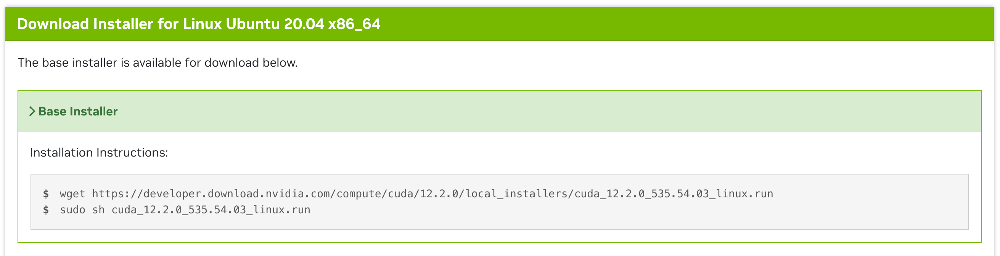

# Speed Optimization
## fp8/fp4 Quantilization

## Setup

Instll transformer-engine-cu12
```
pip install --upgrade --force-reinstall transformer-engine-cu12==1.7.0
# need to set the CUDA HOME if not found nvcc
export CUDA_HOME=<path_to_cuda_env>
export PATH=$CUDA_HOME/bin:$PATH
export LD_LIBRARY_PATH=$CUDA_HOME/lib64:$LD_LIBRARY_PATH

pip install --upgrade --force-reinstall flash-attn --no-build-isolation
```

## Flash Attention

### setup
1. install cuda toolkit
If your ncvv is not the current version or missing. Use the following steps to install correct version.
In the webpage: [cuda toolkit 12.2 Downloads](https://developer.nvidia.com/cuda-12-2-0-download-archive?target_os=Linux&target_arch=x86_64&Distribution=Ubuntu&target_version=20.04&target_type=runfile_local)

Install cuda toolkit according to the commands. If want to specify the cuda path
    ```bash
    sh cuda_12.2.0_535.54.03_linux.run --toolkit --silent --installpath=$HOME/.local/cuda-12.2
    ```

2. setup proper environtments

    ```bash
    export CUDA_HOME=$HOME/.local/cuda-12.2
    export PATH=$CUDA_HOME/bin:$PATH
    export LD_LIBRARY_PATH=$CUDA_HOME/lib64:$LD_LIBRARY_PATH
    ```

    ```bash
    # 0) confirm torch/cuda
    python - <<'PY'
    import torch, sys
    print("torch:", torch.__version__, "cuda:", torch.version.cuda, "py:", sys.version.split()[0])
    PY

    # 1) install dependacy

    python -m pip install -U packaging ninja wheel setuptools


    # 2) Specify A100 architecture to avoid compiling unnecessary SM
    export TORCH_CUDA_ARCH_LIST="8.0"     # A100 = sm80
    <!-- export TORCH_CUDA_ARCH_LIST="8.9"     # RTX 4090 = sm_89 -->


    # 3) Install (disable build isolation for faster and more stable installation)
    #    If memory is limited, you can add MAX_JOBS=4
    python -m pip install flash-attn --no-build-isolation
    ```
    The installation should be successful

    Verify flash attention works

    ```bash
    python - <<'PY'
    import flash_attn, torch
    print("flash-attn:", flash_attn.__version__)
    import flash_attn_2_cuda as ext
    import os; print("so:", os.path.realpath(ext.__file__))
    PY
    ```

    Make sure your torch version is compatible with cuda version
    Install correct one based on [torch install](https://pytorch.org/get-started/previous-versions/). For example

    ```bash
    pip install torch==2.5.1 torchvision==0.20.1 torchaudio==2.5.1 --index-url https://download.pytorch.org/whl/cu121
    ```


3. Forward with flash attention

```python
tok = AutoTokenizer.from_pretrained("meta-llama/Llama-3.1-8B")
model = AutoModelForCausalLM.from_pretrained(
    "meta-llama/Llama-3.1-8B",
    torch_dtype=torch.bfloat16,
    attn_implementation="flash_attention_2"  # 关键
).eval().cuda()
```

### QA
1. If installed flash attention, have the following problem
    ```bash
    RuntimeError: Failed to import diffusers.models.unets.unet_2d_condition because of the following error (look up to see its traceback):
    /lib/x86_64-linux-gnu/libc.so.6: version `GLIBC_2.32' not found (required by /home/lilong/.local/envs/myenv/lib/python3.12/site-packages/flash_attn_2_cuda.cpython-312-x86_64-linux-gnu.so)
    ```

    ```bash
    python -m pip install --no-binary=flash-attn flash-attn==2.7.4.post1 --no-build-isolation -v
    ```
    This workds for `GLIBC_2.31`. If your `GLIBC` is of different version, maybe try different version of flash-attn

2. ./cuda-installer: error while loading shared libraries: libxml2.so.2: cannot open shared object file: No such file or directory

    ```bash
    sudo apt update
    sudo apt install libxml2
    ```

3. `W0829 05:07:25.264000 1567 site-packages/torch/utils/cpp_extension.py:517] There are no g++ version bounds defined for CUDA version 12.2`

    ```bash
    sudo apt-get update && sudo apt-get install -y gcc-11 g++-11
    ```
