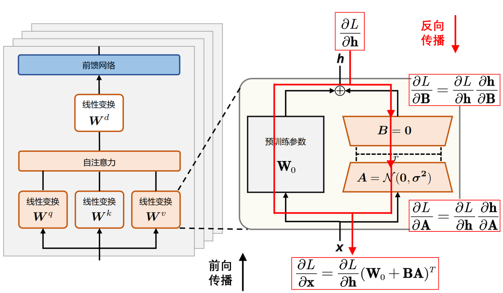

# peft Lora

##  add_adapter usage

Create a lora module

First create a config,
```
lora_config = LoraConfig(
    r=16,
    lora_alpha=16,
    init_lora_weights='gaussian',
    target_modules=["to_k", "to_q", "to_v", "to_out.0"],
)
```
then call `add_adapter`
It will add lora module on the target_modules.

```
transformer.add_adapter(lora_config, adapter_name='lora_edit')  # ← 命名 LoRA
```

You will get lora parameters in the transformer, the key named as following
```
transformer_blocks.0.attn.to_q.lora_A.lora_edit.weight
```
If did not pass the ·`adapter_name`, will use default name

```
transformer_blocks.0.attn.to_q.lora_A.default.weight
transformer_blocks.0.attn.to_q.lora_B.default.weight
transformer_blocks.0.attn.to_k.lora_A.default.weight
transformer_blocks.0.attn.to_k.lora_B.default.weight
transformer_blocks.0.attn.to_v.lora_A.default.weight
transformer_blocks.0.attn.to_v.lora_B.default.weight
transformer_blocks.0.attn.to_out.0.lora_A.default.weight
transformer_blocks.0.attn.to_out.0.lora_B.default.weight
transformer_blocks.1.attn.to_q.lora_A.default.weight
transformer_blocks.1.attn.to_q.lora_B.default.weight
transformer_blocks.1.attn.to_k.lora_A.default.weight
```
Each lora has two part. For example, we have original parameter

```
print(transformer.transformer_blocks[0].attn.to_q.weight.shape)
>>> torch.Size([3072, 3072])
```
The  `lora_A`, and `lora_B` with the shape
```
torch.Size([16, 3072]), torch.Size([3072, 16])
```
which is exactly `[r,d], [d,r]` which d is the dimension of the linear weights， as llustrated in
<div style="display: flex; justify-content: space-between;">
    
    
</div>


After Adapter, the lora parameter has grad, while the base transformer model has no grad
```
for name, p in transformer.named_parameters():
    if p.requires_grad:
        print('grad:', name)
    else:
        print('no grad:', name)
>>>
no grad: transformer_blocks.0.attn.to_q.base_layer.weight
no grad: transformer_blocks.0.attn.to_q.base_layer.bias
gra: transformer_blocks.0.attn.to_q.lora_A.default.weight
gra: transformer_blocks.0.attn.to_q.lora_B.default.weight
```

## set_adapter

Now let's add two loras
```
transformer.add_adapter(lora_config, adapter_name='default')
transformer.add_adapter(lora_config, adapter_name='lora_test')
>>>
transformer_blocks.0.attn.to_q.lora_A.default.weight
transformer_blocks.0.attn.to_q.lora_A.lora_test.weight
transformer_blocks.0.attn.to_q.lora_B.default.weight
transformer_blocks.0.attn.to_q.lora_B.lora_test.weight
transformer_blocks.0.attn.to_k.lora_A.default.weight
transformer_blocks.0.attn.to_k.lora_A.lora_test.weight
transformer_blocks.0.attn.to_k.lora_B.default.weight
transformer_blocks.0.attn.to_k.lora_B.lora_test.weight
transformer_blocks.0.attn.to_v.lora_A.default.weight
transformer_blocks.0.attn.to_v.lora_A.lora_test.weight
transformer_blocks.0.attn.to_v.lora_B.default.weight
```
You can check now you have two lora parameters

Once added, use set_adapter() to force a model to use the specified adapter and disable the other adapters.

```
transformer.set_adapter('default')
>>>
no grad: transformer_blocks.0.attn.norm_q.weight
no grad: transformer_blocks.0.attn.norm_k.weight
no grad: transformer_blocks.0.attn.to_q.base_layer.weight
no grad: transformer_blocks.0.attn.to_q.base_layer.bias
gra: transformer_blocks.0.attn.to_q.lora_A.default.weight
no grad: transformer_blocks.0.attn.to_q.lora_A.lora_test.weight
```

```
transformer.set_adapter('lora_test')
no grad transformer_blocks.0.attn.norm_q.weight
no grad transformer_blocks.0.attn.norm_k.weight
no grad transformer_blocks.0.attn.to_q.base_layer.weight
no grad transformer_blocks.0.attn.to_q.base_layer.bias
no grad transformer_blocks.0.attn.to_q.lora_A.default.weight
gra transformer_blocks.0.attn.to_q.lora_A.lora_test.weight
```

## save lora and load lora
```python
transformer.save_pretrained('<dir_path>')
>>>

```

If you are using the diffuser pipeline, you could have as

```
pipe.save_lora_weights(
    save_directory="./my_lora_weights",
    adapter_name="custom_adapter"
)
>>>
4.0K    config.json
9.4G    diffusion_pytorch_model-00001-of-00002.safetensors
1.6G    diffusion_pytorch_model-00002-of-00002.safetensors
744K    diffusion_pytorch_model.safetensors.index.json
89M     lora_edit_weights.safetensors
11G     total
```
You will got all the parameter saved instead on only the lora.

You could load the pretrain model in this way
```python
flux_transformer = QwenImageTransformer2DModel.from_pretrained(
    '<path_saved>',
    subfolder= "./",
    torch_dtype=torch.bfloat16,
    use_safetensors=True,  # 使用 safetensors 格式，加载更快,
    attn_implementation="flash_attention_2",
    local_files_only=True,
)
```

- Save only Lora
Use the `save_lora_weights` class method to save lora

```python
from diffusers.pipelines.qwenimage.pipeline_qwenimage_edit import QwenImageEditPipeline
from diffusers.utils import convert_state_dict_to_diffusers
from peft.utils import get_peft_model_state_dict


lora_state_dict = convert_state_dict_to_diffusers(
    get_peft_model_state_dict(transformer, adapter_name='lora_edit')
)
QwenImageEditPipeline.save_lora_weights(
    '/data/lilong/temp/lora_edit/', lora_state_dict,
    safe_serialization=True,
        )

```
Now the parameter name will be mapped to
```
transformer.transformer_blocks.1.attn.to_k.lora.down.weight
```

instead of

```
transformer_blocks.1.attn.to_q.lora_A.lora_edit.weight
```


And load it by

```python
transformer.load_lora_adapter('<path_to_lora>/pytorch_lora_weights.safetensors', prefix='transformer', adapter_name='lora_edit')
```

The parameter key will aotmatically converted to

```
transformer_blocks.0.attn.to_q.lora_A.lora_edit.weight
```

## save by accelerator

```
self.accelerator.save_state(save_path)
>>>
89M	checkpoint-0-10/model.safetensors
178M	checkpoint-0-10/optimizer.bin
16K	checkpoint-0-10/random_states_0.pkl
4.0K	checkpoint-0-10/scheduler.bin
4.0K	checkpoint-0-10/state.json
```
We got saved


In this case, you cannot load by `load_lora_adapter` since it is the PEFT style. You could only add lora adapter first, and then load the statedict keys.

```
transformer.add_adapter(lora_config, adapter_name='lora_edit')  # ← 命名 LoRA
missing, unexpected = transformer.load_state_dict(safetensors.torch.load_file(lora_weight), strict=False)
```
