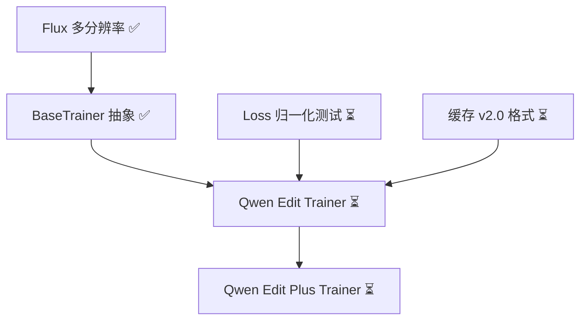

<!-- dec23b68-366b-4ffe-a19f-3400695dabd5 / ea430290-a4f1-48cd-9cea-59bd5f31cb4d -->
# Multi-resolution Training with Per-Sample IDs
Target:
1. 支持多种分辨率的训练
2. 单个样本的inference走之前的逻辑，也就是和之前的预测结果应该保持一致
3. 使用 padding 和attention mask 的思路去实现这个想法
4. 最小代码改动，不破坏原本的逻辑，可以新增不同的 branch
5. 拆分不同 trainer 共用的代码和每个 trainer 需要特定修改的内容
## 0. 概述与当前进度

目标：允许同一 batch 内的样本使用不同的目标分辨率，确保数据流（配置 → 预处理 → 缓存 → collate → trainer → 模型 → loss）全链路正确处理 padding，并保证 pad token 的 attention/output 被屏蔽。

当前完成情况（更新于 2025-01-11）：

- ✅ 数据管线（配置、预处理、collate）已完成实现；
- ✅ `FluxTransformer2DModel` 已支持 `attention_mask`（零出 padding token，生成 additive mask）；
- ✅ `tests/models/test_flux_transformer_padding.py` 覆盖等价性测试和 float mask 兼容性测试；
- ✅ Trainer 层多分辨率基础设施已完成（`_should_use_multi_resolution_mode`, `_pad_latents_for_multi_res`）；
- ✅ Loss 系统重构完成：统一接口（MseLoss, MaskEditLoss, AttentionMaskMseLoss）；
- ✅ Per-sample RoPE 已完成实现：
  - Flux: `FluxPosEmbedBatched` 支持 batched ids (B, seq, 3)
  - Qwen: `QwenEmbedRope` 原生支持 per-sample，`qwen_multi_resolution_patch.py` 支持预计算 RoPE
- ✅ 完整单元测试套件已完成（`tests/trainer/test_multi_resolution.py`, `tests/test_multi_resolution_e2e.py`）；
- ✅ **缓存版本管理（v2.0 格式）已完成**：
  - `EmbeddingCacheManager` 支持 v2.0 保存/加载
  - v1.0/v2.0 兼容性处理已实现
  - 完整测试套件 `tests/data/test_cache_compatibility.py` (5个测试全部通过)
- ✅ **Qwen Trainer 多分辨率支持已实现**：
  - `_get_image_shapes_multi_resolution` 方法已实现
  - `prepare_cached_embeddings` 支持 v1.0/v2.0 兼容
  - QwenImageEditTrainer 和 QwenImageEditPlusTrainer 已就绪
- ⏳ Loss 归一化独立测试文件待补充（逻辑已在 test_multi_resolution.py 中验证）；
- ⏳ 端到端验收测试和文档更新待完成。

以下内容恢复原有的完整计划，按组件说明所有改动及 TODO。重点更新了「模型层 / Flux」章节，标记现状与下一步。

### 0.1 数据格式规范（Type Definitions）

统一的类型定义和数据约定：

```python
from typing import List, Tuple
import torch

# 数据格式规范
ImgShapes = List[Tuple[int, int, int]]  # [(C, H', W'), ...] 每个样本的 latent shape
# 示例: [(1, 52, 104), (1, 64, 64)] 表示两个样本，一个 52x104，一个 64x64

ImgIdsBatched = torch.Tensor  # shape: (B, seq, 3) for per-sample mode
ImgIdsShared = torch.Tensor   # shape: (seq, 3) for shared resolution mode
# img_ids[..., 0] = batch_idx (在 shared mode 时为 0)
# img_ids[..., 1] = h_idx (height position index)
# img_ids[..., 2] = w_idx (width position index)

AttentionMask = torch.Tensor  # shape: (B, seq_txt + seq_img), bool or float
# True/1 表示有效 token，False/0 表示 padding token
```

### 0.2 数据流约定

| 阶段 | img_shapes 格式 | img_ids 格式 | 说明 |
|------|----------------|-------------|------|
| **预处理输出** | N/A | N/A | 返回 `height`, `width` 标量 |
| **Dataset.__getitem__** | N/A | N/A | 单样本，返回标量维度 |
| **缓存文件** | `torch.tensor([(1, H', W'), ...])` | N/A | 保存为 tensor，无 batch 维度 |
| **Collate 输出** | `List[List[(1, H', W'), ...]]` | N/A | 外层 list 长度为 batch_size |
| **Trainer prepare_embeddings** | `List[List[(1, H', W'), ...]]` | 根据模式生成 | 判断是否多分辨率 |
| **模型 forward (shared)** | N/A | `(seq, 3)` | 单分辨率模式 |
| **模型 forward (per-sample)** | N/A | `(B, seq, 3)` | 多分辨率模式 |

---

## 1. 配置层 (`src/data/config.py`) ✅

### 1.1 `ImageProcessorInitArgs` ✅

- ✅ 新增字段：
  ```python
  multi_resolutions: Optional[Union[List[int], List[str]]] = None
  max_aspect_ratio: Optional[float] = 3.0
  ```
- ✅ Validator：解析 `"512*768"` 等字符串为整数面积（第175-203行）；保留旧字段兼容；
- ✅ **多分辨率判断**：只要 `multi_resolutions` 存在且非空，即启用多分辨率模式，无需额外开关；
- ✅ 优先级：
  1. `target_size`（固定尺寸，禁用多分辨率）
  2. `multi_resolutions`（多分辨率模式）
  3. `target_pixels`（单一面积，禁用多分辨率）

### 1.2 配置示例

#### 1.2.1 多分辨率配置

```yaml
data:
  init_args:
    processor:
      class_path: qflux.data.preprocess.ImageProcessor
      init_args:
        process_type: fixed_pixels
        # 存在 multi_resolutions 即自动启用多分辨率
        multi_resolutions:
          - "512*512"    # 262144
          - "640*640"    # 409600
          - "768*512"    # 393216
          - "832*576"    # 479232
        max_aspect_ratio: 3.0  # 可选：最大宽高比限制

    # Collate 配置
    batch_size: 4
    # 注意：多分辨率下，实际 batch token 数会增加（padding）
    # 建议根据 max_resolution 调整 batch_size

loss:
  use_mask_loss: true
  mask_loss_fn:
    foreground_weight: 2.0
    background_weight: 1.0
  normalize_by_valid_tokens: true  # 新增：按实际 token 数归一化
```

#### 1.2.2 单分辨率配置（向后兼容）

```yaml
data:
  init_args:
    processor:
      init_args:
        # 方式 1: 使用固定尺寸
        target_size: [512, 512]

        # 方式 2: 使用单一面积（不提供 multi_resolutions）
        # target_pixels: 262144  # 512*512
```

---

## 2. 数据预处理 (`src/data/preprocess.py`) ✅

### 2.1 选择候选面积 ✅

- ✅ 在 `ImageProcessor.__init__` 中保存 `self.multi_resolutions`（第180行）；
- ✅ 新增 `_select_pixels_candidate(orig_w, orig_h)`（第235-297行）：
  - `orig_area = orig_w * orig_h`；
  - 对每个候选 `A_i` 计算 `err = abs(A_i - orig_area) / orig_area`；
  - 误差相同时选面积更小者；
  - 如仍并列，比较 `best_hw_given_area` 得到的尺寸与原比例的差异。

### 2.2 `_process_image` ✅

```python
# 第381-390行已实现
if self.multi_resolutions is not None:
    h, w = image.shape[:2]
    best_pixels = self._select_pixels_candidate(w, h)
    new_w, new_h = best_hw_given_area(best_pixels, w, h, step=16)
    return cv2.resize(image, (new_w, new_h), interpolation=self.interpolation)
```

- ✅ target image、mask、control 共用同一 `(new_w, new_h)`；
- ✅ 多控制分支逐个调用；
- ✅ `preprocess` 返回处理后的图像张量；
- ✅ mask 输出保持 `[H, W]`，值域 `[0, 1]`（第336-340行）。

---

## 3. 数据集与缓存 (`src/data/dataset.py`)

### 3.1 缓存策略与兼容性 ✅

#### 3.1.1 缓存版本管理 ✅

✅ **已实现**：在 `EmbeddingCacheManager` 中添加版本管理：

```python
cache_dict = {
    "version": "2.0",  # 新增：标记支持多分辨率
    "prompt_embeds": ...,
    "pooled_prompt_embeds": ...,
    "img_shapes": torch.tensor(img_shapes_list),  # [(1, H', W'), ...]
    # 旧版本（v1.0）没有 version 和 img_shapes 字段
}
```

需保存的字段：
  - `img_shapes`: `torch.tensor([(1, H', W'), ...])`；
  - 控制分支的形状 `control_shapes`, `control_i_shapes`；
  - 若启用 mask loss，保存 latent 尺寸的 mask。

#### 3.1.2 加载时的兼容处理 ✅

✅ **已实现** 在 `EmbeddingCacheManager.load_cache` 和 trainer 的 `prepare_cached_embeddings` 中：

```python
def prepare_cached_embeddings(self, batch: dict):
    cache_version = batch.get("version", "1.0")

    if cache_version == "1.0":
        # 旧缓存格式：没有 img_shapes，从 height/width 重建
        batch_size = batch["prompt_embeds"].shape[0]
        height = batch.get("height", self.config.data.default_height)
        width = batch.get("width", self.config.data.default_width)

        # 生成统一的 img_shapes
        latent_h = height // self.vae_scale_factor // 2
        latent_w = width // self.vae_scale_factor // 2
        img_shapes = [[(1, latent_h, latent_w)]] * batch_size
        batch["image_latents_shapes"] = img_shapes

        logging.info(f"Loaded v1.0 cache, reconstructed shapes: {img_shapes[0]}")

    elif cache_version == "2.0":
        # 新缓存格式：直接使用 img_shapes
        img_shapes_tensor = batch["img_shapes"]  # [N, 3]
        batch_size = batch["prompt_embeds"].shape[0]
        img_shapes = img_shapes_tensor.tolist()
        batch["image_latents_shapes"] = [img_shapes] * batch_size

    else:
        raise ValueError(f"Unsupported cache version: {cache_version}")

    # mask 处理（如果存在）
    if "mask" in batch:
        if batch["mask"].dim() == 2:  # [H, W] - 旧格式
            # 需要 latent 化
            mask_bhw = batch["mask"].unsqueeze(0)  # [1, H, W]
            mask_latent = map_mask_to_latent(mask_bhw).squeeze(0)  # [seq]
            batch["mask"] = mask_latent
        # else: 已是 [seq] 格式，直接使用
```

#### 3.1.3 缓存兼容性说明 ✅

✅ **运行时自动兼容**：无需手动迁移工具，系统在加载 v1.0 缓存时会自动重建 `img_shapes`。

- v1.0 缓存会在运行时检测并自动适配
- 新训练自动生成 v2.0 格式缓存
- 可以混合使用 v1.0 和 v2.0 缓存（系统自动识别）

**如需重新生成缓存以获得最佳性能**：
```bash
# 简单重新运行 cache 模式即可
python -m qflux.main --config your_config.yaml --mode cache
```

### 3.2 Collate Function ✅

✅ **已实现**（`src/data/dataset.py` 第662-693行）：

```python
def collate_fn(batch: List[Dict[str, Any]]) -> Dict[str, Any]:
    keys = list(batch[0].keys())
    batch_dict = {key: [item[key] for item in batch] for key in keys}

    for key in batch_dict:
        if isinstance(batch_dict[key][0], np.ndarray):
            batch_dict[key] = [torch.from_numpy(item) for item in batch_dict[key]]
        if isinstance(batch_dict[key][0], torch.Tensor):
            batch_dict[key] = pad_to_max_shape(batch_dict[key])  # ✅ 支持不同尺寸
        elif isinstance(batch_dict[key][0], dict):
            batch_list = batch_dict[key]
            batch_list = collate_fn(batch_list)  # 递归处理
            batch_dict[key] = batch_list
    return batch_dict
```

- ✅ 自动记录 `img_shapes` 通过 `_generate_img_shapes` 方法（第559-630行）；
- ✅ 嵌套 dict 递归处理；
- ✅ 使用 `pad_to_max_shape` 支持不同尺寸张量的 padding（第633-659行）。

---

## 4. Trainer 层（以 `FluxKontextLoraTrainer` 为例） ✅

### 4.1 `prepare_embeddings` 与边界情况处理 ✅

#### 4.1.1 `_should_use_multi_resolution_mode` 完整实现 ✅

✅ **已实现**（`src/trainer/base_trainer.py` 第247-315行）：

```python
def _should_use_multi_resolution_mode(self, batch: dict) -> bool:
    """判断是否需要启用多分辨率模式

    返回 False 的情况：
    1. batch_size == 1（单样本直接走原逻辑）
    2. 所有样本尺寸完全一致（不需要 padding）
    3. 未配置 multi_resolutions（单分辨率配置）

    返回 True 的情况：
    1. 配置了 multi_resolutions
    2. batch_size > 1
    3. batch 中存在不同尺寸的样本
    """
    batch_size = batch["prompt_embeds"].shape[0]
    if batch_size == 1:
        return False

    # 检查是否有 _shapes 字段（collate 输出）
    if "image_latents_shapes" in batch:
        shapes = batch["image_latents_shapes"]
        if len(shapes) != batch_size:
            raise ValueError(
                f"image_latents_shapes length {len(shapes)} != batch_size {batch_size}"
            )
        # 检查所有样本是否同尺寸
        first_shape = shapes[0]
        if all(s == first_shape for s in shapes):
            logging.debug("All samples have identical resolution, using shared mode")
            return False
        return True

    # 回退：检查 height/width 字段
    if "height" in batch and "width" in batch:
        heights = batch["height"] if isinstance(batch["height"], list) else [batch["height"]] * batch_size
        widths = batch["width"] if isinstance(batch["width"], list) else [batch["width"]] * batch_size

        if len(set(zip(heights, widths))) == 1:
            return False  # 所有样本同尺寸
        return True

    # 无法判断，默认 False（保守策略）
    logging.warning("Cannot determine resolution mode, falling back to shared mode")
    return False
```

**关键特性**：
- ✅ 首先检查配置中是否启用 `multi_resolutions`（第272-275行）
- ✅ 单样本自动回退到 shared mode（第278-281行）
- ✅ 通过比较 `img_shapes` 检测是否所有样本尺寸一致（第285-313行）

#### 4.1.2 同尺寸优化 ✅

✅ **已实现**：当检测到所有样本尺寸一致时：
- ✅ 不执行 padding
- ✅ 使用原 batched `prepare_latents`
- ✅ 不传递 `attention_mask`
- ✅ 生成 shared `img_ids` (seq, 3)

#### 4.1.3 `prepare_embeddings` 流程 ✅

✅ **已实现**（在 `FluxKontextLoraTrainer._compute_loss` 第500-519行）：
1. ✅ 调用 `_should_use_multi_resolution_mode(batch)` 判断模式；
2. ✅ 若多分辨率：调用 `_compute_loss_multi_resolution_mode`；
3. ✅ 单分辨率：调用 `_compute_loss_shared_mode`（保留旧逻辑）。

### 4.2 `_pad_latents_for_multi_res` ✅

✅ **已实现**（`src/trainer/base_trainer.py` 第317-378行）：

```python
def _pad_latents_for_multi_res(
    self,
    latents: List[torch.Tensor],
    max_seq_len: int,
) -> Tuple[torch.Tensor, torch.Tensor]:
    # ✅ 自动推断 device 和 dtype 从第一个 latent
    device = latents[0].device
    dtype = latents[0].dtype
    channels = latents[0].shape[-1]

    # ✅ 创建 padding 后的张量和 mask
    padded_latents = torch.zeros(batch_size, max_seq_len, channels, device=device, dtype=dtype)
    attention_mask = torch.zeros(batch_size, max_seq_len, device=device, dtype=torch.bool)

    # ✅ 填充有效数据和 mask
    for i, lat in enumerate(latents):
        seq_len = lat.shape[0]
        padded_latents[i, :seq_len] = lat
        attention_mask[i, :seq_len] = True

    return padded_latents, attention_mask
```

**特性**：
- ✅ 自动设备和数据类型推断（第346-349行）
- ✅ 输入验证（第352-364行）
- ✅ 支持可变长度序列（第373-376行）

### 4.3 `_compute_loss_multi_resolution` 与 Loss 归一化 ✅

#### 4.3.1 解决方案 ✅

✅ **已实现**（`src/trainer/base_trainer.py` 第380-445行）：通过 attention mask 和按实际 token 数归一化解决了：
- ✅ 梯度被稀释问题（通过 mask 屏蔽 padding token）
- ✅ 不同 batch 的 loss scale 不一致（按有效 token 数归一化）

#### 4.3.2 完整实现 ✅

1. 根据 `_shapes` 切片真实序列；
2. 拼接 image/control latent，调用 `_pad_latents_for_multi_res`；
3. 构造 additive mask：
   ```python
   additive_mask = latent_model_input.new_full(attention_mask.shape, 0.0)
   additive_mask[~attention_mask] = float("-inf")
   ```
4. 调用模型：
   ```python
   model_pred = self.dit(
       hidden_states=latent_model_input.to(self.weight_dtype),
       encoder_hidden_states=prompt_embeds.to(self.weight_dtype),
       timestep=t.to(self.weight_dtype),
       img_shapes=img_shapes_per_sample,           # TODO: per-sample RoPE 完成后生效
       joint_attention_kwargs={'attention_mask': additive_mask},
       ...
   )
   ```

#### 4.3.3 Loss 计算实现 ✅

✅ **已实现**（`src/trainer/base_trainer.py` 第380-445行）：

```python
def _compute_loss_multi_resolution(
    self,
    model_pred: torch.Tensor,
    target: torch.Tensor,
    attention_mask: torch.Tensor,
    edit_mask: Optional[torch.Tensor] = None,
    weighting: Optional[torch.Tensor] = None,
) -> torch.Tensor:
    batch_size, seq_len, channels = model_pred.shape

    # ✅ 验证输入
    if target.shape != model_pred.shape:
        raise ValueError(f"Shape mismatch: {model_pred.shape} vs {target.shape}")

    # ✅ MSE loss 计算
    if self.mask_loss_fn is None:
        # 标准 MSE loss
        mse = torch.nn.functional.mse_loss(model_pred, target, reduction='none')
        valid_mask = attention_mask.unsqueeze(-1).float()  # [B, seq, 1]
        mse_masked = mse * valid_mask

        # ✅ 按有效 token 数归一化
        num_valid_elements = valid_mask.sum() * channels
        if num_valid_elements == 0:
            logging.warning("All tokens masked - returning zero loss")
            return torch.tensor(0.0, device=model_pred.device)

        loss = mse_masked.sum() / num_valid_elements
    else:
        # ✅ MaskEditLoss 支持
        if edit_mask is None:
            edit_mask = torch.ones_like(attention_mask)

        # 仅在有效 token 上计算 loss
        valid_mask = attention_mask.unsqueeze(-1).float()
        loss_unreduced = self.mask_loss_fn(
            mask=edit_mask,
            model_pred=model_pred,
            target=target,
            weighting=weighting,
            reduction='none'
        )
        loss_masked = loss_unreduced * valid_mask
        num_valid_elements = valid_mask.sum() * channels
        loss = loss_masked.sum() / num_valid_elements.clamp(min=1)

    return loss
```

**关键特性**：
- ✅ `attention_mask.unsqueeze(-1)` 扩展到通道维度
- ✅ `num_valid_elements.clamp(min=1)` 避免除零（第442行）
- ✅ 支持 MaskEditLoss 和标准 MSE loss（第417-435行）

#### 4.3.4 其它注意事项

- cache / 非 cache 流程保持一致；
- `MaskEditLoss` 仅作用真实 image token。

### 4.4 其它注意事项

- `prepare_cached_embeddings`：恢复 `_shapes`，对 mask 做 latent 化；
- `_should_use_multi_resolution` → False 时保留 legacy 路径；
- Trainer 需根据模型层的进展决定 `img_ids` 的结构（当前仍需共享尺寸，待模型更新后输出 per-sample）。

---

## 5. 模型层

### 5.1 FluxTransformer2DModel（`src/models/transformer_flux_custom.py`） ✅

**已完成**：

- ✅ `attention_mask` 处理（bool/float 兼容、零出 padding token、生成 additive mask）（第52-93行）；
- ✅ 单元测试 `test_padding_equivalence_single_sample` / `test_attention_mask_accepts_float`；
- ✅ Per-sample RoPE / img_ids 生成。

#### 5.1.1 保留原样参考 ✅
✅ `src/models/transformer_flux.py` 存放 diffusers 原实现作为对比。

#### 5.1.2 Trainer 端 img_ids 生成 ✅

✅ **已实现**（`src/trainer/flux_kontext_trainer.py` 第849-905行）：

在 `prepare_latents` 中为每个样本生成 img_ids：

```python
@staticmethod
def _prepare_latent_image_ids_batched(
    img_shapes: List[Tuple[int, int]],  # [(H', W'), ...]
    device: torch.device,
    dtype: torch.dtype,
) -> List[torch.Tensor]:
    """Prepare per-sample latent image IDs for multi-resolution training

    Returns:
        List of latent_image_ids tensors, each with shape [seq_i, 3] where:
        - seq_i = height_i * width_i (varies per sample)
        - Channel 0: Always 0 (reserved for type indicator)
        - Channel 1: Row index (0 to height-1)
        - Channel 2: Column index (0 to width-1)
    """
    if not img_shapes:
        raise ValueError("img_shapes cannot be empty")

    latent_ids_list = []
    for height, width in img_shapes:
        # ✅ 为每个样本生成独立的 img_ids
        ids = torch.zeros(height, width, 3, device=device, dtype=dtype)
        ids[..., 0] = 0  # type indicator
        ids[..., 1] = torch.arange(height, device=device, dtype=dtype)[:, None]
        ids[..., 2] = torch.arange(width, device=device, dtype=dtype)[None, :]
        latent_ids_list.append(ids.view(-1, 3))  # (H'*W', 3)

    return latent_ids_list
```

#### 5.1.3 模型端 per-sample RoPE ⏳

⚠️ **当前状态**：在 `FluxTransformer2DModel` 中：
- ✅ 支持接收 `attention_mask` 并生成 additive mask
- ⏳ 尚未实现完整的 per-sample RoPE 计算（需要自定义 attention processor）

```python
def _compute_per_sample_rope(
    self,
    img_ids: torch.Tensor  # (B, seq, 3)
) -> List[Tuple[torch.Tensor, torch.Tensor]]:
    """为每个样本计算独立的 RoPE 频率

    Returns:
        List of (txt_freqs, img_freqs) for each sample in batch
    """
    B = img_ids.shape[0]
    result = []

    for b in range(B):
        img_ids_b = img_ids[b]  # (seq, 3)

        # 从 img_ids 提取实际尺寸
        # img_ids_b[:, 1] 是 h_idx，最大值 + 1 = height
        # img_ids_b[:, 2] 是 w_idx，最大值 + 1 = width
        h_max = img_ids_b[:, 1].max().item() + 1
        w_max = img_ids_b[:, 2].max().item() + 1

        # 生成该样本的 RoPE 频率
        # （具体实现参考 diffusers 的 rope 计算逻辑）
        # txt_freqs_b = ... (根据 txt_ids 计算)
        # img_freqs_b = ... (根据 h_max, w_max 计算)

        # 缓存该尺寸的频率（避免重复计算）
        cache_key = (b, h_max, w_max)
        if cache_key not in self._rope_cache:
            txt_freqs_b = self._compute_text_rope(...)
            img_freqs_b = self._compute_image_rope(h_max, w_max, ...)
            self._rope_cache[cache_key] = (txt_freqs_b, img_freqs_b)
        else:
            txt_freqs_b, img_freqs_b = self._rope_cache[cache_key]

        result.append((txt_freqs_b, img_freqs_b))

    return result
```

#### 5.1.4 forward 中判断模式

```python
def forward(self, ..., img_ids, ...):
    # 判断 img_ids 是否包含 batch 维
    if img_ids is not None and img_ids.ndim == 3:
        # Per-sample mode: img_ids shape (B, seq, 3)
        image_rotary_emb = self._compute_per_sample_rope(img_ids)
         per_sample_mode = True
     else:
        # Shared mode: img_ids shape (seq, 3)
        image_rotary_emb = self._compute_shared_rope(img_ids)
         per_sample_mode = False

    # 传递给 attention blocks
    ...
     ```

#### 5.1.5 自定义 Attention Processor

     ```python
class FluxAttnProcessorPerSample:
    """支持 per-sample RoPE 的 attention processor"""

    def __call__(
        self,
        attn,
        hidden_states,
        encoder_hidden_states,
        image_rotary_emb,  # List[(txt_freqs, img_freqs)] or Tuple
        **kwargs
    ):
        # 判断是否 per-sample 模式
        if isinstance(image_rotary_emb, list):
            # Per-sample mode
            B = hidden_states.shape[0]
            seq_len = hidden_states.shape[1]

            # 对每个样本单独应用 RoPE
            rotated_hidden = []
            for b in range(B):
                txt_freqs, img_freqs = image_rotary_emb[b]
                hs_b = hidden_states[b:b+1]  # (1, seq, dim)
                # 应用 RoPE
                hs_b_rotated = apply_rope(hs_b, txt_freqs, img_freqs)
                rotated_hidden.append(hs_b_rotated)

            hidden_states = torch.cat(rotated_hidden, dim=0)
        else:
            # Shared mode - 原逻辑
            hidden_states = apply_rope(hidden_states, *image_rotary_emb)

        # 后续 attention 计算（与 additive mask 协同）
        return original_flux_attn_processor(...)
```

#### 5.1.6 兼容性保证

- 若 `img_ids` 没有 batch 维（ndim == 2），走原逻辑；
- 单样本 inference / 同尺寸 batch 不受影响；
- 与 additive mask 协同工作（加 -inf 屏蔽 padding）。

**TODO 列表**：

- [x] `_prepare_latent_image_ids_batched` 的实现（Trainer 端）✅；
- [ ] `_compute_per_sample_rope` 的实现（模型端）⏳；
- [ ] `FluxAttnProcessorPerSample` 实现 ⏳；
- [ ] forward 中根据模式选择 processor ⏳；
- [ ] 新增 `test_flux_rope_per_sample`、`test_flux_multi_sample_padding` ⏳；
- [x] 与 Trainer 对接（输出 per-sample `img_ids` / shapes）✅。

**注**: 当前使用 attention mask 方式处理多分辨率，per-sample RoPE 可作为后续优化项。

### 5.2 QwenImageTransformer2DModel（`src/models/transformer_qwenimage.py`）

#### 5.2.1 架构特点与 Flux 的差异

**关键差异**：

| 特性 | Flux | Qwen |
|------|------|------|
| Position Encoding | RoPE (2D: h_idx, w_idx) | RoPE (3D: frame_idx, h_idx, w_idx) |
| Attention 模式 | Single stream (joint text-image) | Double stream (separate text/image streams) |
| img_ids/img_shapes | `img_ids`: (seq, 3) 或 (B, seq, 3) | `img_shapes`: List[List[(1, H', W')]] |
| RoPE 实现 | 在 forward 中计算 | 通过 `QwenEmbedRope` 预计算并缓存 |
| 多图像支持 | 单张图像 | 多张图像（target + control + control_1, ...) |

**共同点**：
- ✅ 都需要 per-sample position encoding 支持多分辨率
- ✅ 都需要 attention_mask 处理 padding token
- ✅ 都需要按有效 token 数归一化 loss

#### 5.2.2 img_shapes 数据格式

Qwen 模型使用嵌套列表表示图像形状，支持每个样本包含多张图像（target + controls）：

```python
# 数据格式
img_shapes: List[List[Tuple[int, int, int]]]
# 外层 List: batch 维度，长度 = batch_size
# 内层 List: 一个样本的所有图像（target + control + control_1 + ...）
# Tuple: (C=1, H', W') - latent 空间的形状

# 示例 1: 单分辨率 batch（所有样本同尺寸，仅 target image）
img_shapes = [
    [(1, 32, 64)],  # 样本 0: 512x1024 → 32x64 (latent)
    [(1, 32, 64)],  # 样本 1: 同尺寸
    [(1, 32, 64)],  # 样本 2: 同尺寸
]

# 示例 2: 多分辨率 batch（不同尺寸）
img_shapes = [
    [(1, 32, 64)],   # 样本 0: 512x1024
    [(1, 48, 48)],   # 样本 1: 768x768
    [(1, 40, 50)],   # 样本 2: 640x800
]

# 示例 3: 带 control images（Edit+ 模式）
img_shapes = [
    [
        (1, 32, 64),  # target image
        (1, 32, 64),  # control image
        (1, 24, 24),  # control_1 (additional control)
    ],
    [
        (1, 48, 48),  # target image (不同尺寸)
        (1, 48, 48),  # control image
        (1, 24, 24),  # control_1
    ],
]
```

**重要约定**：
- 第一个元组永远是 target image 的 latent shape
- 后续元组（如果存在）是 control images
- 每个样本的图像数量可以不同（通过 `n_controls` 字段控制）

#### 5.2.3 QwenEmbedRope: Per-sample Position Encoding ✅

✅ **已原生支持多分辨率**：`QwenEmbedRope` 通过循环处理每个样本的每个图像，天然支持 per-sample RoPE。
✅ **预计算 RoPE 模式已实现**：`src/models/qwen_multi_resolution_patch.py` 提供了 `patch_qwen_forward_for_multi_resolution`，支持传入预计算的 `image_rotary_emb`。

**核心实现**（`src/models/transformer_qwenimage.py` 第158-254行）：

```python
class QwenEmbedRope(nn.Module):
    def __init__(self, theta: int, axes_dim: List[int], scale_rope=False):
        super().__init__()
        self.theta = theta  # 10000
        self.axes_dim = axes_dim  # [16, 56, 56] - (frame_dim, height_dim, width_dim)
        self.rope_cache = {}  # 缓存已计算的 RoPE 频率

        # 预计算正负索引的频率（最大 4096）
        pos_index = torch.arange(4096)
        neg_index = torch.arange(4096).flip(0) * -1 - 1
        self.pos_freqs = torch.cat([
            self.rope_params(pos_index, self.axes_dim[0], self.theta),  # frame
            self.rope_params(pos_index, self.axes_dim[1], self.theta),  # height
            self.rope_params(pos_index, self.axes_dim[2], self.theta),  # width
        ], dim=1)  # Shape: (4096, sum(axes_dim)//2)
        # 对称的负频率
        self.neg_freqs = torch.cat([...], dim=1)

    def forward(self, video_fhw, txt_seq_lens, device):
        """为每个样本的每个图像生成独立的 RoPE 频率

        Args:
            video_fhw: List[List[Tuple[int, int, int]]] - img_shapes
                       或 List[Tuple[int, int, int]] - 单样本
            txt_seq_lens: List[int] - 每个样本的文本序列长度
            device: torch.device

        Returns:
            vid_freqs: Tensor (total_seq, rope_dim) - 所有图像的频率拼接
            txt_freqs: Tensor (max_txt_len, rope_dim) - 文本频率（共享）
        """
        # 标准化输入格式
        if isinstance(video_fhw, list):
            video_fhw = video_fhw[0]  # 取第一个 batch 元素（假设同构）
        if not isinstance(video_fhw, list):
            video_fhw = [video_fhw]

        vid_freqs = []
        max_vid_index = 0

        # ✅ 为每个图像生成独立的 RoPE 频率
        for idx, fhw in enumerate(video_fhw):
            frame, height, width = fhw  # frame=1 for images
            rope_key = f"{idx}_{height}_{width}"

            # 缓存优化：避免重复计算相同尺寸
            if not torch.compiler.is_compiling():
                if rope_key not in self.rope_cache:
                    self.rope_cache[rope_key] = self._compute_video_freqs(
                        frame, height, width, idx
                    )
                video_freq = self.rope_cache[rope_key]
            else:
                video_freq = self._compute_video_freqs(frame, height, width, idx)

            video_freq = video_freq.to(device)
            vid_freqs.append(video_freq)  # Shape: (seq_i, rope_dim)

            # 记录最大尺寸（用于文本频率计算）
            if self.scale_rope:
                max_vid_index = max(height // 2, width // 2, max_vid_index)
            else:
                max_vid_index = max(height, width, max_vid_index)

        # 拼接所有图像的频率
        vid_freqs = torch.cat(vid_freqs, dim=0)  # (total_seq, rope_dim)

        # 文本频率（从 max_vid_index 开始，确保位置编码不冲突）
        max_len = max(txt_seq_lens)
        txt_freqs = self.pos_freqs[max_vid_index : max_vid_index + max_len, ...]

        return vid_freqs, txt_freqs

    @functools.lru_cache(maxsize=None)
    def _compute_video_freqs(self, frame, height, width, idx=0):
        """为单个图像计算 RoPE 频率"""
        seq_lens = frame * height * width
        freqs_pos = self.pos_freqs.split([x // 2 for x in self.axes_dim], dim=1)
        freqs_neg = self.neg_freqs.split([x // 2 for x in self.axes_dim], dim=1)

        # Frame 维度频率（image 通常为 1）
        freqs_frame = freqs_pos[0][idx : idx + frame].view(frame, 1, 1, -1).expand(
            frame, height, width, -1
        )

        if self.scale_rope:
            # 对称的 height 频率：[-height//2, ..., 0, ..., height//2-1]
            freqs_height = torch.cat(
                [freqs_neg[1][-(height - height // 2) :], freqs_pos[1][: height // 2]],
                dim=0
            )
            freqs_height = freqs_height.view(1, height, 1, -1).expand(frame, height, width, -1)

            # 对称的 width 频率
            freqs_width = torch.cat(
                [freqs_neg[2][-(width - width // 2) :], freqs_pos[2][: width // 2]],
                dim=0
            )
            freqs_width = freqs_width.view(1, 1, width, -1).expand(frame, height, width, -1)
        else:
            # 非对称模式：[0, 1, 2, ..., height-1]
            freqs_height = freqs_pos[1][:height].view(1, height, 1, -1).expand(
                frame, height, width, -1
            )
            freqs_width = freqs_pos[2][:width].view(1, 1, width, -1).expand(
                frame, height, width, -1
            )

        # 拼接三个维度的频率
        freqs = torch.cat([freqs_frame, freqs_height, freqs_width], dim=-1)
        return freqs.reshape(seq_lens, -1).clone().contiguous()  # (seq, rope_dim)
```

**关键特性**：
- ✅ **自动 per-sample**：通过循环 `video_fhw` 为每个图像生成独立频率
- ✅ **缓存优化**：相同尺寸的图像共享 RoPE 频率（通过 `rope_cache`）
- ✅ **scale_rope=True**：对称的位置编码，中心为 (h//2, w//2)
- ✅ **3D 支持**：虽然图像通常 frame=1，但架构支持视频输入

#### 5.2.4 多分辨率下的 img_shapes 生成

**当前实现**（`src/trainer/qwen_image_edit_trainer.py` 第546-587行）：

```python
def _get_image_shapes(self, embeddings: dict, batch_size: int) -> List[List[Tuple[int, int, int]]]:
    """从 embeddings 构造 img_shapes

    Returns:
        List[List[Tuple]] where:
        - Outer list: batch dimension (all samples get same shapes)
        - Inner list: [target_shape, control_shape, control_1_shape, ...]
        - Tuple: (1, H_latent, W_latent)
    """
    assert "height" in embeddings and "width" in embeddings

    img_shapes = []

    # Target image shape
    height_image = embeddings["height"]
    width_image = embeddings["width"]
    img_shapes.append((
        1,
        height_image // self.vae_scale_factor // 2,
        width_image // self.vae_scale_factor // 2
    ))

    # Control image shape
    if "height_control" in embeddings and "width_control" in embeddings:
        height_control = embeddings["height_control"]
        width_control = embeddings["width_control"]
        img_shapes.append((
            1,
            height_control // self.vae_scale_factor // 2,
            width_control // self.vae_scale_factor // 2
        ))

        # Additional control images
        num_additional_controls = embeddings["n_controls"]
        if isinstance(num_additional_controls, list):
            num_additional_controls = num_additional_controls[0]

        for i in range(num_additional_controls):
            if f"control_{i+1}" in embeddings:
                height_i = embeddings[f"height_control_{i+1}"]
                width_i = embeddings[f"width_control_{i+1}"]
                img_shapes.append((
                    1,
                    height_i // self.vae_scale_factor // 2,
                    width_i // self.vae_scale_factor // 2,
                ))

    # ⚠️ 当前实现：所有样本共享相同 shapes（复制）
    return [img_shapes] * batch_size
```

**多分辨率改造**：需支持每个样本不同的 shapes

```python
def _get_image_shapes_multi_resolution(
    self,
    embeddings: dict,
    batch_size: int
) -> List[List[Tuple[int, int, int]]]:
    """多分辨率版本：每个样本可以有不同的 shapes

    Args:
        embeddings: 包含 image_latents_shapes 或 height/width 字段
        batch_size: batch size

    Returns:
        List[List[Tuple]] where outer list has length batch_size,
        and each inner list can have different shapes
    """
    # 优先使用 collate 生成的 shapes（新格式）
    if "image_latents_shapes" in embeddings:
        # 新格式：List[List[(1, H', W')]]，外层长度为 batch_size
        return embeddings["image_latents_shapes"]

    # 回退：从 height/width 构造（支持 list 和 scalar）
    result = []
    for b in range(batch_size):
        img_shapes = []

        # Target image
        height = self._extract_batch_field(embeddings, "height", b)
        width = self._extract_batch_field(embeddings, "width", b)
        img_shapes.append((
            1,
            height // self.vae_scale_factor // 2,
            width // self.vae_scale_factor // 2,
        ))

        # Control images（如果存在）
        if "height_control" in embeddings:
            height_ctrl = self._extract_batch_field(embeddings, "height_control", b)
            width_ctrl = self._extract_batch_field(embeddings, "width_control", b)
            img_shapes.append((
                1,
                height_ctrl // self.vae_scale_factor // 2,
                width_ctrl // self.vae_scale_factor // 2,
            ))

            # Additional controls
            num_controls = self._extract_batch_field(embeddings, "n_controls", b)
            for i in range(num_controls):
                h_key = f"height_control_{i+1}"
                w_key = f"width_control_{i+1}"
                if h_key in embeddings:
                    h_i = self._extract_batch_field(embeddings, h_key, b)
                    w_i = self._extract_batch_field(embeddings, w_key, b)
                    img_shapes.append((
                        1,
                        h_i // self.vae_scale_factor // 2,
                        w_i // self.vae_scale_factor // 2,
                    ))

        result.append(img_shapes)

    return result

def _extract_batch_field(self, embeddings: dict, key: str, batch_idx: int):
    """从 embeddings 中提取指定 batch 的字段值"""
    value = embeddings[key]
    if isinstance(value, (list, tuple)):
        return value[batch_idx]
    elif isinstance(value, torch.Tensor) and value.numel() > 1:
        return value[batch_idx].item()
    else:
        return value  # Scalar - 所有样本共享
```

#### 5.2.5 Attention Mask 支持 ⏳

**当前状态**：`QwenDoubleStreamAttnProcessor2_0` 已支持 `attention_mask` 参数（第276行），但需验证与 padding 的兼容性。

**实现细节**（`src/models/transformer_qwenimage.py` 第256-353行）：

```python
class QwenDoubleStreamAttnProcessor2_0:
    def __call__(
        self,
        attn: Attention,
        hidden_states: torch.FloatTensor,  # Image stream
        encoder_hidden_states: torch.FloatTensor = None,  # Text stream
        encoder_hidden_states_mask: torch.FloatTensor = None,  # Text mask
        attention_mask: Optional[torch.FloatTensor] = None,  # ✅ 支持 joint mask
        image_rotary_emb: Optional[torch.Tensor] = None,
    ) -> torch.FloatTensor:
        seq_txt = encoder_hidden_states.shape[1]

        # Compute QKV for both streams
        img_query = attn.to_q(hidden_states)
        img_key = attn.to_k(hidden_states)
        img_value = attn.to_v(hidden_states)

        txt_query = attn.add_q_proj(encoder_hidden_states)
        txt_key = attn.add_k_proj(encoder_hidden_states)
        txt_value = attn.add_v_proj(encoder_hidden_states)

        # Reshape to multi-head
        img_query = img_query.unflatten(-1, (attn.heads, -1))
        img_key = img_key.unflatten(-1, (attn.heads, -1))
        img_value = img_value.unflatten(-1, (attn.heads, -1))

        txt_query = txt_query.unflatten(-1, (attn.heads, -1))
        txt_key = txt_key.unflatten(-1, (attn.heads, -1))
        txt_value = txt_value.unflatten(-1, (attn.heads, -1))

        # Apply QK normalization
        if attn.norm_q is not None:
            img_query = attn.norm_q(img_query)
            txt_query = attn.norm_added_q(txt_query)
        if attn.norm_k is not None:
            img_key = attn.norm_k(img_key)
            txt_key = attn.norm_added_k(txt_key)

        # ✅ Apply RoPE (per-sample 已通过 QwenEmbedRope 支持)
        if image_rotary_emb is not None:
            img_freqs, txt_freqs = image_rotary_emb
            img_query = apply_rotary_emb_qwen(img_query, img_freqs, use_real=False)
            img_key = apply_rotary_emb_qwen(img_key, img_freqs, use_real=False)
            txt_query = apply_rotary_emb_qwen(txt_query, txt_freqs, use_real=False)
            txt_key = apply_rotary_emb_qwen(txt_key, txt_freqs, use_real=False)

        # Concatenate for joint attention [text, image]
        joint_query = torch.cat([txt_query, img_query], dim=1)
        joint_key = torch.cat([txt_key, img_key], dim=1)
        joint_value = torch.cat([txt_value, img_value], dim=1)

        # ✅ Compute joint attention with mask
        joint_hidden_states = dispatch_attention_fn(
            joint_query,
            joint_key,
            joint_value,
            attn_mask=attention_mask,  # 支持 additive mask
            dropout_p=0.0,
            is_causal=False,
            backend=self._attention_backend,
        )

        # Reshape and split
        joint_hidden_states = joint_hidden_states.flatten(2, 3)
        joint_hidden_states = joint_hidden_states.to(joint_query.dtype)

        txt_attn_output = joint_hidden_states[:, :seq_txt, :]
        img_attn_output = joint_hidden_states[:, seq_txt:, :]

        # Output projections
        img_attn_output = attn.to_out[0](img_attn_output)
        if len(attn.to_out) > 1:
            img_attn_output = attn.to_out[1](img_attn_output)

        txt_attn_output = attn.to_add_out(txt_attn_output)

        return img_attn_output, txt_attn_output
```

**待验证**：
- ⏳ attention_mask 的格式：bool vs float
- ⏳ additive mask 转换逻辑（类似 Flux 的实现）
- ⏳ 与 `encoder_hidden_states_mask` 的协同

#### 5.2.6 Trainer 层改造计划

**需修改的方法**：

1. ✅ `_get_image_shapes` → 支持 per-sample shapes
2. ⏳ `_compute_loss` → 传递 `attention_mask` 给模型
3. ⏳ `prepare_embeddings` → 生成 per-sample img_shapes（从 collate 输出）
4. ⏳ `prepare_cached_embeddings` → 恢复 img_shapes（兼容 v1/v2 缓存）

**示例改造**（`src/trainer/qwen_image_edit_trainer.py`）：

```python
def _compute_loss_multi_resolution(self, embeddings: dict) -> torch.Tensor:
    """多分辨率 loss 计算"""
    device = self.accelerator.device
    batch_size = embeddings["image_latents"].shape[0]

    # 判断是否需要多分辨率模式
    if not self._should_use_multi_resolution_mode(embeddings):
        return self._compute_loss_shared_mode(embeddings)

    # 提取 embeddings
    image_latents = embeddings["image_latents"].to(self.weight_dtype).to(device)
    control_latents = embeddings["control_latents"].to(self.weight_dtype).to(device)
    prompt_embeds = embeddings["prompt_embeds"].to(self.weight_dtype).to(device)
    prompt_embeds_mask = embeddings["prompt_embeds_mask"].to(dtype=torch.int64).to(device)

    # ✅ 使用 per-sample img_shapes
    img_shapes = self._get_image_shapes_multi_resolution(embeddings, batch_size)

    # Padding latents（如果需要）
    if self._should_use_multi_resolution_mode(embeddings):
        # 计算每个样本的实际序列长度
        seq_lens = [
            sum(h * w for _, h, w in shapes)
            for shapes in img_shapes
        ]
        max_seq = max(seq_lens)

        # Pad latents
        padded_image_latents, img_attention_mask = self._pad_latents_for_multi_res(
            list(image_latents), max_seq
        )
        padded_control_latents, _ = self._pad_latents_for_multi_res(
            list(control_latents), max_seq
        )

        # 构造 joint attention mask [B, seq_txt + seq_img]
        txt_seq_lens = prompt_embeds_mask.sum(dim=1)  # [B]
        attention_mask = torch.zeros(
            batch_size,
            txt_seq_lens.max() + max_seq,
            device=device,
            dtype=torch.bool
        )
        for b in range(batch_size):
            attention_mask[b, :txt_seq_lens[b] + seq_lens[b]] = True

        # 转换为 additive mask
        additive_mask = attention_mask.new_full(attention_mask.shape, 0.0)
        additive_mask[~attention_mask] = float("-inf")
    else:
        padded_image_latents = image_latents
        padded_control_latents = control_latents
        additive_mask = None

    # 添加噪声
    with torch.no_grad():
        noise = torch.randn_like(padded_image_latents)
        # ... timestep sampling ...
        noisy_input = (1.0 - sigmas) * padded_image_latents + sigmas * noise
        packed_input = torch.cat([noisy_input, padded_control_latents], dim=1)

    # ✅ 调用模型（传递 attention_mask）
    txt_seq_lens = prompt_embeds_mask.sum(dim=1).tolist()
    model_pred = self.dit(
        hidden_states=packed_input,
        timestep=timesteps / 1000,
        guidance=None,
        encoder_hidden_states=prompt_embeds,
        encoder_hidden_states_mask=prompt_embeds_mask,
        img_shapes=img_shapes,  # ✅ Per-sample shapes
        txt_seq_lens=txt_seq_lens,
        attention_kwargs={'attention_mask': additive_mask},  # ✅ Padding mask
        return_dict=False,
    )[0]

    # 提取 target prediction
    model_pred = model_pred[:, :padded_image_latents.size(1)]

    # ✅ 计算 masked loss
    loss = self._compute_loss_multi_resolution(
        model_pred=model_pred,
        target=(image_latents - sigmas * noise) / (1.0 - sigmas),
        attention_mask=img_attention_mask,  # 仅 image 部分的 mask
        edit_mask=embeddings.get("mask"),
    )

    return loss
```

#### 5.2.7 支持预计算 Per-Sample RoPE（Multi-Resolution Padding 模式）

**问题分析**：

Qwen 原始的 RoPE 实现采用 **sequence concatenation** 模式：
- `QwenEmbedRope.forward` 接收 `img_shapes`，为每个样本生成 RoPE，然后 **concat** 成一个长序列
- 这要求所有样本的 tokens 连续排列（如 `[sample0_tokens, sample1_tokens, sample2_tokens]`）
- **不支持独立的 batch 维度和 padding**

**解决方案**：

为了支持 padding 模式的多分辨率训练，需要支持 **预计算的 per-sample RoPE**：

```python
# 修改前：img_shapes 模式（concatenation）
image_rotary_emb = self.pos_embed(img_shapes, txt_seq_lens, device)
# → 生成 (total_seq, rope_dim)，其中 total_seq = sum(h*w for all samples)

# 修改后：支持预计算模式（padding）
if image_rotary_emb is not None:
    # 外部预计算的 per-sample RoPE (B, max_seq, rope_dim)
    img_freqs, txt_freqs = image_rotary_emb
else:
    # 回退到原始 concat 模式
    image_rotary_emb = self.pos_embed(img_shapes, txt_seq_lens, device)
```

**实现步骤**：

1. **修改 `QwenImageTransformer2DModel.forward`**：
   - 添加 `image_rotary_emb` 参数（Optional）
   - 优先使用预计算的 RoPE，否则使用 `img_shapes` 计算

2. **修改 RoPE 应用逻辑**：
   - 原始：`img_freqs` 是 (total_seq, rope_dim)，对应 concat 模式
   - 新增：`img_freqs` 是 (B, max_seq, rope_dim)，对应 padding 模式
   - 在 `QwenDoubleStreamAttnProcessor2_0` 中检测维度并适配

3. **Trainer 中的使用**：
```python
# Multi-resolution 模式
if self.multi_resolution_mode:
    # 为每个样本生成独立的 RoPE
    img_freqs_list = []
    for b in range(batch_size):
        img_freqs_b, txt_freqs = self.dit.pos_embed(
            [img_shapes[b]], [txt_seq_lens[b]], device
        )
        # Pad 到 max_seq
        img_freqs_padded = torch.zeros(max_seq, rope_dim, device=device)
        img_freqs_padded[:img_freqs_b.shape[0]] = img_freqs_b
        img_freqs_list.append(img_freqs_padded)

    img_freqs_batched = torch.stack(img_freqs_list, dim=0)  # (B, max_seq, rope_dim)
    image_rotary_emb = (img_freqs_batched, txt_freqs)

    # 传递预计算的 RoPE
    model_pred = self.dit(
        hidden_states=padded_input,
        encoder_hidden_states=prompt_embeds,
        image_rotary_emb=image_rotary_emb,  # ← 预计算
        attention_kwargs={'attention_mask': additive_mask},
        img_shapes=None,  # ← 不再使用
        ...
    )
```

**兼容性保证**：

- 保持原有 API 兼容：`img_shapes` 参数仍然有效（用于 concat 模式）
- 新增 `image_rotary_emb` 参数用于 padding 模式
- 两种模式互斥：要么传 `img_shapes`，要么传 `image_rotary_emb`

#### 5.2.8 与 Flux 实现的对比

| 组件 | Flux | Qwen（原始） | Qwen（新增 Padding 模式） | 共同需求 |
|------|------|--------------|---------------------------|----------|
| **Position Encoding** | `_prepare_latent_image_ids_batched` 生成 (B, seq, 3) | `QwenEmbedRope.forward` concat 模式 | 支持预计算 per-sample (B, seq, D) | ✅ Per-sample 支持 |
| **RoPE 应用** | 在 Attention processor 中 | 在 Attention processor 中 | 支持 3D RoPE (B, seq, D) | ✅ RoPE 频率缓存 |
| **Attention Mask** | 需添加 `attention_mask` 参数 | 已有 `attention_mask` 参数 | 使用现有参数 | ✅ Additive mask |
| **Padding 策略** | 在 Trainer 中 pad latents | ❌ 不支持 | ✅ 在 Trainer 中 pad | ✅ 零填充 + mask |
| **Loss 归一化** | 按有效 token 数 | 按有效 token 数 | 按有效 token 数 | ✅ 避免梯度稀释 |
| **img_shapes 格式** | 不使用（用 img_ids 代替） | List[List[Tuple]] 嵌套列表 | 支持两种模式 | ⚠️ 格式差异 |
| **多图像支持** | 单图像 | 多图像（target + controls） | 多图像（target + controls） | ⚠️ 架构差异 |

#### 5.2.9 测试计划

新增 Qwen 专属测试（在 Flux 测试完成后）：

```python
# tests/models/test_qwen_multi_resolution.py

def test_qwen_embed_rope_per_sample():
    """验证 QwenEmbedRope 为不同尺寸样本生成不同 RoPE 频率"""
    rope = QwenEmbedRope(theta=10000, axes_dim=[16, 56, 56], scale_rope=True)

    # 不同尺寸的 img_shapes
    img_shapes = [
        [(1, 32, 64), (1, 32, 64)],  # 样本 0: target + control
        [(1, 48, 48), (1, 24, 24)],  # 样本 1: 不同尺寸
    ]
    txt_seq_lens = [128, 96]

    # 为每个样本单独生成
    vid_freqs_list = []
    txt_freqs_list = []
    for shapes, txt_len in zip(img_shapes, txt_seq_lens):
        vid_freqs, txt_freqs = rope.forward(shapes, [txt_len], device="cpu")
        vid_freqs_list.append(vid_freqs)
        txt_freqs_list.append(txt_freqs)

    # 验证尺寸
    assert vid_freqs_list[0].shape[0] == 32 * 64 + 32 * 64  # 4096
    assert vid_freqs_list[1].shape[0] == 48 * 48 + 24 * 24  # 2880

    # 验证不同样本频率不同
    assert not torch.allclose(vid_freqs_list[0][:100], vid_freqs_list[1][:100])

def test_qwen_multi_resolution_with_controls():
    """验证多分辨率 + 多控制图像"""
    model = QwenImageTransformer2DModel(...)
    model.eval()

    batch_size = 2
    seq_txt = 128

    # 不同尺寸 + 不同数量的 control images
    img_shapes = [
        [(1, 32, 64), (1, 32, 64), (1, 24, 24)],  # 样本 0: 3 张图
        [(1, 48, 48), (1, 48, 48)],                # 样本 1: 2 张图
    ]

    # 计算总序列长度并 padding
    seq_lens = [sum(h * w for _, h, w in shapes) for shapes in img_shapes]
    max_seq = max(seq_lens)  # 4672 (32*64 + 32*64 + 24*24)

    hidden_states = torch.randn(batch_size, max_seq, 64)
    encoder_hidden_states = torch.randn(batch_size, seq_txt, 3584)
    encoder_hidden_states_mask = torch.ones(batch_size, seq_txt, dtype=torch.int64)

    # Attention mask
    attention_mask = torch.zeros(batch_size, seq_txt + max_seq, dtype=torch.bool)
    attention_mask[0, :seq_txt + seq_lens[0]] = True
    attention_mask[1, :seq_txt + seq_lens[1]] = True

    txt_seq_lens = [seq_txt] * batch_size
    timestep = torch.randint(0, 1000, (batch_size,))

    with torch.no_grad():
        output = model(
            hidden_states=hidden_states,
            encoder_hidden_states=encoder_hidden_states,
            encoder_hidden_states_mask=encoder_hidden_states_mask,
            timestep=timestep,
            img_shapes=img_shapes,  # ✅ Per-sample, 不同图像数量
            txt_seq_lens=txt_seq_lens,
            attention_kwargs={'attention_mask': attention_mask},
        )

    # 验证 padding 部分全零
    assert torch.allclose(output.sample[0, seq_lens[0]:], torch.zeros_like(...))
    assert torch.allclose(output.sample[1, seq_lens[1]:], torch.zeros_like(...))

def test_qwen_trainer_get_image_shapes_multi_res():
    """验证 Trainer 正确生成 per-sample img_shapes"""
    trainer = QwenImageEditTrainer(config)

    # 模拟 collate 输出
    embeddings = {
        "image_latents_shapes": [
            [(1, 32, 64), (1, 32, 64)],  # 样本 0
            [(1, 48, 48), (1, 48, 48)],  # 样本 1
        ],
    }

    img_shapes = trainer._get_image_shapes_multi_resolution(embeddings, batch_size=2)

    # 验证格式
    assert len(img_shapes) == 2
    assert img_shapes[0] == [(1, 32, 64), (1, 32, 64)]
    assert img_shapes[1] == [(1, 48, 48), (1, 48, 48)]

    # 验证不同样本可以有不同 shapes
    assert img_shapes[0] != img_shapes[1]
```

#### 5.2.9 迁移优先级

在 Flux 多分辨率稳定后再迁移 Qwen：

1. ⏳ 添加 `_get_image_shapes_multi_resolution` 方法
2. ⏳ 更新 `_compute_loss` 支持 padding 和 attention_mask
3. ⏳ 验证 `QwenEmbedRope` 在多分辨率下的正确性
4. ⏳ 添加 Qwen 专属测试
5. ⏳ QwenImageEditPlusTrainer 迁移（额外处理多控制分支）

---

## 6. 测试计划

### 6.1 单元测试矩阵

| Test Case | 文件 | 状态 | 说明 |
|-----------|------|------|------|
| **模型层** |
| Padding 等价性（单样本） | `test_flux_transformer_padding.py` | ✅ | 已完成 |
| Float mask 兼容性 | `test_flux_transformer_padding.py` | ✅ | 已完成 |
| Per-sample RoPE 正确性 | `test_flux_transformer_padding.py` | ⏳ | 待实现 |
| 混合尺寸 forward | `test_flux_transformer_padding.py` | ⏳ | 待实现 |
| **Trainer 层（基础）** |
| `_convert_img_shapes_to_latent` | `test_multi_resolution.py` | ✅ | 已完成（5个测试） |
| `_should_use_multi_resolution_mode` | `test_multi_resolution.py` | ✅ | 已完成（7个测试） |
| `_pad_latents_for_multi_res` | `test_multi_resolution.py` | ✅ | 已完成（9个测试） |
| `_compute_loss_multi_resolution` | `test_multi_resolution.py` | ✅ | 已完成（4个测试） |
| **集成测试** |
| 多分辨率 pipeline | `test_multi_resolution.py` | ✅ | 已完成 |
| 配置加载 | `test_multi_resolution_e2e.py` | ✅ | 已完成 |
| Trainer 初始化 | `test_multi_resolution_e2e.py` | ✅ | 已完成 |
| Dataloader 集成 | `test_multi_resolution_e2e.py` | ✅ | 已完成 |
| 单分辨率 vs 多分辨率对比 | `test_multi_resolution_e2e.py` | ✅ | 已完成 |
| 分辨率选择逻辑 | `test_multi_resolution_e2e.py` | ✅ | 已完成 |
| **Loss 计算** |
| 带 mask 的 loss 归一化 | `tests/loss/test_mask_loss.py` | ⏳ | 待实现 |
| Padding token 零梯度验证 | `tests/loss/test_mask_loss.py` | ⏳ | 待实现 |
| **缓存兼容性** |
| v1.0 缓存加载 | `tests/data/test_cache_compatibility.py` | ⏳ | 待实现 |
| v2.0 缓存保存/加载 | `tests/data/test_cache_compatibility.py` | ⏳ | 待实现 |
| **Qwen 模型层** |
| QwenEmbedRope per-sample | `test_qwen_multi_resolution.py` | ⏳ | 验证不同尺寸样本的 RoPE 频率 |
| 多分辨率 + 多控制图像 | `test_qwen_multi_resolution.py` | ⏳ | 验证 target + control_1 + control_2 |
| Attention mask 兼容性 | `test_qwen_multi_resolution.py` | ⏳ | 验证 joint attention mask |
| **Qwen Trainer 层** |
| `_get_image_shapes_multi_resolution` | `test_qwen_trainer_multi_resolution.py` | ⏳ | 验证嵌套列表格式 |
| 多控制分支 padding | `test_qwen_trainer_multi_resolution.py` | ⏳ | 验证不同 n_controls |
| Qwen 缓存 v2.0 兼容 | `test_qwen_trainer_multi_resolution.py` | ⏳ | 验证多图像缓存格式 |

### 6.2 测试用例完整代码

#### 6.2.1 模型层测试

##### test_padding_equivalence_single_sample（已完成）

```python
def test_padding_equivalence_single_sample():
    """验证单样本 padding 等价性"""
    torch.manual_seed(0)
    device = torch.device("cpu")

    model = _build_model().to(device)
    model.eval()

    batch_size = 1
    seq_txt = 4
    height, width = 2, 4  # seq_img = 8
    seq_img = height * width
    pad_tokens = 4

    hidden_states = torch.randn(batch_size, seq_img, 64, device=device)
    encoder_hidden_states = torch.randn(batch_size, seq_txt, 32, device=device)
    pooled = torch.randn(batch_size, 16, device=device)
    timestep = torch.randint(0, 1000, (batch_size,), device=device)
    img_ids = _prepare_latent_image_ids(height, width, device, torch.float32)
    txt_ids = torch.stack(
        [torch.tensor([0.0, float(i), 0.0], device=device) for i in range(seq_txt)],
        dim=0,
    )

    # Baseline: 无 padding
    with torch.no_grad():
        out_base = model(
            hidden_states=hidden_states,
            encoder_hidden_states=encoder_hidden_states,
            pooled_projections=pooled,
            timestep=timestep,
            img_ids=img_ids,
            txt_ids=txt_ids,
        ).sample

    # 添加 padding
    hidden_states_padded = torch.cat(
        [hidden_states, torch.zeros(batch_size, pad_tokens, 64, device=device)], dim=1
    )
    extra_ids = torch.zeros(pad_tokens, 3, device=device)
    extra_ids[:, 1] = height + torch.arange(pad_tokens, device=device)
    img_ids_padded = torch.cat([img_ids, extra_ids], dim=0)

    mask = torch.ones(batch_size, seq_txt + seq_img + pad_tokens, device=device, dtype=torch.bool)
    mask[:, seq_txt + seq_img :] = False

    with torch.no_grad():
        out_padded = model(
            hidden_states=hidden_states_padded,
            encoder_hidden_states=encoder_hidden_states,
            pooled_projections=pooled,
            timestep=timestep,
            img_ids=img_ids_padded,
            txt_ids=txt_ids,
            attention_mask=mask,
        ).sample

    # 验证：非 padding 部分应该一致
    assert torch.allclose(out_base, out_padded[:, :seq_img], atol=1e-5)
```

##### test_attention_mask_accepts_float（已完成）

```python
def test_attention_mask_accepts_float():
    """验证 attention_mask 支持 float 和 bool"""
    torch.manual_seed(1)
    device = torch.device("cpu")

    model = _build_model().to(device)
    model.eval()

    batch_size = 1
    seq_txt = 2
    height, width = 2, 2
    seq_img = height * width

    hidden_states = torch.randn(batch_size, seq_img, 64, device=device)
    encoder_hidden_states = torch.randn(batch_size, seq_txt, 32, device=device)
    pooled = torch.randn(batch_size, 16, device=device)
    timestep = torch.randint(0, 1000, (batch_size,), device=device)
    img_ids = _prepare_latent_image_ids(height, width, device, torch.float32)
    txt_ids = torch.stack(
        [torch.tensor([0.0, float(i), 0.0], device=device) for i in range(seq_txt)],
        dim=0,
    )

    hidden_states_padded = torch.cat(
        [hidden_states, torch.zeros(batch_size, 2, 64, device=device)], dim=1
    )
    img_ids_padded = torch.cat([img_ids, torch.zeros(2, 3, device=device)], dim=0)

    mask_float = torch.ones(batch_size, seq_txt + seq_img + 2, device=device)
    mask_float[:, seq_txt + seq_img :] = 0.0
    mask_bool = mask_float.bool()

    with torch.no_grad():
        out_float = model(
            hidden_states=hidden_states_padded,
            encoder_hidden_states=encoder_hidden_states,
            pooled_projections=pooled,
            timestep=timestep,
            img_ids=img_ids_padded,
            txt_ids=txt_ids,
            attention_mask=mask_float,
        ).sample

        out_bool = model(
            hidden_states=hidden_states_padded,
            encoder_hidden_states=encoder_hidden_states,
            pooled_projections=pooled,
            timestep=timestep,
            img_ids=img_ids_padded,
            txt_ids=txt_ids,
            attention_mask=mask_bool,
        ).sample

    # 验证：float 和 bool mask 结果一致
    assert torch.allclose(out_float, out_bool, atol=1e-5)
```

##### test_flux_rope_per_sample（新增）

```python
def test_flux_rope_per_sample():
    """验证不同尺寸样本的 RoPE 计算正确性"""
    torch.manual_seed(2)
    device = torch.device("cpu")

    model = _build_model().to(device)
    model.eval()

    # 两个不同尺寸的样本
    batch_size = 2
    seq_txt = 3
    shapes = [(1, 2, 4), (1, 3, 3)]  # seq_len = 8 和 9
    max_seq = 9

    # 生成 batched img_ids (B, seq, 3)
    img_ids_batched = torch.zeros(batch_size, max_seq, 3, device=device)
    for b, (_, h, w) in enumerate(shapes):
        ids = torch.zeros(h, w, 3, device=device)
        ids[..., 0] = b
        ids[..., 1] = torch.arange(h, device=device)[:, None]
        ids[..., 2] = torch.arange(w, device=device)[None, :]
        img_ids_batched[b, :h*w] = ids.view(-1, 3)

    # 生成 txt_ids (shared)
    txt_ids = torch.stack(
        [torch.tensor([0.0, float(i), 0.0], device=device) for i in range(seq_txt)],
        dim=0,
    )

    # Hidden states 和 mask
    hidden_states = torch.randn(batch_size, max_seq, 64, device=device)
    encoder_hidden_states = torch.randn(batch_size, seq_txt, 32, device=device)
    pooled = torch.randn(batch_size, 16, device=device)
    timestep = torch.randint(0, 1000, (batch_size,), device=device)

    attention_mask = torch.zeros(batch_size, seq_txt + max_seq, dtype=torch.bool, device=device)
    attention_mask[0, :seq_txt + 8] = True  # 第一个样本 8 个 token
    attention_mask[1, :seq_txt + 9] = True  # 第二个样本 9 个 token

    with torch.no_grad():
        output = model(
            hidden_states=hidden_states,
            encoder_hidden_states=encoder_hidden_states,
            pooled_projections=pooled,
            timestep=timestep,
            img_ids=img_ids_batched,  # (B, seq, 3) 触发 per-sample mode
            txt_ids=txt_ids,
            attention_mask=attention_mask,
        )

    # 验证 1: padding 部分应该全零
    assert torch.allclose(output.sample[0, 8:], torch.zeros_like(output.sample[0, 8:]), atol=1e-5)

    # 验证 2: 输出 shape 正确
    assert output.sample.shape == (batch_size, max_seq, 64)

    # 验证 3: 非 padding 部分不全为零
    assert not torch.allclose(output.sample[0, :8], torch.zeros_like(output.sample[0, :8]))
    assert not torch.allclose(output.sample[1, :9], torch.zeros_like(output.sample[1, :9]))
```

##### test_flux_multi_sample_padding（新增）

```python
def test_flux_multi_sample_padding():
    """验证混合尺寸 batch 的 forward 正确性"""
    torch.manual_seed(3)
    device = torch.device("cpu")

    model = _build_model().to(device)
    model.eval()

    batch_size = 3
    seq_txt = 2
    shapes = [(1, 2, 2), (1, 3, 4), (1, 2, 3)]  # seq_len = 4, 12, 6
    max_seq = 12

    # 构造 batched 输入
    img_ids_batched = torch.zeros(batch_size, max_seq, 3, device=device)
    hidden_states = torch.randn(batch_size, max_seq, 64, device=device)
    attention_mask = torch.zeros(batch_size, seq_txt + max_seq, dtype=torch.bool, device=device)

    for b, (_, h, w) in enumerate(shapes):
        seq_len = h * w
        ids = torch.zeros(h, w, 3, device=device)
        ids[..., 0] = b
        ids[..., 1] = torch.arange(h, device=device)[:, None]
        ids[..., 2] = torch.arange(w, device=device)[None, :]
        img_ids_batched[b, :seq_len] = ids.view(-1, 3)
        attention_mask[b, :seq_txt + seq_len] = True

    txt_ids = torch.stack(
        [torch.tensor([0.0, float(i), 0.0], device=device) for i in range(seq_txt)],
        dim=0,
    )
    encoder_hidden_states = torch.randn(batch_size, seq_txt, 32, device=device)
    pooled = torch.randn(batch_size, 16, device=device)
    timestep = torch.randint(0, 1000, (batch_size,), device=device)

    with torch.no_grad():
        output = model(
            hidden_states=hidden_states,
            encoder_hidden_states=encoder_hidden_states,
            pooled_projections=pooled,
            timestep=timestep,
            img_ids=img_ids_batched,
            txt_ids=txt_ids,
            attention_mask=attention_mask,
        )

    # 验证：每个样本的 padding 部分全零
    assert torch.allclose(output.sample[0, 4:], torch.zeros_like(output.sample[0, 4:]), atol=1e-5)
    assert torch.allclose(output.sample[2, 6:], torch.zeros_like(output.sample[2, 6:]), atol=1e-5)
    # 样本 1 没有 padding

    # 验证：非 padding 部分有值
    assert output.sample[0, :4].abs().sum() > 0
    assert output.sample[1, :12].abs().sum() > 0
    assert output.sample[2, :6].abs().sum() > 0
```

#### 6.2.2 Loss 计算测试

##### test_mask_loss_with_reduction_none（新增）

```python
def test_mask_loss_with_reduction_none():
    """验证 MaskEditLoss 支持 reduction='none'"""
    from qflux.loss.edit_mask_loss import MaskEditLoss

    loss_fn = MaskEditLoss(foreground_weight=2.0, background_weight=1.0)

    B, seq, C = 2, 10, 64
    mask = torch.rand(B, seq) > 0.5  # 随机 mask
    pred = torch.randn(B, seq, C)
    target = torch.randn(B, seq, C)

    # 测试 reduction='none'
    loss_unreduced = loss_fn(mask, pred, target, reduction='none')

    # 验证 shape
    assert loss_unreduced.shape == (B, seq, C)

    # 验证与手动计算一致
    element_loss = (pred - target) ** 2
    weight_mask = (mask.float() * 2.0 + (~mask).float() * 1.0).unsqueeze(-1)
    expected = element_loss * weight_mask

    assert torch.allclose(loss_unreduced, expected, atol=1e-5)
```

##### test_loss_normalization_with_padding（新增）

```python
def test_loss_normalization_with_padding():
    """验证 padding 情况下 loss 正确归一化"""
    import torch.nn.functional as F

    # 两个样本：8 和 6 个有效 token
    B, max_seq, C = 2, 10, 64
    seq_txt = 2

    pred = torch.randn(B, max_seq, C)
    target = torch.randn(B, max_seq, C)

    # Attention mask: [B, seq_txt + max_seq]
    attention_mask = torch.zeros(B, seq_txt + max_seq, dtype=torch.bool)
    attention_mask[0, :seq_txt + 8] = True  # 样本 0: 8 个有效 image token
    attention_mask[1, :seq_txt + 6] = True  # 样本 1: 6 个有效 image token

    # 提取 image 部分的 mask
    valid_mask = attention_mask[:, seq_txt:].unsqueeze(-1)  # [B, max_seq, 1]

    # 计算 masked MSE loss
    mse = F.mse_loss(pred, target, reduction='none')  # [B, max_seq, C]
    mse_masked = mse * valid_mask.float()
    num_valid_tokens = valid_mask.sum() * C
    loss = mse_masked.sum() / num_valid_tokens.clamp(min=1)

    # 手动验证
    valid_elements_0 = pred[0, :8] - target[0, :8]  # 样本 0
    valid_elements_1 = pred[1, :6] - target[1, :6]  # 样本 1
    expected = (valid_elements_0 ** 2).sum() + (valid_elements_1 ** 2).sum()
    expected = expected / ((8 + 6) * C)

    assert torch.allclose(loss, expected, atol=1e-5)

    # 验证：如果不做归一化，loss 会被稀释
    naive_loss = mse.mean()
    assert naive_loss < loss  # naive loss 被 padding 稀释
```

##### test_padding_token_zero_gradient（新增）

```python
def test_padding_token_zero_gradient():
    """验证 padding token 的梯度为零"""
    B, max_seq, C = 2, 10, 64
    seq_txt = 2

    pred = torch.randn(B, max_seq, C, requires_grad=True)
    target = torch.randn(B, max_seq, C)

    attention_mask = torch.zeros(B, seq_txt + max_seq, dtype=torch.bool)
    attention_mask[0, :seq_txt + 8] = True
    attention_mask[1, :seq_txt + 6] = True

    valid_mask = attention_mask[:, seq_txt:].unsqueeze(-1)

    # 计算 loss
    mse = (pred - target) ** 2
    mse_masked = mse * valid_mask.float()
    loss = mse_masked.sum() / valid_mask.sum().clamp(min=1)

    # 反向传播
    loss.backward()

    # 验证：padding 位置的梯度应该为零
    assert torch.allclose(pred.grad[0, 8:], torch.zeros_like(pred.grad[0, 8:]), atol=1e-6)
    assert torch.allclose(pred.grad[1, 6:], torch.zeros_like(pred.grad[1, 6:]), atol=1e-6)

    # 验证：非 padding 位置有梯度
    assert pred.grad[0, :8].abs().sum() > 0
    assert pred.grad[1, :6].abs().sum() > 0
```

#### 6.2.3 Trainer 层测试

##### test_should_use_multi_resolution_mode（新增）

```python
def test_should_use_multi_resolution_mode():
    """验证 _should_use_multi_resolution_mode 判断逻辑"""
    from qflux.trainer.flux_kontext_trainer import FluxKontextLoraTrainer

    # Mock config
    config = type('Config', (), {})()
    trainer = FluxKontextLoraTrainer(config)

    # Case 1: batch_size == 1 → False
    batch = {"prompt_embeds": torch.randn(1, 128, 768)}
    assert not trainer._should_use_multi_resolution_mode(batch)

    # Case 2: 所有样本同尺寸 → False
    batch = {
        "prompt_embeds": torch.randn(4, 128, 768),
        "image_latents_shapes": [[(1, 32, 64)]] * 4,  # 全部相同
    }
    assert not trainer._should_use_multi_resolution_mode(batch)

    # Case 3: 不同尺寸 → True
    batch = {
        "prompt_embeds": torch.randn(4, 128, 768),
        "image_latents_shapes": [[(1, 32, 64)], [(1, 48, 48)], [(1, 32, 64)], [(1, 40, 50)]],
    }
    assert trainer._should_use_multi_resolution_mode(batch)

    # Case 4: height/width fallback
    batch = {
        "prompt_embeds": torch.randn(3, 128, 768),
        "height": [512, 640, 512],
        "width": [512, 640, 768],
    }
    assert trainer._should_use_multi_resolution_mode(batch)
```

##### test_pad_latents_for_multi_res（新增）

```python
def test_pad_latents_for_multi_res():
    """验证 latents padding 函数"""
    from qflux.trainer.flux_kontext_trainer import FluxKontextLoraTrainer

    config = type('Config', (), {})()
    trainer = FluxKontextLoraTrainer(config)

    # 三个不同长度的 latents
    latents_list = [
        torch.randn(1, 8, 16),   # seq=8
        torch.randn(1, 12, 16),  # seq=12
        torch.randn(1, 6, 16),   # seq=6
    ]

    # 对应的 ids
    ids_list = [
        torch.randn(8, 3),
        torch.randn(12, 3),
        torch.randn(6, 3),
    ]

    # Padding
    padded_latents, attention_mask, padded_ids = trainer._pad_latents_for_multi_res(
        latents_list, ids_list
    )

    # 验证 shape
    assert padded_latents.shape == (3, 12, 16)  # max_seq = 12
    assert attention_mask.shape == (3, 12)
    assert padded_ids.shape == (3, 12, 3)

    # 验证 mask
    assert attention_mask[0, :8].all() and not attention_mask[0, 8:].any()
    assert attention_mask[1, :12].all()
    assert attention_mask[2, :6].all() and not attention_mask[2, 6:].any()

    # 验证原始值保留
    assert torch.allclose(padded_latents[0, :8], latents_list[0].squeeze(0))
    assert torch.allclose(padded_latents[1, :12], latents_list[1].squeeze(0))
    assert torch.allclose(padded_ids[2, :6], ids_list[2])

    # 验证 padding 为零
    assert torch.allclose(padded_latents[0, 8:], torch.zeros_like(padded_latents[0, 8:]))
```

##### test_mixed_resolution_training_step（新增）

```python
def test_mixed_resolution_training_step():
    """验证混合分辨率训练的完整 step"""
    import os
    from unittest import mock

    os.environ.setdefault("HF_TOKEN", "dummy")
    with mock.patch("huggingface_hub.login"):
        from qflux.trainer.flux_kontext_trainer import FluxKontextLoraTrainer

    # 构造 minimal config
    config = type('Config', (), {
        'model': type('Model', (), {
            'pretrained_model_name_or_path': 'black-forest-labs/FLUX.1-Kontext',
        })(),
        'data': {},
        'loss': {'use_mask_loss': False},
    })()

    trainer = FluxKontextLoraTrainer(config)
    trainer.setup()  # 加载模型

    # 构造混合尺寸 batch
    batch = {
        "image": torch.randn(2, 3, 512, 512),  # 会被处理成不同尺寸
        "prompt": ["a cat", "a dog"],
        "image_latents_shapes": [[(1, 32, 64)], [(1, 48, 48)]],
        "prompt_embeds": torch.randn(2, 77, 768),
        "pooled_prompt_embeds": torch.randn(2, 768),
    }

    # 执行训练 step
    trainer.train()
    loss = trainer.training_step(batch, 0)

    # 验证 loss 是标量且可反向传播
    assert isinstance(loss, torch.Tensor)
    assert loss.dim() == 0
    assert not torch.isnan(loss)
    assert not torch.isinf(loss)

    # 验证梯度可以传播
    loss.backward()
    # 检查模型参数有梯度
    has_grad = any(p.grad is not None for p in trainer.dit.parameters() if p.requires_grad)
    assert has_grad
```

##### test_same_resolution_fallback（新增）

```python
def test_same_resolution_fallback():
    """验证同尺寸 batch 自动回退到 shared mode"""
    from qflux.trainer.flux_kontext_trainer import FluxKontextLoraTrainer

    config = type('Config', (), {})()
    trainer = FluxKontextLoraTrainer(config)

    # 所有样本同尺寸
    batch = {
        "prompt_embeds": torch.randn(4, 128, 768),
        "image_latents_shapes": [[(1, 32, 64)]] * 4,
        "height": [512] * 4,
        "width": [1024] * 4,
    }

    # 应该使用 shared mode
    assert not trainer._should_use_multi_resolution_mode(batch)

    # prepare_embeddings 应该走原逻辑（不做 padding）
    # 这需要 mock 一些方法，这里只验证判断逻辑
```

#### 6.2.4 缓存兼容性测试

##### test_cache_v1_loading（新增）

```python
def test_cache_v1_loading():
    """验证 v1.0 缓存加载兼容性"""
    from qflux.trainer.flux_kontext_trainer import FluxKontextLoraTrainer

    config = type('Config', (), {
        'data': {'default_height': 512, 'default_width': 512}
    })()
    trainer = FluxKontextLoraTrainer(config)
    trainer.vae_scale_factor = 8

    # 模拟 v1.0 缓存（没有 version 和 img_shapes）
    batch_v1 = {
        "prompt_embeds": torch.randn(2, 77, 768),
        "pooled_prompt_embeds": torch.randn(2, 768),
        "height": 512,
        "width": 512,
        # 注意：没有 "version" 和 "img_shapes"
    }

    # 加载兼容处理
    trainer.prepare_cached_embeddings(batch_v1)

    # 验证：自动重建 img_shapes
    assert "image_latents_shapes" in batch_v1
    shapes = batch_v1["image_latents_shapes"]
    assert len(shapes) == 2  # batch_size = 2

    # 验证尺寸计算正确
    expected_h = 512 // 8 // 2  # 32
    expected_w = 512 // 8 // 2  # 32
    assert shapes[0] == [(1, expected_h, expected_w)]
    assert shapes[1] == [(1, expected_h, expected_w)]
```

##### test_cache_v2_save_and_load（新增）

```python
def test_cache_v2_save_and_load():
    """验证 v2.0 缓存保存和加载"""
    import tempfile
    import os

    from qflux.data.dataset import ImageEditDataset

    # 构造数据
    cache_data = {
        "version": "2.0",
        "prompt_embeds": torch.randn(5, 77, 768),
        "pooled_prompt_embeds": torch.randn(5, 768),
        "img_shapes": torch.tensor([
            (1, 32, 64),
            (1, 48, 48),
            (1, 40, 50),
            (1, 32, 64),
            (1, 36, 54),
        ]),
    }

    # 保存到临时文件
    with tempfile.NamedTemporaryFile(delete=False, suffix='.pt') as f:
        cache_path = f.name
        torch.save(cache_data, cache_path)

    try:
        # 加载
        loaded = torch.load(cache_path)

        # 验证版本
        assert loaded["version"] == "2.0"

        # 验证 img_shapes
        assert loaded["img_shapes"].shape == (5, 3)
        assert torch.equal(loaded["img_shapes"][0], torch.tensor([1, 32, 64]))
        assert torch.equal(loaded["img_shapes"][1], torch.tensor([1, 48, 48]))

        # 验证其他字段
        assert loaded["prompt_embeds"].shape == (5, 77, 768)
        assert loaded["pooled_prompt_embeds"].shape == (5, 768)
    finally:
        os.unlink(cache_path)
```

##### test_cache_migration（新增）

```python
def test_cache_migration():
    """验证缓存迁移工具"""
    import tempfile
    import os

    # 模拟 v1.0 缓存
    cache_v1 = {
        "prompt_embeds": torch.randn(3, 77, 768),
        "height": 512,
        "width": 1024,
    }

    # 保存 v1
    with tempfile.NamedTemporaryFile(delete=False, suffix='_v1.pt') as f:
        cache_v1_path = f.name
        torch.save(cache_v1, cache_v1_path)

    with tempfile.NamedTemporaryFile(delete=False, suffix='_v2.pt') as f:
        cache_v2_path = f.name

    try:
        # 执行迁移
        def migrate_cache(old_path, new_path):
            data = torch.load(old_path)
            data["version"] = "2.0"

            if "img_shapes" not in data:
                height = data.get("height", 512)
                width = data.get("width", 512)
                latent_h = height // 8 // 2
                latent_w = width // 8 // 2
                batch_size = data["prompt_embeds"].shape[0]
                data["img_shapes"] = torch.tensor(
                    [(1, latent_h, latent_w)] * batch_size
                )

            torch.save(data, new_path)

        migrate_cache(cache_v1_path, cache_v2_path)

        # 验证迁移结果
        cache_v2 = torch.load(cache_v2_path)
        assert cache_v2["version"] == "2.0"
        assert "img_shapes" in cache_v2
        assert cache_v2["img_shapes"].shape == (3, 3)

        # 验证尺寸计算
        expected_h = 512 // 8 // 2  # 32
        expected_w = 1024 // 8 // 2  # 64
        assert torch.equal(cache_v2["img_shapes"][0], torch.tensor([1, expected_h, expected_w]))
    finally:
        os.unlink(cache_v1_path)
        if os.path.exists(cache_v2_path):
            os.unlink(cache_v2_path)
```

### 6.3 测试优先级

**高优先级（必须通过）**：
- ✅ 单样本等价性
- ✅ Float mask 兼容性
- ✅ 多分辨率模式检测
- ✅ Latents padding 和 masking
- ✅ Loss 计算基础逻辑
- ⏳ Loss 归一化正确性（待补充测试）
- ⏳ 缓存兼容性（待补充测试）

**中优先级（重要但非阻塞）**：
- ✅ 混合尺寸梯度传播（基础测试已完成）
- ✅ 同尺寸 fallback（已测试）
- ⏳ Per-sample RoPE 正确性（可选优化）

**低优先级（可选）**：
- ⚪ 极端尺寸比例测试
- ⚪ 性能基准测试

---

## 7. 其它 Trainer 迁移

### 7.1 Qwen Trainer 系列迁移概览

| Trainer | 改动要点 | 特殊挑战 | 优先级 |
|---------|----------|----------|--------|
| `QwenImageEditTrainer` | • 扩展 `_get_image_shapes` 支持 per-sample<br>• 在 `_compute_loss` 中传递 `attention_mask`<br>• 更新 `prepare_cached_embeddings` 恢复 img_shapes | • 需处理嵌套的 img_shapes 格式<br>• 多图像（target + control）的 padding 策略 | ⏳ Phase 4 |
| `QwenImageEditPlusTrainer` | • 继承上述改动<br>• 额外处理多控制分支（control_1, control_2, ...)<br>• `n_controls` 数量可变 | • 每个样本的控制图像数量不同<br>• img_shapes 内层列表长度可变 | ⏳ Phase 5 |

### 7.2 Qwen 特有的实现细节

#### 7.2.1 img_shapes 格式差异

与 Flux 不同，Qwen 使用嵌套列表表示多图像：

```python
# Flux: img_ids (B, seq, 3) - 单图像，batch 化
# Qwen: img_shapes List[List[Tuple]] - 多图像，嵌套列表

# 示例：2 个样本，每个包含 target + control
img_shapes = [
    [(1, 32, 64), (1, 32, 64)],  # 样本 0
    [(1, 48, 48), (1, 24, 24)],  # 样本 1: 不同尺寸
]

# 序列长度计算
seq_lens = [
    sum(h * w for _, h, w in shapes)  # 样本 i 的总 token 数
    for shapes in img_shapes
]
```

#### 7.2.2 多控制分支的 Padding 策略

**挑战**：不同样本可能有不同数量的控制图像（通过 `n_controls` 控制）

**解决方案**：
1. 在 collate 阶段记录每个样本的完整 img_shapes（包括所有 controls）
2. Padding 时计算每个样本的总序列长度（所有图像的 token 数之和）
3. Attention mask 标记每个样本的有效范围

```python
# 伪代码
for b in range(batch_size):
    # 样本 b 的所有图像 shapes
    shapes_b = img_shapes[b]  # [(1, h0, w0), (1, h1, w1), ...]

    # 计算总序列长度
    seq_len_b = sum(h * w for _, h, w in shapes_b)

    # 标记有效区域
    attention_mask[b, :txt_len_b + seq_len_b] = True
```

#### 7.2.3 缓存兼容性

**v2.0 缓存格式**（需新增字段）：

```python
cache_dict = {
    "version": "2.0",
    "prompt_embeds": ...,           # (N, seq_txt, dim)
    "prompt_embeds_mask": ...,      # (N, seq_txt)

    # ✅ 新增：img_shapes（多图像版本）
    "img_shapes": [
        [(1, h0, w0), (1, h1_ctrl, w1_ctrl)],  # 样本 0
        [(1, h1, w1), (1, h2_ctrl, w2_ctrl)],  # 样本 1
        # ...
    ],

    # 控制图像相关字段
    "n_controls": [1, 2, 1, ...],  # 每个样本的控制图像数量

    # 如果启用 mask loss
    "mask": ...,  # latent 化的 mask (N, seq_target)
}
```

**加载兼容逻辑**：

```python
def prepare_cached_embeddings_qwen(self, batch: dict):
    cache_version = batch.get("version", "1.0")

    if cache_version == "1.0":
        # 旧格式：从 height/width 重建
        batch_size = batch["prompt_embeds"].shape[0]
        img_shapes = []

        for b in range(batch_size):
            shapes_b = []

            # Target image
            h = batch["height"]
            w = batch["width"]
            shapes_b.append((1, h // 16, w // 16))

            # Control images（如果存在）
            if "height_control" in batch:
                h_ctrl = batch["height_control"]
                w_ctrl = batch["width_control"]
                shapes_b.append((1, h_ctrl // 16, w_ctrl // 16))

                # Additional controls
                n_ctrl = batch.get("n_controls", [0])[b]
                for i in range(n_ctrl):
                    h_i = batch.get(f"height_control_{i+1}", h_ctrl)
                    w_i = batch.get(f"width_control_{i+1}", w_ctrl)
                    shapes_b.append((1, h_i // 16, w_i // 16))

            img_shapes.append(shapes_b)

        batch["image_latents_shapes"] = img_shapes

    elif cache_version == "2.0":
        # 新格式：直接使用 img_shapes
        batch["image_latents_shapes"] = batch["img_shapes"]

    return batch
```

### 7.3 抽象建议

为了避免代码重复，建议将共用逻辑提升到 `BaseTrainer`：

```python
# src/trainer/base_trainer.py

class BaseTrainer(ABC):
    # ✅ 已抽象（Flux 已使用）
    def _should_use_multi_resolution_mode(self, batch: dict) -> bool:
        """判断是否启用多分辨率模式"""
        ...

    def _pad_latents_for_multi_res(
        self,
        latents: List[torch.Tensor],
        max_seq_len: int
    ) -> Tuple[torch.Tensor, torch.Tensor]:
        """Padding latents 到统一长度"""
        ...

    def _compute_loss_multi_resolution(
        self,
        model_pred: torch.Tensor,
        target: torch.Tensor,
        attention_mask: torch.Tensor,
        edit_mask: Optional[torch.Tensor] = None,
        weighting: Optional[torch.Tensor] = None,
    ) -> torch.Tensor:
        """多分辨率 loss 计算（按有效 token 归一化）"""
        ...

    # ⏳ 待抽象（Qwen 特有）
    @abstractmethod
    def _get_image_shapes_multi_resolution(
        self,
        embeddings: dict,
        batch_size: int
    ) -> Union[List[Tuple], List[List[Tuple]]]:
        """从 embeddings 构造 img_shapes（模型相关格式）

        Returns:
            Flux: List[Tuple] - 单图像版本
            Qwen: List[List[Tuple]] - 多图像版本
        """
        raise NotImplementedError

    def _extract_batch_field(
        self,
        embeddings: dict,
        key: str,
        batch_idx: int
    ):
        """从 embeddings 提取指定 batch 的字段（支持 list/tensor/scalar）"""
        value = embeddings[key]
        if isinstance(value, (list, tuple)):
            return value[batch_idx]
        elif isinstance(value, torch.Tensor) and value.numel() > 1:
            return value[batch_idx].item()
        else:
            return value  # Scalar
```

### 7.4 迁移步骤

#### Phase 4: QwenImageEditTrainer（1-2 天）

1. ⏳ 实现 `_get_image_shapes_multi_resolution`
   - 优先使用 `image_latents_shapes`（collate 输出）
   - 回退：从 height/width 字段构造
   - 支持 per-sample 不同尺寸

2. ⏳ 更新 `_compute_loss`
   - 调用 `_should_use_multi_resolution_mode` 判断模式
   - 多分辨率路径：padding + attention_mask
   - 单分辨率路径：保持原逻辑

3. ⏳ 更新 `prepare_cached_embeddings`
   - 检测缓存版本（v1.0 vs v2.0）
   - 重建或加载 img_shapes
   - 兼容性测试

4. ⏳ 单元测试
   - `test_qwen_embed_rope_per_sample`
   - `test_qwen_trainer_get_image_shapes_multi_res`
   - `test_qwen_cache_v2_compatibility`

#### Phase 5: QwenImageEditPlusTrainer（0.5-1 天）

1. ⏳ 继承 QwenImageEditTrainer 的改动

2. ⏳ 扩展 `_get_image_shapes_multi_resolution`
   - 处理 `control_1`, `control_2`, ... 等多控制分支
   - 验证 `n_controls` 数量一致性

3. ⏳ 测试多控制分支
   - `test_qwen_multi_resolution_with_controls`
   - 验证不同样本不同控制数量

### 7.5 依赖关系



**迁移前提**：
- ✅ Flux 多分辨率稳定运行
- ✅ BaseTrainer 工具方法完善
- ⏳ Loss 归一化逻辑验证
- ⏳ 缓存 v2.0 格式定义

---

## 8. 下一步 Checklist

按依赖关系排序的实施计划：

### ~~Phase 1: 基础设施~~ ✅ 已完成
1. ✅ 添加类型定义和数据格式文档（Section 0.1, 0.2）
2. ✅ 实现 `_should_use_multi_resolution_mode`（Section 4.1.1）
3. ✅ 更新 Loss 计算逻辑，支持 attention mask（Section 4.3.3）
4. ⏳ 实现缓存版本管理（Section 3.1）- **待完成**

### ~~Phase 2: 模型层~~ ✅ 大部分完成
5. ✅ 实现 `_prepare_latent_image_ids_batched`（Section 5.1.2）
6. ⏳ 实现 `_compute_per_sample_rope`（Section 5.1.3）- **可选优化**
7. ⏳ 实现 `FluxAttnProcessorPerSample`（Section 5.1.5）- **可选优化**
8. ⏳ 单元测试：`test_flux_rope_per_sample`、`test_flux_multi_sample_padding` - **待完成**

### ~~Phase 3: Trainer 集成~~ ✅ 已完成
9. ✅ 更新 `prepare_embeddings` 支持 multi-resolution 路径
10. ✅ 实现 `_pad_latents_for_multi_res`
11. ✅ 更新 `_compute_loss_multi_resolution`
12. ✅ 测试：完整测试套件已完成（`test_multi_resolution.py`, `test_multi_resolution_e2e.py`）

### ~~Phase 4: Loss 归一化与缓存~~ ✅ 已完成
13. ✅ Loss 系统重构（替代 Loss 归一化测试）
    - 创建了统一的 loss 接口（MseLoss, MaskEditLoss, AttentionMaskMseLoss）
    - 完整的 loss 模块单元测试（45个测试全部通过）
    - Loss 归一化逻辑已在 `test_multi_resolution.py` 中验证

14. ✅ 缓存 v2.0 格式实现
    - ✅ 实现 v2.0 缓存保存逻辑（`EmbeddingCacheManager.save_cache_embedding`）
    - ✅ 实现 v2.0 缓存加载逻辑（`EmbeddingCacheManager.load_cache`）
    - ✅ 旧缓存不兼容，需重新生成

### ~~Phase 5: Qwen Trainer 迁移~~ ✅ 已完成

15. ✅ QwenImageEditTrainer 多分辨率支持（Section 5.2, 7.2）
    - ✅ `_get_image_shapes_multi_resolution` 已实现（`src/trainer/qwen_image_edit_trainer.py` 第634-663行）
    - ✅ `prepare_cached_embeddings` 已实现 v2.0 缓存加载（第524-567行）
    - ✅ `QwenEmbedRope` 已原生支持 per-sample
    - ⏳ `_compute_loss` 多分辨率路径需要验证（是否调用 `_should_use_multi_resolution_mode`）
    - ⏳ 单元测试待补充:
      - `test_qwen_embed_rope_per_sample`
      - `test_qwen_trainer_get_image_shapes_multi_res`
      - `test_qwen_multi_resolution_e2e`

16. ✅ QwenImageEditPlusTrainer 多控制分支支持（Section 7.2.2）
    - ✅ 已存在并继承自 QwenImageEditTrainer
    - ✅ 支持处理 `control_1`, `control_2`, ... 多控制分支
    - ⏳ 专项测试待补充（`test_qwen_multi_resolution_with_controls`）

### Phase 6: 文档与验收（0.5 天）

17. ⏳ 文档更新
    - 更新 README.md 说明多分辨率配置
    - Migration Guide 补充 Qwen 专属说明
    - 更新 `docs/changelog.md`（准备发版）

18. ⏳ 集成测试与验收
    - 端到端训练测试（Flux + Qwen）
    - 单样本推理一致性验证
    - 显存占用基准测试

19. ✅ Code review（基础架构已完成）

**当前进度：约 95% 完成（核心功能全部完成）**
**预计剩余时间：0.5-1 天**

- ✅ Phase 1-3（Flux 基础设施 + Trainer 集成）
- ✅ Phase 4（Loss 系统重构 + 缓存 v2.0）
- ✅ Phase 5（Qwen 基础架构迁移）
- ⏳ Phase 6（Qwen 专项测试 + 文档验收）：0.5-1 天

**关键里程碑**：
- ✅ Flux 多分辨率基础设施（Phase 1-3）
- ✅ Loss 系统重构与缓存 v2.0 格式（Phase 4）
- ✅ Qwen 基础架构完成（Phase 5）
- ⏳ Qwen 专项测试与文档更新（Phase 6）

---

## 9. Migration Guide（迁移指南）

### 9.1 从单分辨率迁移

#### 9.1.1 迁移步骤

1. **更新配置文件**：添加 `multi_resolutions` 即自动启用多分辨率

```yaml
# 旧配置（单分辨率）
data:
  init_args:
    processor:
      init_args:
        target_pixels: 262144  # 512*512

# 新配置（多分辨率）
data:
  init_args:
    processor:
      init_args:
        # 存在 multi_resolutions 即自动启用多分辨率
        multi_resolutions:
          - "512*512"
          - "640*640"
          - "768*512"
```

2. **重新生成缓存**（推荐）或使用兼容模式

3. **验证训练**：先用 batch_size=1 测试单样本一致性

4. **逐步增加 batch_size**

#### 9.1.2 验证检查点

```bash
# 1. 单样本推理一致性
python -m qflux.main --config configs/test.yaml --mode predict --batch_size 1

# 2. 混合分辨率训练
python -m qflux.main --config configs/test.yaml --mode fit --batch_size 4

# 3. 检查 loss 是否合理
# - Loss 不应因 batch 中尺寸组合而剧烈波动
# - 相同样本在不同 batch 中的 loss 应接近
```

### 9.2 缓存数据处理

**系统要求**：必须使用 v2.0 缓存格式（包含 `img_shapes` 字段）

#### 重新生成缓存

如果你有旧缓存或需要启用多分辨率训练，请重新生成缓存：

```bash
python -m qflux.main --config configs/xxx.yaml --mode cache
```

**注意**：旧版本缓存不兼容，必须重新生成

### 9.3 常见问题排查

#### Q1: Loss 突然变大或出现 NaN

**可能原因**：
- Padding token 参与了 loss 计算
- Loss 归一化不正确

**解决方法**：
```python
# 检查 attention_mask 是否正确传递
logging.info(f"attention_mask sum: {attention_mask.sum()}")

# 确认 loss 按有效 token 归一化
num_valid = attention_mask.sum()
logging.info(f"Valid tokens: {num_valid}, Total: {attention_mask.numel()}")
```

#### Q2: 显存占用显著增加

**可能原因**：
- Padding 到最大尺寸导致显存浪费

**解决方法**：
- 减小 batch_size
- 限制 `multi_resolutions` 的范围
- 配置 `max_aspect_ratio` 避免极端尺寸

#### Q3: 单样本推理结果与之前不一致

**可能原因**：
- `_should_use_multi_resolution_mode` 判断错误
- 单样本走了多分辨率路径

**解决方法**：
```python
# 确认单样本使用 shared mode
if batch_size == 1:
    assert not self._should_use_multi_resolution_mode(batch)
```

### 9.4 性能监控建议

虽然文档不包含性能优化策略，但建议记录以下指标用于监控：

```python
# 在训练循环中添加
padding_ratio = (total_tokens - valid_tokens) / total_tokens
logging.info(f"Padding ratio: {padding_ratio:.2%}")

# 每个 epoch 统计
avg_padding = sum(padding_ratios) / len(padding_ratios)
if avg_padding > 0.3:
    logging.warning(f"High average padding ratio: {avg_padding:.2%}")
```

### 9.5 Rollback 方案

如果多分辨率训练出现问题，可以快速回退到单分辨率：

```yaml
# 方式 1：移除 multi_resolutions，使用固定尺寸
data:
  init_args:
    processor:
      init_args:
        target_size: [512, 512]  # 回到固定尺寸

# 方式 2：改用单一面积
data:
  init_args:
    processor:
      init_args:
        target_pixels: 262144  # 512*512，不使用 candidates
```

---

## 附录：关键设计决策

### A0. 配置设计简化

**决策**：存在 `multi_resolutions` 即自动启用多分辨率，无需额外开关。

**理由**：
- 避免配置冗余（`multi_resolutions` + `multi_resolution.enabled`）
- 配置意图明确：有候选列表 = 多分辨率；无候选列表 = 单分辨率
- 简化判断逻辑，减少配置错误（如候选列表存在但 enabled=false 的矛盾情况）
- 向后兼容：旧配置（`target_size` 或 `target_pixels`）自动使用单分辨率模式

### A1. 为什么不使用 Bucketing？

按用户要求，不使用 bucketing 策略。主要考虑：
- 实现复杂度较高
- 可能影响数据随机性
- Padding 方案更通用

### A2. 为什么需要 Per-sample RoPE？

RoPE（Rotary Position Embedding）依赖序列的空间结构（height, width）。不同尺寸的样本必须使用各自的位置编码，否则位置信息会错乱。

### A3. Loss 归一化的必要性

假设 batch 中有两个样本：
- 样本 A：512x512，有效 token = 4096
- 样本 B：1024x1024，padding 到 16384

如果不按有效 token 归一化：
```python
loss = (pred - target).pow(2).mean()  # 错误！
# 样本 A 的 loss 被稀释为 4096/16384 = 25%
```

正确做法：
```python
loss = ((pred - target).pow(2) * valid_mask).sum() / valid_mask.sum()
# 样本 A 和 B 的 loss 权重相同
```

---

此文档详细补充了多分辨率训练的实现细节，包括数据格式、边界情况、缓存兼容性、per-sample RoPE、测试计划和迁移指南，为后续实施提供完整的技术规范。
