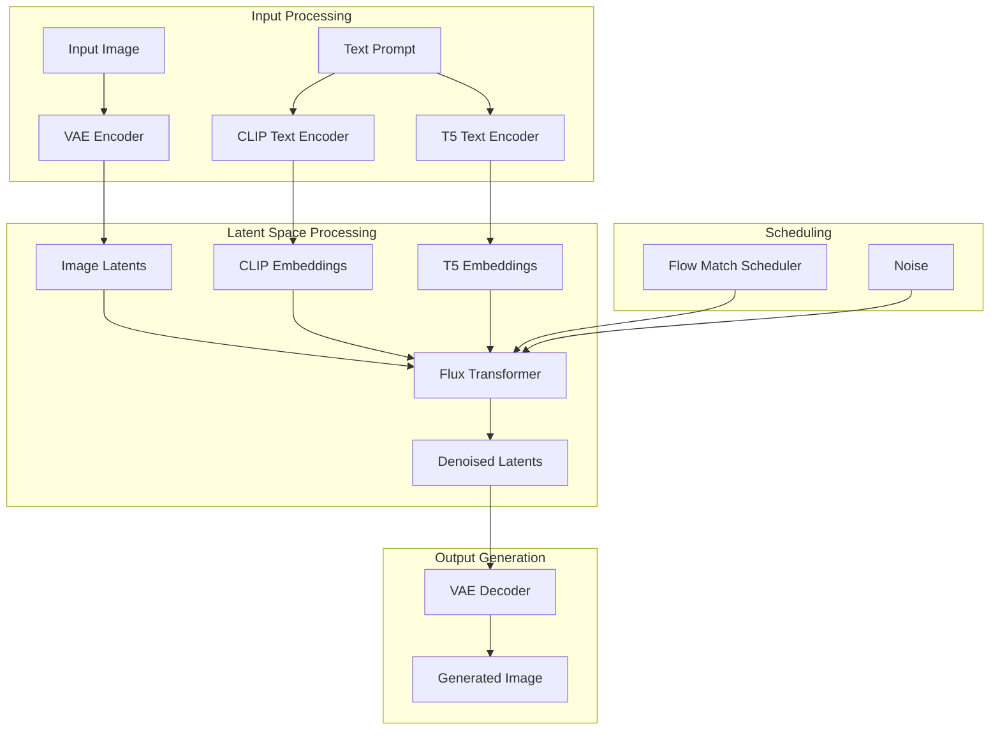
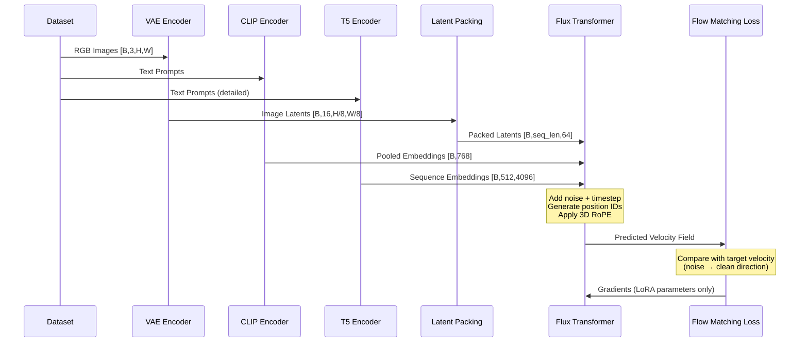
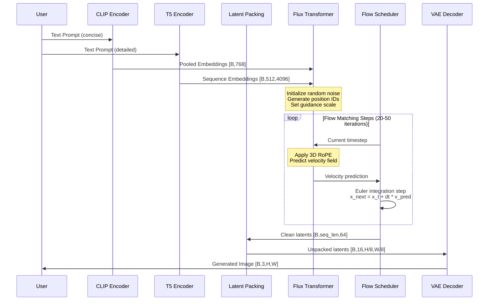

# Flux Kontext Model Architecture Analysis

## Overview

This document provides a comprehensive analysis of the Flux Kontext model architecture, including its components, data flow, and implementation details for integration with our training framework. Flux Kontext is a state-of-the-art diffusion model that combines image and text understanding through a sophisticated transformer-based architecture.

## Table of Contents

1. [Model Architecture Overview](#model-architecture-overview)
2. [Input Processing Components](#input-processing-components)
3. [Latent Space Processing](#latent-space-processing)
4. [Core Transformer Architecture](#core-transformer-architecture)
5. [Flow Matching Scheduler](#flow-matching-scheduler)
6. [Data Flow Analysis](#data-flow-analysis)

## Model Architecture Overview

### High-Level Architecture

The Flux Kontext model follows a multi-stage pipeline that processes both image and text inputs through specialized encoders before feeding them into a unified transformer architecture.



## Input Processing Components

### Image Resolution Handling
Flux Kontext supports a range of predefined resolutions optimized for the model's architecture:

```python
PREFERRED_KONTEXT_RESOLUTIONS = [
    (672, 1568),   # Ultra-wide portrait
    (688, 1504),
    (720, 1456),
    (752, 1392),
    (800, 1328),
    (832, 1248),
    (880, 1184),
    (944, 1104),
    (1024, 1024),  # Square format
    (1104, 944),
    (1184, 880),
    (1248, 832),
    (1328, 800),
    (1392, 752),
    (1456, 720),
    (1504, 688),
    (1568, 672),   # Ultra-wide landscape
]
```

**Key Resolution Characteristics:**
- **Flexibility**: While preferred resolutions are optimized, any resolution divisible by 16 is supported
- **Training Adaptability**: Source and target images can have different resolutions during training
- **Pipeline Control**: The FluxKontext pipeline provides parameters (`height`, `width`, `max_area`, `_auto_resize`) for dynamic resolution adjustment
- **Task-Dependent**: Resolution choice depends on specific use case requirements


### Text Encoding System (Dual Encoder Architecture)

Flux Kontext employs a sophisticated dual-encoder system that combines CLIP and T5 encoders to capture both high-level semantic concepts and detailed textual nuances.

#### Encoding Process Overview

```python
(
    prompt_embeds,
    pooled_prompt_embeds,
    text_ids,
) = self.encode_prompt(
    prompt=prompt,
    prompt_2=prompt_2,
    prompt_embeds=prompt_embeds,
    pooled_prompt_embeds=pooled_prompt_embeds,
    device=device,
    num_images_per_prompt=num_images_per_prompt,
    max_sequence_length=max_sequence_length,
    lora_scale=lora_scale,
)
```

**Output Tensor Shapes:**
```python
# T5 embeddings: Rich contextual representations
prompt_embeds.shape        # torch.Size([1, 512, 4096])

# CLIP embeddings: Pooled semantic features
pooled_prompt_embeds.shape # torch.Size([1, 768])

# Position encoding coordinates for 3D RoPE
text_ids.shape            # torch.Size([512, 3])
```

#### Encoder Specialization

**CLIP Encoder:**
- **Purpose**: Captures high-level semantic concepts and visual-textual alignment
- **Limitation**: Maximum token length of 77 tokens (truncates longer prompts)
- **Strength**: Fast inference and optimized for visual concepts

**T5 Encoder:**
- **Purpose**: Provides detailed semantic understanding and complex prompt interpretation
- **Capacity**: Handles up to 512 tokens (much longer than CLIP)
- **Strength**: Superior text comprehension for complex descriptions

#### Prompt Strategy

The dual-encoder system supports flexible prompt handling:

- **Single Prompt**: When only `prompt` is provided, both encoders use the same text
- **Dual Prompts**: When `prompt_2` is specified:
  - `prompt` → CLIP encoder (should be concise, ≤77 tokens)
  - `prompt_2` → T5 encoder (can be detailed, ≤512 tokens)
- **Best Practice**: Use concise, visual-focused descriptions for CLIP and detailed, contextual descriptions for T5

#### Implementation Details

```python
# CLIP encoder processing
pooled_prompt_embeds = self.get_clip_prompt_embeds(
    prompt=prompt,
)

# T5 encoder processing
prompt_embeds = self.get_t5_prompt_embeds(
    prompt=prompt_2,
    max_sequence_length=max_sequence_length,  # typically 512
)

# Generate position encoding coordinates for 3D RoPE
text_ids = torch.zeros(prompt_embeds.shape[1], 3)  # Shape: [512, 3]
```

#### Understanding `text_ids`: 3D RoPE Position Encoding

**Important**: `text_ids` are **not token IDs or attention masks**. They serve as coordinate indices for Flux's 3D Rotary Position Embedding (RoPE) system.

**Key Concepts:**

1. **Purpose**: `text_ids` provide spatial coordinates for the 3D RoPE mechanism
   - Shape: `(sequence_length, 3)` where 3 represents `[domain, height, width]` coordinates
   - Text tokens use all-zero coordinates since T5/CLIP encoders already provide positional information

2. **3D RoPE Architecture**:
   - Flux uses three-axis RoPE (typically configured as `axes_dims_rope = (16, 56, 56)`)
   - The sum equals the attention head dimension (e.g., 128)
   - Enables unified position encoding for both text and image tokens

3. **Integration Process**:
   ```
   text_ids + image_ids → concatenated_ids → FluxPosEmbed → rotary_embeddings → transformer
   ```

4. **Domain Separation**:
   - **Text domain**: `text_ids` set to zeros `[0, 0, 0]`
   - **Image domain**: `image_ids` contain 2D grid coordinates `[1, row, col]`
   - This allows the model to distinguish between text and image tokens

**Practical Implications:**
- Text tokens don't require additional positional encoding (handled by pre-trained encoders)
- Image tokens receive explicit 2D spatial positioning
- The unified coordinate system enables cross-modal attention between text and image regions


#### CLIP Text Encoder Implementation

**Architecture**: OpenAI CLIP-based text encoder optimized for visual-semantic alignment

**Specifications**:
- **Model**: Pre-trained `CLIPTextModel`
- **Tokenizer**: `CLIPTokenizer`
- **Max Length**: 77 tokens
- **Output Shape**: `[batch_size, 768]` (pooled embeddings)

**Processing Pipeline**:

```python
def get_clip_prompt_embeds(self, prompt: Union[str, List[str]]):
    # 1. Tokenization
    text_inputs = self.tokenizer(
        prompt,
        padding="max_length",
        max_length=self.tokenizer_max_length,  # 77 tokens
        truncation=True,
        return_overflowing_tokens=False,
        return_length=False,
        return_tensors="pt",
    )

    # 2. Text encoding
    prompt_embeds = self.text_encoder(
        text_input_ids.to(device),
        output_hidden_states=False
    )

    # 3. Extract pooled representation
    prompt_embeds = prompt_embeds.pooler_output  # [batch_size, 768]

    return prompt_embeds
```

**Key Characteristics**:
- **Speed**: Fast inference due to smaller model size
- **Specialization**: Optimized for visual concepts and image-text alignment
- **Limitation**: Token truncation at 77 tokens may lose information for long prompts

#### T5 Text Encoder Implementation

**Architecture**: Google T5-XXL encoder model for comprehensive text understanding

**Specifications**:
- **Model**: `T5EncoderModel` (T5-XXL variant)
- **Tokenizer**: `T5TokenizerFast`
- **Max Length**: 512 tokens (7x longer than CLIP)
- **Output Shape**: `[batch_size, 512, 4096]` (sequence embeddings)

**Processing Pipeline**:

```python
def get_t5_prompt_embeds(
    self,
    prompt: Union[str, List[str]] = None,
    max_sequence_length: int = 512,
):
    # 1. Tokenization with extended context
    text_inputs = self.tokenizer_2(
        prompt,
        padding="max_length",
        max_length=max_sequence_length,  # 512 tokens
        truncation=True,
        return_length=False,
        return_overflowing_tokens=False,
        return_tensors="pt",
    )

    # 2. Generate rich contextual embeddings
    prompt_embeds = self.text_encoder_2(
        text_input_ids,
        output_hidden_states=False
    )[0]  # [batch_size, 512, 4096]

    return prompt_embeds
```

**Key Characteristics**:
- **Capacity**: Handles complex, detailed prompts up to 512 tokens
- **Quality**: Superior semantic understanding and contextual reasoning
- **Resource**: Higher memory and computational requirements
- **Output**: Rich sequence-level embeddings for fine-grained text-image alignment

## Latent Space Processing

### Visual Encoding System (VAE)

The VAE (Variational Autoencoder) system is responsible for converting images between pixel space and latent space, enabling efficient diffusion processing in a compressed representation.

#### Latent Preparation Overview

The core latent preparation process handles both input images and noise initialization:

```python
latents, image_latents, latent_ids, image_ids = self.prepare_latents(
    image,
    batch_size * num_images_per_prompt,
    num_channels_latents,  # 16 channels
    height,
    width,
    prompt_embeds.dtype,
    device,
    generator,
    latents,
)
```

#### Detailed Implementation

```python
def prepare_latents(
    self,
    image: Optional[torch.Tensor],
    batch_size: int,
    num_channels_latents: int,  # Fixed at 16 channels
    height: int,
    width: int,
    latents: Optional[torch.Tensor] = None,
):
    # Ensure dimensions are compatible with VAE and packing requirements
    # VAE applies 8x compression: [3,H,W] -> [16,H/8,W/8]
    # Additional 2x factor required for latent packing
    height = 2 * (int(height) // (self.vae_scale_factor * 2))  # vae_scale_factor = 8
    width = 2 * (int(width) // (self.vae_scale_factor * 2))

    # Define target latent shape
    shape = (batch_size, num_channels_latents, height, width)

    # Process input image through VAE encoder
    image_latents = self.encode_vae_image(image=image)
    # Example: [1, 3, 704, 1024] -> [1, 16, 88, 128] (8x downsampling)

    # Pack image latents for transformer processing
    image_latent_height, image_latent_width = image_latents.shape[2:]
    image_latents = self._pack_latents(
        image_latents, batch_size, num_channels_latents,
        image_latent_height, image_latent_width
    )
    # Example: [1, 16, 88, 128] -> [1, 2816, 64] (space-to-depth packing)

    # Generate position IDs for image tokens
    image_ids = self._prepare_latent_image_ids(
        batch_size, image_latent_height // 2, image_latent_width // 2, device, dtype
    )
    # Set domain identifier: 1 for image domain
    image_ids[..., 0] = 1

    # Generate position IDs for noise latents
    latent_ids = self._prepare_latent_image_ids(
        batch_size, height // 2, width // 2, device, dtype
    )

    # Initialize or prepare noise latents
    if latents is None:
        latents = randn_tensor(shape, generator=generator, device=device, dtype=dtype)
        latents = self._pack_latents(latents, batch_size, num_channels_latents, height, width)
    else:
        latents = latents.to(device=device, dtype=dtype)

    return latents, image_latents, latent_ids, image_ids
```

**Key Processing Steps**:

1. **Dimension Alignment**: Ensures height/width compatibility with 8x VAE compression and 2x packing
2. **VAE Encoding**: Converts RGB images to 16-channel latent representations
3. **Latent Packing**: Applies space-to-depth transformation for efficient transformer processing
4. **Position ID Generation**: Creates coordinate systems for both image and noise latents
5. **Domain Separation**: Distinguishes image tokens (domain=1) from noise tokens (domain=0)
#### VAE Image Encoding

**Preprocessing Requirements**:
- Input images must be preprocessed to dimensions divisible by 16
- Target latent dimensions can differ from input image dimensions (both must be divisible by 16)
- This flexibility allows for different source and target resolutions during training

**Core Encoding Process**:

```python
def encode_vae_image(self, image):
    return self.vae.encode(image).latent_dist.mode()
```

**Why Use `.mode()` Instead of Sampling?**

The VAE encoding uses the **mode (mean) of the posterior distribution** rather than random sampling for several critical reasons:

1. **Deterministic Behavior**:
   - Same input image always produces identical latents
   - Ensures reproducible results across runs
   - Essential for stable conditioning in img2img/editing tasks

2. **Noise Management**:
   - Diffusion process already introduces controlled randomness
   - Additional VAE sampling would create unwanted variance
   - VAE posterior variance is typically small in trained models

3. **Stability & Control**:
   - Provides consistent baseline for image-to-image transformations
   - Reduces artifacts and improves generation quality
   - Standard practice across diffusion model implementations

**Alternative Sampling (if needed)**:
```python
# For data augmentation or style variation
latents = vae.encode(image).latent_dist.sample(generator)
# or
latents = retrieve_latents(encoder_output, generator, sample_mode="sample")
```

**Recommendation**: Use `.mode()` for production applications; consider sampling only for research or data augmentation purposes.

#### Latent Packing: Space-to-Depth Transformation

**Purpose**: Converts VAE latents from `[B,C,H,W]` format to sequence format `[B, seq_len, feat_dim]` by grouping 2×2 pixel patches into individual tokens for transformer processing.

**Transformation Process**:

| Step | Operation | Shape Change | Description |
|------|-----------|--------------|-------------|
| Input | — | `[B, C, H, W]` | VAE-encoded image latents |
| Reshape | `view(B, C, H//2, 2, W//2, 2)` | `[B, C, H/2, 2, W/2, 2]` | Explicitly separate 2×2 neighborhoods |
| Permute | `permute(0, 2, 4, 1, 3, 5)` | `[B, H/2, W/2, C, 2, 2]` | Move spatial grid to front dimensions |
| Flatten | `reshape(B, (H//2)*(W//2), C*4)` | `[B, (H/2·W/2), 4C]` | Each 2×2 patch → 1 token, 4× feature dim |

**Key Benefits**:

1. **Efficiency**: Reduces sequence length by 4× (from H×W to H/2×W/2)
   - Attention complexity scales as O(L²), so 4× reduction = 16× speedup
   - Maintains information density by increasing feature dimensions

2. **Spatial Coherence**: Preserves local 2×2 patch relationships
   - Equivalent to `PixelUnshuffle(2)` followed by spatial flattening
   - Each token represents a coherent spatial region

3. **Position Encoding**: Creates grid coordinates `(H/2, W/2)` for 3D RoPE
   - Enables precise spatial positioning in transformer attention
   - Integrates seamlessly with text token positioning

**Example Transformation**:
```
Input:  [1, 16, 88, 128] (VAE latents)
Output: [1, 2816, 64]    (packed tokens)

Where:
- seq_len = (88/2) × (128/2) = 44 × 64 = 2816 tokens
- feat_dim = 16 × 4 = 64 features per token
```

**Requirements**:
- Height and width must be even numbers (divisible by 2)
- Input tensors must be memory-contiguous for `view()` operation
- Use `reshape()` instead of `view()` if memory layout is uncertain

#### Image Position IDs Generation

**Purpose**: `image_ids` provide grid coordinates and domain markers for Flux's 3D RoPE position encoding system, enabling the transformer to understand spatial relationships between image patches.

**Core Concept**:
`image_ids` are **not token IDs or attention masks**. They serve as coordinate indices that carry **position and domain information** for the FluxPosEmbed/3D RoPE system.

#### Generation Process

**Step 1: Grid Construction**
```python
def _prepare_latent_image_ids(batch_size, height, width, device, dtype):
    # Create coordinate grid [H, W, 3] where 3 = [domain, row, col]
    ids = torch.zeros(height, width, 3, device=device, dtype=dtype)

    # Fill row indices (0 to H-1)
    ids[:, :, 1] = torch.arange(height, device=device, dtype=dtype)[:, None]

    # Fill column indices (0 to W-1)
    ids[:, :, 2] = torch.arange(width, device=device, dtype=dtype)[None, :]

    # Flatten spatial dimensions: [H, W, 3] -> [(H*W), 3]
    ids = ids.reshape(-1, 3)

    return ids.repeat(batch_size, 1, 1)  # [batch_size, H*W, 3]
```

**Step 2: Domain Assignment**
- **Latent domain**: `latent_ids[..., 0] = 0` (noise/generation tokens)
- **Image domain**: `image_ids[..., 0] = 1` (reference image tokens)

#### Coordinate System

For each spatial position `(i, j)` in the packed latent grid:
- **Latent tokens**: `[0, i, j]` (domain=0, row=i, col=j)
- **Image tokens**: `[1, i, j]` (domain=1, row=i, col=j)

#### Integration with 3D RoPE

**Sequence Concatenation**:
```
text_ids + latent_ids + image_ids → concatenated_ids → FluxPosEmbed → rotary_embeddings
```

**Domain Separation Benefits**:
1. **Cross-modal attention**: Text tokens can attend to specific image regions
2. **Spatial awareness**: Model understands relative positions between patches
3. **Domain distinction**: Clear separation between text, noise, and image tokens
4. **Unified encoding**: Single position embedding system for all modalities

#### Example Output

For a `44×64` packed grid:
```python
# Sample image_ids entries:
[[1., 0., 0.],   # domain=1, row=0, col=0
 [1., 0., 1.],   # domain=1, row=0, col=1
 [1., 0., 2.],   # domain=1, row=0, col=2
 ...
 [1., 43., 63.]] # domain=1, row=43, col=63
```

This coordinate system enables the transformer to perform spatially-aware attention across text and image modalities.

### Diffusion Process

#### Timestep Scheduling

The Flux diffusion process uses a sophisticated timestep scheduling system that adapts to image resolution and sequence length for optimal denoising performance.

**Implementation Overview**:

```python
# Generate noise schedule
sigmas = np.linspace(1.0, 1 / num_inference_steps, num_inference_steps)
# Example: [1.0, 0.95, 0.9, 0.85, ..., 0.1, 0.05] for 20 steps

# Calculate resolution-dependent shift parameter
image_seq_len = latents.shape[1]  # e.g., 4081 tokens
mu = calculate_shift(
    image_seq_len,
    base_image_seq_len=256,    # Base sequence length
    max_image_seq_len=4096,    # Maximum sequence length
    base_shift=0.5,            # Minimum shift value
    max_shift=1.15,            # Maximum shift value
)
# Result: mu ≈ 1.1474609375 for high-resolution images

# Generate adaptive timesteps
timesteps, num_inference_steps = retrieve_timesteps(
    scheduler=self.scheduler,
    num_inference_steps=num_inference_steps,
    device=device,
    sigmas=sigmas,
    mu=mu,
)
# Output: tensor([1000.0, 983.6, 965.9, ..., 259.3, 142.2])
```
#### Scheduling Components

**1. Noise Schedule (`sigmas`)**
- **Purpose**: Defines the noise strength at each denoising step
- **Default**: Linear schedule from 1.0 to 1/num_steps
- **Alternatives**: Karras, exponential, or custom schedules supported
- **Effect**: Controls the overall denoising trajectory

**2. Resolution-Adaptive Shift (`mu`)**

The shift parameter adapts the timestep schedule based on image resolution:

```python
def calculate_shift(image_seq_len, base_seq_len, max_seq_len, base_shift, max_shift):
    """
    Calculate resolution-dependent timestep shift.

    Formula: μ = m × image_seq_len + b
    Where:
        m = (max_shift - base_shift) / (max_seq_len - base_seq_len)
        b = base_shift - m × base_seq_len
    """
    m = (max_shift - base_shift) / (max_seq_len - base_seq_len)
    b = base_shift - m * base_seq_len
    return m * image_seq_len + b
```

**Shift Behavior**:
- **Low resolution** (seq_len ≈ 256): μ ≈ 0.5 (base_shift)
- **High resolution** (seq_len ≈ 4096): μ ≈ 1.15 (max_shift)
- **Linear interpolation** for intermediate resolutions

**3. Scheduler Integration**

The `FlowMatchEulerDiscreteScheduler` combines sigmas and mu to generate the final timestep sequence:

```python
scheduler.set_timesteps(
    num_inference_steps=num_inference_steps,
    sigmas=sigmas,
    mu=mu,
    device=device
)
```

**Result**: Adaptive timestep sequence that:
- Starts from ~1000 (high noise)
- Decreases to ~140 (low noise)
- Adjusts denoising emphasis based on image resolution
- Optimizes quality vs. speed trade-offs

#### Benefits of Adaptive Scheduling

1. **Resolution Optimization**: Higher resolutions get more aggressive denoising schedules
2. **Quality Consistency**: Maintains generation quality across different image sizes
3. **Computational Efficiency**: Balances steps vs. quality based on content complexity
4. **Flexibility**: Supports custom schedules for specialized use cases

#### Guidance System

**Purpose**: The guidance system in Flux provides fine-grained control over prompt adherence, similar to Classifier-Free Guidance (CFG) but implemented as an embedded conditioning mechanism.

#### Architecture & Implementation

**Processing Pipeline**:
```
guidance_scale → sinusoidal_embedding → guidance_embedder →
(+ timestep_embedding) → (+ text_projection) → conditioning_vector
```

**Integration with Transformer**:
- The conditioning vector modulates each transformer block through AdaLN (Adaptive Layer Normalization)
- Enables dynamic adjustment of prompt following strength per layer
- Provides more nuanced control than traditional CFG approaches

#### Guidance Effects

**Higher Values (3.5-7.0)**:
- **Pros**: Stronger prompt adherence, more predictable results
- **Cons**: Risk of over-fitting, potential artifacts, reduced diversity

**Lower Values (1.0-2.5)**:
- **Pros**: More creative freedom, natural variations, diverse outputs
- **Cons**: Weaker prompt following, less predictable results

**Recommended Range**: 2.0-4.0 for balanced results

#### Model Compatibility

**Guidance-Distilled Models** (FLUX.1-dev, FLUX.1-pro):
- **Support**: Full guidance embedding functionality
- **Default**: guidance_scale=3.5
- **Range**: 1.0-10.0 (practical range 1.0-7.0)

**Schnell/Non-Distilled Models**:
- **Support**: Limited or no guidance embedding support
- **Behavior**: guidance_embeds parameter ignored
- **Alternative**: Use traditional CFG if supported

#### Technical Background

**Distillation Approach**:
- Replaces traditional two-pass CFG with single-pass guided generation
- Embeds guidance strength as learnable conditioning signal
- Reduces computational overhead while maintaining control

**Usage Example**:
```python
# Standard usage
pipeline(
    prompt="A serene mountain landscape",
    guidance_scale=3.5,  # Balanced prompt adherence
    num_inference_steps=20
)

# High creativity
pipeline(
    prompt="Abstract art with flowing colors",
    guidance_scale=1.5,  # More creative freedom
    num_inference_steps=25
)
```

**Best Practices**:
- Start with default guidance_scale=3.5
- Increase for more prompt adherence (up to 7.0)
- Decrease for more creative variation (down to 1.0)
- Adjust based on prompt complexity and desired output style

## Core Transformer Architecture

### Flux Transformer Design

The Flux transformer represents the core computational engine that processes multimodal inputs (text + image) through a unified attention mechanism.

**Architecture Specifications**:
- **Model Type**: Multimodal Diffusion Transformer (MMDiT)
- **Input Processing**: Unified sequence of text and image tokens
- **Attention Pattern**: Self-attention with 3D RoPE position encoding
- **Scale**: 19-38 transformer blocks (model dependent)
- **Dimensions**: 3072-4096 hidden size, 24-32 attention heads

### Transformer Block Architecture

**Core Components**:

```python
class FluxTransformerBlock(nn.Module):
    def __init__(self, hidden_size, num_heads, mlp_ratio=4.0):
        super().__init__()
        # Adaptive Layer Normalization with conditioning
        self.norm1 = AdaLayerNormZero(hidden_size)

        # Multi-head self-attention with 3D RoPE
        self.self_attn = MultiHeadAttention(
            hidden_size,
            num_heads,
            rotary_emb=True  # 3D RoPE support
        )

        # Second normalization layer
        self.norm2 = AdaLayerNormZero(hidden_size)

        # Feed-forward network
        self.mlp = FeedForward(
            hidden_size,
            int(hidden_size * mlp_ratio)
        )

    def forward(self, x, conditioning, rotary_emb):
        # Self-attention with adaptive normalization
        norm_x, gate_msa, shift_mlp, scale_mlp, gate_mlp = self.norm1(x, conditioning)

        # Apply rotary position embeddings and self-attention
        attn_output = self.self_attn(norm_x, rotary_emb=rotary_emb)
        x = x + gate_msa.unsqueeze(1) * attn_output

        # Feed-forward with adaptive normalization
        norm_x = self.norm2(x, shift_mlp, scale_mlp)
        mlp_output = self.mlp(norm_x)
        x = x + gate_mlp.unsqueeze(1) * mlp_output

        return x
```

### Key Architectural Features

**1. Adaptive Layer Normalization (AdaLN-Zero)**:
- Conditions normalization on timestep and guidance embeddings
- Enables dynamic modulation of attention and MLP outputs
- Provides fine-grained control over generation process

**2. 3D Rotary Position Embedding**:
- Unified position encoding for text and image tokens
- Spatial awareness for image patches
- Domain separation between modalities

**3. Unified Attention Mechanism**:
- Single attention operation across all token types
- Cross-modal interactions between text and image
- Efficient processing of multimodal sequences

### Fine-Tuning Target Modules

**LoRA-Compatible Layers**:
- **`to_q`**: Query projection matrices in attention layers
- **`to_k`**: Key projection matrices in attention layers
- **`to_v`**: Value projection matrices in attention layers
- **`to_out.0`**: Output projection matrices in attention layers

**Typical LoRA Configuration**:
```python
lora_config = {
    "target_modules": ["to_q", "to_k", "to_v", "to_out.0"],
    "rank": 64,           # LoRA rank (8-128 typical range)
    "alpha": 64,          # LoRA scaling factor
    "dropout": 0.1,       # LoRA dropout rate
}
```

**Benefits of LoRA Fine-tuning**:
- **Efficiency**: Only 1-5% of original parameters
- **Quality**: Maintains generation quality with targeted adaptation
- **Flexibility**: Easy to swap between different adaptations
- **Storage**: Minimal storage overhead for multiple models

## Flow Matching Scheduler

### Scheduler Architecture

Flux uses a **Flow Matching (Rectified Flow)** approach that differs from traditional DDPM/DDIM schedulers by learning direct paths between noise and data distributions.

**Key Characteristics**:
- **Type**: FlowMatchEulerDiscreteScheduler (Rectified Flow)
- **Prediction Target**: Velocity field (not noise or x₀)
- **Sampling Method**: Euler integration with adaptive timesteps
- **Efficiency**: Fewer steps required compared to DDPM (typically 20-50 steps)

### Flow Matching Theory

**Core Concept**: Instead of learning to denoise, the model learns to predict velocity fields that define straight-line paths from noise to data.

**Mathematical Framework**:
```
dx/dt = v_θ(x_t, t, c)
```
Where:
- `x_t`: Current latent state at time t
- `v_θ`: Learned velocity field (transformer output)
- `c`: Conditioning (text embeddings, guidance)
- `t`: Continuous time parameter [0,1]

### Implementation

**Single Denoising Step**:
```python
def flow_matching_step(x_t, t, model, conditioning):
    """
    Single step of flow matching denoising using Euler integration.

    Args:
        x_t: Current latent state [B, seq_len, dim]
        t: Current timestep (scalar or tensor)
        model: Flux transformer model
        conditioning: Text embeddings and guidance

    Returns:
        x_next: Updated latent state
    """
    # Predict velocity field at current state
    v_pred = model(
        hidden_states=x_t,
        timestep=t,
        encoder_hidden_states=conditioning['text_embeds'],
        pooled_projections=conditioning['pooled_embeds'],
        guidance=conditioning['guidance']
    )

    # Euler integration step
    dt = scheduler.get_timestep_spacing(t)
    x_next = x_t + dt * v_pred

    return x_next
```

**Complete Sampling Loop**:
```python
def sample_flow_matching(
    model,
    noise,
    conditioning,
    num_steps=20,
    guidance_scale=3.5
):
    """Complete flow matching sampling process."""
    x = noise
    timesteps = scheduler.timesteps

    for i, t in enumerate(timesteps):
        # Prepare conditioning with guidance
        cond = {
            'text_embeds': conditioning['text_embeds'],
            'pooled_embeds': conditioning['pooled_embeds'],
            'guidance': torch.tensor([guidance_scale])
        }

        # Single denoising step
        x = flow_matching_step(x, t, model, cond)

        # Optional: Apply scheduler-specific corrections
        if hasattr(scheduler, 'scale_model_input'):
            x = scheduler.scale_model_input(x, t)

    return x
```

### Advantages of Flow Matching

**1. Efficiency**:
- Straight-line paths require fewer sampling steps
- Faster convergence compared to curved DDPM trajectories
- Typical generation: 20-50 steps vs 1000+ for DDPM

**2. Stability**:
- More stable training dynamics
- Reduced mode collapse issues
- Better handling of high-resolution generation

**3. Quality**:
- Smoother interpolation between noise and data
- Better preservation of fine details
- More consistent generation quality

**4. Flexibility**:
- Easy integration with guidance mechanisms
- Compatible with various sampling methods
- Supports adaptive step sizing

## Data Flow Analysis

### Training Data Flow

The training process involves multiple components working in coordination to learn the velocity field for flow matching:



**Training Process Details**:

1. **Data Preparation**: Images and prompts are processed through respective encoders
2. **Latent Packing**: VAE latents are packed into 2×2 patches for efficient processing
3. **Position Encoding**: 3D RoPE coordinates generated for all tokens (text + image)
4. **Noise Addition**: Random noise added to clean latents with random timesteps
5. **Velocity Prediction**: Transformer predicts velocity field to move from noisy to clean state
6. **Loss Computation**: Flow matching loss computed between predicted and target velocities
7. **Gradient Update**: Only LoRA parameters updated, base model frozen

### Inference Data Flow

The inference process generates images through iterative denoising using the learned velocity field:



**Inference Process Details**:

1. **Text Encoding**: Dual encoding with CLIP (semantic) and T5 (detailed)
2. **Noise Initialization**: Random Gaussian noise in latent space
3. **Iterative Denoising**: Flow matching steps with adaptive timestep scheduling
4. **Velocity Integration**: Euler method integration of predicted velocity fields
5. **Latent Unpacking**: Convert sequence tokens back to spatial latent format
6. **Image Decoding**: VAE decoder converts latents to RGB images

### Key Data Flow Characteristics

**Multimodal Integration**:
- Text and image tokens processed in unified transformer
- 3D RoPE enables spatial awareness across modalities
- Cross-modal attention allows text-guided image generation

**Efficiency Optimizations**:
- Latent packing reduces sequence length by 4×
- Flow matching requires fewer denoising steps (20-50 vs 1000+)
- LoRA fine-tuning updates only 1-5% of parameters

**Quality Preservation**:
- VAE mode() encoding ensures deterministic image conditioning
- Adaptive timestep scheduling optimizes for different resolutions
- Guidance system provides controllable prompt adherence

## Summary and Key Insights

### Architectural Innovations

**1. Multimodal Transformer Design**:
- Unified processing of text and image tokens in single transformer
- 3D RoPE position encoding enables spatial awareness across modalities
- AdaLN-Zero conditioning provides fine-grained control over generation

**2. Efficient Latent Processing**:
- Space-to-depth packing reduces attention complexity by 16×
- VAE compression (8×) combined with patch packing (4×) for efficiency
- Deterministic encoding ensures reproducible conditioning

**3. Flow Matching Framework**:
- Direct velocity field prediction instead of noise prediction
- Straight-line paths from noise to data reduce sampling steps
- Adaptive timestep scheduling based on image resolution

**4. Dual Text Encoding**:
- CLIP for semantic alignment (77 tokens max)
- T5 for detailed understanding (512 tokens max)
- Complementary strengths for comprehensive text processing

### Training and Fine-Tuning Considerations

**LoRA Integration**:
- Target attention projection layers (to_q, to_k, to_v, to_out.0)
- Typical rank 64 with alpha 64 for balanced adaptation
- Only 1-5% parameter overhead while maintaining quality

**Resolution Handling**:
- Flexible resolution support (any multiple of 16)
- Preferred resolutions optimized for model architecture
- Adaptive scheduling adjusts denoising based on image complexity

**Guidance Control**:
- Embedded guidance system replaces traditional CFG
- Single-pass generation with controllable prompt adherence
- Model-dependent support (dev/pro vs schnell variants)

### Implementation Best Practices

**For Training**:
- Use mixed precision for memory efficiency
- Implement gradient checkpointing for large models
- Consider sequence length when setting batch sizes
- Monitor velocity prediction quality during training

**For Inference**:
- Start with 20-50 steps for good quality/speed balance
- Use guidance_scale 2.0-4.0 for most applications
- Leverage dual prompts for complex descriptions
- Consider resolution-appropriate step counts

**For Fine-Tuning**:
- Focus on attention layers for LoRA adaptation
- Use appropriate rank based on adaptation complexity
- Monitor for overfitting with small datasets
- Validate across different guidance scales

### Future Directions

The Flux Kontext architecture represents a significant advancement in multimodal diffusion models, with potential extensions including:

- **Enhanced Conditioning**: Additional modalities (audio, video, 3D)
- **Efficiency Improvements**: Further compression techniques and faster sampling
- **Scale Expansion**: Larger models with improved capabilities
- **Specialized Adaptations**: Domain-specific fine-tuning approaches

This architecture provides a robust foundation for high-quality text-to-image generation while maintaining efficiency and controllability through its innovative design choices.
