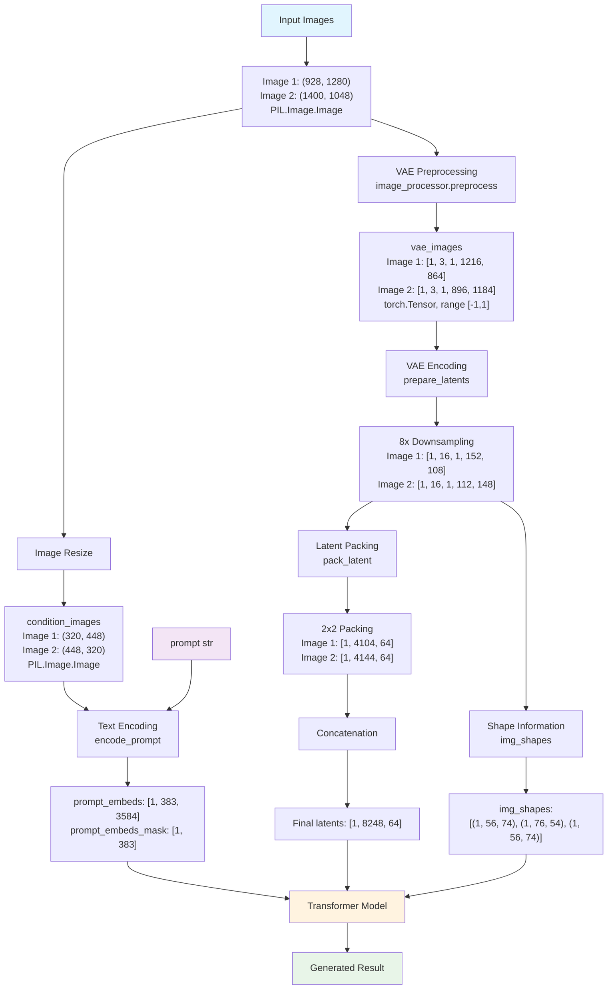

# Differences between Qwen-Image-Edit and Qwen-Image-Edit-Plus

## Prompt Design

### Qwen-Image-Edit (Original)
```python
self.prompt_template_encode = "<|im_start|>system\nDescribe the key features of the input image (color, shape, size, texture, objects, background), then explain how the user's text instruction should alter or modify the image. Generate a new image that meets the user's requirements while maintaining consistency with the original input where appropriate.<|im_end|>\n<|im_start|>user\n<|vision_start|><|image_pad|><|vision_end|>{}<|im_end|>\n<|im_start|>assistant\n"
```

### Qwen-Image-Edit-Plus
```python
self.prompt_template_encode = "<|im_start|>system\nDescribe the key features of the input image (color, shape, size, texture, objects, background), then explain how the user's text instruction should alter or modify the image. Generate a new image that meets the user's requirements while maintaining consistency with the original input where appropriate.<|im_end|>\n<|im_start|>user\n{}<|im_end|>\n<|im_start|>assistant\n"
```

### Key Differences

The most critical difference lies in the content after `<|im_start|>user\n`:
- **Original**: `<|vision_start|><|image_pad|><|vision_end|>{}<|im_end|>`
- **Plus**: `{}<|im_end|>`

**Specific Distinctions:**
- **Original version**: Directly includes visual tokens `<|vision_start|><|image_pad|><|vision_end|>` in the template
- **Plus version**: Does not pre-include visual tokens in the template; instead, they are dynamically constructed in the `_get_qwen_prompt_embeds` method

**Plus Version Dynamic Construction:**

```python
img_prompt_template = "Picture {}: <|vision_start|><|image_pad|><|vision_end|>"
if isinstance(image, list):
    base_img_prompt = ""
    for i, img in enumerate(image):
        base_img_prompt += img_prompt_template.format(i + 1)  # Picture 1:, Picture 2:, etc.
elif image is not None:
    base_img_prompt = img_prompt_template.format(1)  # Picture 1:
else:
    base_img_prompt = ""

txt = [template.format(base_img_prompt + e) for e in prompt]
```

For three images, you would get a `base_img_prompt` like:

```python
'Picture 1: <|vision_start|><|image_pad|><|vision_end|>Picture 2: <|vision_start|><|image_pad|><|vision_end|>Picture 3: <|vision_start|><|image_pad|><|vision_end|>'
```

**Design Impact:**
- **Original**: Fixed support for single image, with visual tokens hardcoded in template
- **Plus**: Flexible support for multiple images, generates numbered visual tokens (Picture 1:, Picture 2:, etc.)

This is one of the core design improvements enabling multi-image processing in the Plus version.

## Prepare Latents

### 1. **Parameter Name Differences**
- **Original**: `image` (single image)
- **Plus**: `images` (multiple images, plural form)

### 2. **Multi-Image Processing Logic**

**Original (Single Image Processing):**
```python
image_latents = None
if image is not None:
    image = image.to(device=device, dtype=dtype)
    if image.shape[1] != self.latent_channels:
        image_latents = self._encode_vae_image(image=image, generator=generator)
    else:
        image_latents = image
    # ... batch expansion logic ...
    image_latents = self._pack_latents(
        image_latents, batch_size, num_channels_latents, image_latent_height, image_latent_width
    )
```

**Plus (Multi-Image Processing):**
```python
image_latents = None
if images is not None:
    if not isinstance(images, list):
        images = [images]  # Convert single image to list
    all_image_latents = []
    for image in images:  # Process each image iteratively
        image = image.to(device=device, dtype=dtype)
        if image.shape[1] != self.latent_channels:
            image_latents = self._encode_vae_image(image=image, generator=generator)
        else:
            image_latents = image
        # ... batch expansion logic ...
        image_latents = self._pack_latents(
            image_latents, batch_size, num_channels_latents, image_latent_height, image_latent_width
        )
        all_image_latents.append(image_latents)  # Collect latent representations
    image_latents = torch.cat(all_image_latents, dim=1)  # Concatenate all image latents
```

### 3. **Key Processing Differences**

**Plus Version Core Improvements:**

1. **Multi-Image Support:**
   ```python
   if not isinstance(images, list):
       images = [images]
   ```

2. **Individual Processing:**
   ```python
   all_image_latents = []
   for image in images:
       # Process each image individually
       all_image_latents.append(image_latents)
   ```

3. **Latent Concatenation:**
   ```python
   image_latents = torch.cat(all_image_latents, dim=1)
   ```

### 4. **Return Values**
Both versions return `latents, image_latents`, but the Plus version's `image_latents` contains concatenated latent representations of all input images.

## Image Processing

### 1. Qwen-Image-Edit (Original)

```python
# 3. Preprocess image
if image is not None and not (isinstance(image, torch.Tensor) and image.size(1) == self.latent_channels):
    image = self.image_processor.resize(image, calculated_height, calculated_width)
    prompt_image = image
    image = self.image_processor.preprocess(image, calculated_height, calculated_width)
    # prompt_image = 255*(image * 2 -1)  # [B,3,H,W]
    # prompt_image = prompt_image.astype(torch.uint8)
    image = image.unsqueeze(2)  # range  [-1,1] shape [B,3,1,H,W]
```

### 2. Qwen-Image-Edit-Plus

```python
# 3. Preprocess image
if image is not None and not (isinstance(image, torch.Tensor) and image.size(1) == self.latent_channels):
    if not isinstance(image, list):
        image = [image]
    condition_image_sizes = []
    condition_images = []
    vae_image_sizes = []
    vae_images = []
    for img in image:
        image_width, image_height = img.size
        condition_width, condition_height = calculate_dimensions(
            CONDITION_IMAGE_SIZE, image_width / image_height
        )
        vae_width, vae_height = calculate_dimensions(VAE_IMAGE_SIZE, image_width / image_height)
        condition_image_sizes.append((condition_width, condition_height))
        vae_image_sizes.append((vae_width, vae_height))
        condition_images.append(self.image_processor.resize(img, condition_height, condition_width))
        vae_images.append(self.image_processor.preprocess(img, vae_height, vae_width).unsqueeze(2))
```

### **Input Processing Approach**
| Aspect | Original | Plus |
|--------|----------|------|
| Image Input | Direct processing of single image | Unified conversion to list format |
| Type Checking | No explicit list handling | `if not isinstance(image, list): image = [image]` |

### **Image Sizing Strategy**
| Aspect | Original | Plus |
|--------|----------|------|
| Size Calculation | Uses unified `calculated_height, calculated_width` | Dynamically calculates dual dimensions for each image |
| Target Size | Single size (1024×1024 base) | Dual sizing system |
| Condition Image | - | `CONDITION_IMAGE_SIZE = 384 * 384` |
| VAE Image | - | `VAE_IMAGE_SIZE = 1024 * 1024` |

### **Processing Complexity**
| Aspect | Original | Plus |
|--------|----------|------|
| Processing Steps | 2 steps: resize → preprocess | 4 steps per image: calculate sizes → resize → preprocess × 2 |
| Loop Processing | None | `for img in image:` iterates through all images |
| Data Collection | Single variable | 4 lists collecting different data types |

### **Output Data Structure**
| Aspect | Original | Plus |
|--------|----------|------|
| Processing Result | `image` (single processed image) | 4 lists: `condition_images`, `vae_images`, `condition_image_sizes`, `vae_image_sizes` |
| Prompt Image | `prompt_image = image` | `condition_images` (list) |
| VAE Image | `image` | `vae_images` (list) |

### **Plus Version Dual Processing Strategy:**

1. **Condition Images** (`384×384`):
   - Used for prompt encoding
   - Smaller size for computational efficiency
   - Maintains sufficient visual information for understanding

2. **VAE Images** (`1024×1024`):
   - Used for latent space encoding
   - High resolution to preserve details
   - Used for final image generation

### **Data Flow:**

```
Original: image → resize → preprocess → image (single)
Plus: images[] → for each img:
                    ├── calculate sizes
                    ├── condition resize → condition_images[]
                    └── vae preprocess → vae_images[]
```

## `img_shapes` Construction Differences

### **Original (QwenImageEditPipeline):**
```python
img_shapes = [
    [
        (1, height // self.vae_scale_factor // 2, width // self.vae_scale_factor // 2),
        (1, calculated_height // self.vae_scale_factor // 2, calculated_width // self.vae_scale_factor // 2),
    ]
] * batch_size
```

### **Plus (QwenImageEditPlusPipeline):**
```python
img_shapes = [
    [
        (1, height // self.vae_scale_factor // 2, width // self.vae_scale_factor // 2),
        *[
            (1, vae_height // self.vae_scale_factor // 2, vae_width // self.vae_scale_factor // 2)
            for vae_width, vae_height in vae_image_sizes
        ],
    ]
] * batch_size
```


**Original Fixed Structure**
```python
[
    [
        (output_image_shape),      # Generated target image
        (input_image_shape),       # Single input image
    ]
] * batch_size
```

**Characteristics:**
- **Fixed Length**: Each batch's img_shapes contains exactly 2 shapes
- **Single Input**: Only one input image's shape information
- **Static Structure**: Structure remains the same regardless of input

 **Plus Dynamic Structure**
```python
[
    [
        (output_image_shape),      # Generated target image
        *(multiple_input_shapes),  # Dynamic number of input images
    ]
] * batch_size
```

**Characteristics:**
- **Dynamic Length**: Shape array length determined by input image count
- **Multi-Input Support**: Supports arbitrary number of input images
- **Unpacking Operation**: Uses `*[...]` to unpack list into outer list

### **Single Image Input:**

**Original:**
```python
img_shapes = [
    [
        (1, 64, 64),    # Output image: 1024//8//2 = 64
        (1, 64, 64),    # Input image: same calculation
    ]
] * batch_size
```

**Plus:**
```python
# Assuming vae_image_sizes = [(1024, 1024)]
img_shapes = [
    [
        (1, 64, 64),    # Output image
        (1, 64, 64),    # 1st input image
    ]
] * batch_size
```

### **Multi-Image Input:**

**Original:** ❌ **Not supported, still fixed structure**
```python
img_shapes = [
    [
        (1, 64, 64),    # Output image
        (1, 64, 64),    # Only one input image shape
    ]
] * batch_size
```

**Plus:** ✅ **Dynamic multi-image support**
```python
# Assuming vae_image_sizes = [(1024, 1024), (512, 768), (2048, 1024)]
img_shapes = [
    [
        (1, 64, 64),    # Output image
        (1, 64, 64),    # 1st input image: 1024x1024
        (1, 32, 48),    # 2nd input image: 512x768
        (1, 128, 64),   # 3rd input image: 2048x1024
    ]
] * batch_size
```


### **Shape Calculation Formula:**
```python
shape_height = vae_height // self.vae_scale_factor // 2
shape_width = vae_width // self.vae_scale_factor // 2
```

- `vae_scale_factor` is typically 8 (VAE downsampling factor)
- Additional division by 2 is due to QwenImage using 2×2 patch packing

### **Plus Version Dynamic List Comprehension:**
```python
*[
    (1, vae_height // self.vae_scale_factor // 2, vae_width // self.vae_scale_factor // 2)
    for vae_width, vae_height in vae_image_sizes  # Iterate through all input image sizes
]
```

This syntax:
1. Iterates through each `(vae_width, vae_height)` tuple in `vae_image_sizes`
2. Calculates corresponding shape tuple for each size
3. Uses `*` unpacking to insert all shape tuples directly into the outer list


### **Role of img_shapes:**
- Passed to **transformer model** to inform it of each image's spatial dimensions
- Used for **attention mechanisms** to correctly process different-sized image regions
- Used for **position encoding** to assign correct positional information to each image region

### **Plus Version Advantages:**
- **Flexibility**: Supports arbitrary number of input images
- **Accuracy**: Provides precise shape information for each image
- **Scalability**: Easily handles complex multi-image scenarios

### **Original Version Limitations:**
- **Fixed Structure**: Can only process single input image
- **Information Loss**: Cannot provide complete shape information for multi-image inputs
- **Compatibility Issues**: Mismatched with transformer's multi-image processing capabilities

## Unchanged Methods
- `encode_prompt` - Completely identical
- `_pack_latents` - Completely identical
- `_unpack_latents` - Completely identical
- `_encode_vae_image` - Completely identical

## Summary

Overall, the main changes include:

1. **Prompt modifications**: Enhanced adaptation for multiple images
2. **VAE and text encoder multi-image support**: The original text encoder already supported multi-image output; now it simply requires multiple images as input. Additionally, the VAE encoder now processes multiple images, generating multiple latents that are concatenated along the token dimension. The `img_shapes` contains shape information for each image, creating corresponding `position_ids` for position embedding to help the model distinguish between different images.

## Complete Image Input Processing Pipeline

Assuming we have two images with shapes ((928, 1280), (1400, 1048)):

```
images [(928, 1280), (1400, 1048), PIL.Image.Image]
    → resize → condition_images [(320, 448), (448, 320), PIL.Image.Image]

images → image_processor.preprocess → vae_images [[1, 3, 1, 1216, 864], [1, 3, 1, 896, 1184], torch.Tensor, range [-1,1]]

condition_images + prompt (str) → encode_prompt → prompt_embeds [1, 383, 3584], prompt_embeds_mask [1, 383]

vae_images [[1, 3, 1, 1216, 864], [1, 3, 1, 896, 1184]]
    → prepare_latents → 8x downsample → ([1, 16, 1, 152, 108],[1, 16, 1, 112, 148])
    → pack_latent (2x2 pack) → ([1, 4104, 64], [1, 4144, 64])
    → concat → [1, 8248, 64]

8x downsample → img_shapes [[(1, 56, 74), (1, 76, 54), (1, 56, 74)]]
```

## Image Input Processing Flow Chart



### Detailed Process Description

#### 1. Input Stage
- **Original Images**: Two PIL images with different dimensions
  - Image 1: (928, 1280)
  - Image 2: (1400, 1048)

#### 2. Image Processing Branches

**Branch A: Condition Image Processing (for text encoding)**
- **Resize**: Adjust to appropriate condition image dimensions
  - Image 1: (320, 448)
  - Image 2: (448, 320)
- **Purpose**: Sent to encoder together with text prompt

**Branch B: VAE Image Processing (for latent space encoding)**
- **Preprocess**: Preprocess to VAE-acceptable format
  - Image 1: [1, 3, 1, 1216, 864]
  - Image 2: [1, 3, 1, 896, 1184]
  - Value range: [-1, 1]

#### 3. Encoding Stage

**Text + Image Encoding:**
- condition_images + prompt → prompt_embeds [1, 383, 3584]
- Simultaneously generates prompt_embeds_mask [1, 383]

**VAE Latent Space Encoding:**
1. **8x Downsampling**: VAE encoder downsamples images by 8x
   - Image 1: [1, 16, 1, 152, 108]
   - Image 2: [1, 16, 1, 112, 148]

2. **2×2 Packing**: pack_latent operation performs spatial packing
   - Image 1: [1, 4104, 64]
   - Image 2: [1, 4144, 64]

3. **Concatenation**: Concatenate all images along token dimension
   - Final: [1, 8248, 64]

#### 4. Auxiliary Information
- **img_shapes**: Records shape information for each image
  - Used for Transformer position encoding
  - [(1, 56, 74), (1, 76, 54), (1, 56, 74)]

#### 5. Model Inference
- prompt_embeds, latents, and img_shapes are sent together to Transformer model
- Generates final image editing results
